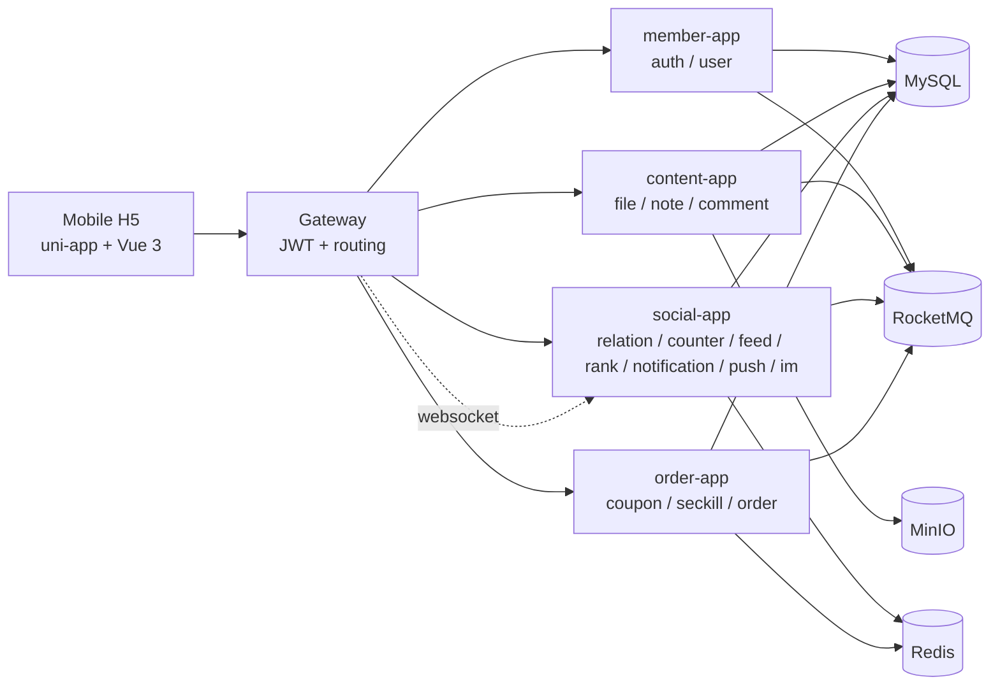

# BlueNote

BlueNote is a full-stack mobile community app inspired by modern note-sharing products. It is built as a personal project, but the codebase is organized like a small production system: contract-first APIs, separate backend applications, MySQL fact tables, Redis read models, RocketMQ outbox events, MinIO direct upload, and a uni-app mobile H5 client.

The project is currently a runnable local demo rather than a production deployment. It is suitable for showcasing backend service design, event-driven workflows, mobile API integration, and end-to-end product thinking.

[中文说明 / Chinese README](README.zh-CN.md)

## Highlights

- Mobile H5 app built with uni-app, Vue 3, TypeScript and Pinia.
- Java 21 + Spring Boot 3.5 multi-module backend.
- Gateway JWT authentication and downstream user context propagation.
- MySQL-backed auth, user profile, file, note, comment, relation, counter, feed, rank, notification, push, IM and order domains.
- MinIO presigned image upload flow for note images, avatars and profile covers.
- RocketMQ + outbox baseline for note, interaction, relation, counter, feed, rank, notification, push, IM and order events.
- Redis-backed online counters, feed inbox, ranking list, notification unread count, push online state and order seckill stock.
- Mobile pages for login, home feed, publish, note detail, profile, profile editing, notifications, IM, coupon activity and rankings.
- Repeatable local smoke script for the main user journey.

## Why This Project Is Useful

BlueNote is intentionally documented as a backend internship project reference. It tries to answer questions that are often missing from small demo projects:

- Where does each business fact live?
- Which APIs are external and which are internal?
- Why is Redis used, and how can Redis data be rebuilt?
- Which changes are sent through RocketMQ events?
- How are outbox sending, duplicate consumption, idempotency and state transitions handled?
- What is implemented now, and what is honestly left as production work?

Recommended reading for backend learners:

- [Chinese README](README.zh-CN.md)
- [Engineering docs index](docs/engineering/README.md)
- [Backend internship study roadmap](docs/engineering/04-backend-internship-study-roadmap.md)
- [Architecture and core flows](docs/engineering/05-architecture-and-core-flows.md)
- [Interview and resume guide](docs/engineering/06-interview-and-resume-guide.md)
- [Module design overview](docs/engineering/07-module-design-overview.md)

## What Works

```text
Register / login
  -> edit user profile and upload avatar / cover
  -> upload note image and publish note
  -> view note detail
  -> follow users and read following feed
  -> like, collect, comment and receive notifications
  -> realtime WebSocket push and IM single chat
  -> ranking list
  -> coupon seckill order with MOCK payment
```

This is not a clone of any specific product brand. The UI and domain model are intentionally generic.

## Architecture



Backend applications:

| App | Port | Responsibility |
|---|---:|---|
| gateway-app | 8080 | Authentication, routing, user context headers, WebSocket forwarding |
| member-app | 8081 | Auth, session, user profile, profile image binding |
| content-app | 8082 | File upload, notes, comments, note interactions |
| social-app | 8083 | Relation, counter, feed, rank, notification, push, IM |
| order-app | 8084 | Coupon activities, seckill, orders, MOCK payment |

## Tech Stack

| Area | Stack |
|---|---|
| Mobile | uni-app, Vue 3, TypeScript, Pinia, Vite |
| Backend | Java 21, Spring Boot 3.5, Spring Cloud Gateway, Maven |
| Persistence | MySQL 8, MyBatis / MyBatis-Plus XML mappers |
| Cache / read model | Redis 7 |
| Messaging | RocketMQ 5, transactional outbox pattern |
| Object storage | MinIO presigned PUT upload |
| Local environment | Docker Compose |

## Repository Layout

```text
BlueNote/
  backend/               Java backend multi-module project
  mobile/                uni-app mobile H5 client
  deploy/compose/        local Docker Compose dependencies
  docs/contracts/        API, DB, Redis, MQ and security contracts
  docs/engineering/      engineering notes and local runbooks
  docs/testing/          smoke-test and contract-audit records
  scripts/               local verification scripts
  方案/                  original Chinese architecture and service design docs
```

## Learning Map

For a quick review, start with this README and [README.zh-CN.md](README.zh-CN.md).

For a serious walkthrough:

1. Read [Contract index](docs/contracts/README.md) to understand the contract-first baseline.
2. Read [Architecture and core flows](docs/engineering/05-architecture-and-core-flows.md) to understand service boundaries and data flow.
3. Follow [Backend internship study roadmap](docs/engineering/04-backend-internship-study-roadmap.md) from auth/user/file/note to counter/feed/order/rank.
4. Read [Module design overview](docs/engineering/07-module-design-overview.md) when you want a module-by-module explanation of architecture, flow and design choices.
5. Use [Interview and resume guide](docs/engineering/06-interview-and-resume-guide.md) to turn the implementation into a clear project story.
6. Open `方案/services/` when you want the original detailed Chinese service design documents.

## Quick Start

Prerequisites:

- JDK 21
- Maven
- Node.js and npm
- Docker Desktop or Docker Compose

Start local dependencies from the repository root:

```bash
docker compose -f deploy/compose/compose.base.yml -f deploy/compose/compose.local.yml up -d
```

Compile backend:

```bash
cd backend
mvn -q -DskipTests compile
```

Start backend applications in separate terminals:

```bash
cd backend/bluenote-member-app
mvn -q -DskipTests spring-boot:run
```

```bash
cd backend/bluenote-content-app
mvn -q -DskipTests spring-boot:run
```

```bash
cd backend/bluenote-social-app
mvn -q -DskipTests spring-boot:run
```

```bash
cd backend/bluenote-order-app
mvn -q -DskipTests spring-boot:run
```

```bash
cd backend/bluenote-gateway-app
mvn -q -DskipTests spring-boot:run
```

Run the mobile H5 app:

```bash
cd mobile
npm install
npm run dev:h5
```

Default H5 URL:

```text
http://127.0.0.1:5173
```

Vite proxies `/api` and `/ws` to the gateway by default. You can override it with `VITE_BLUENOTE_GATEWAY=http://127.0.0.1:8080`.

## Verification

Main journey smoke test:

```powershell
powershell -ExecutionPolicy Bypass -File scripts/verify-main-chain.ps1 -GatewayBaseUrl http://127.0.0.1:8080
```

This creates a temporary user, uploads images to MinIO, publishes a note, updates the user profile and verifies the user home response.

Common checks:

```bash
cd backend
mvn -q -DskipTests compile
```

```bash
cd mobile
npm run typecheck
npm run build:h5
```

More details:

- [Engineering docs index](docs/engineering/README.md)
- [Local main-chain runbook](docs/engineering/02-local-main-chain-runbook.md)
- [Main-chain contract audit](docs/testing/01-main-chain-contract-audit.md)
- [Current engineering status](docs/engineering/current-status.md)

## API And Contracts

BlueNote is contract-first. The most useful entry points are:

- [Contract index](docs/contracts/README.md)
- [Common API format](docs/contracts/api/00-common.md)
- [Auth API](docs/contracts/api/02-auth-api.md)
- [User API](docs/contracts/api/03-user-api.md)
- [File API](docs/contracts/api/04-file-api.md)
- [Note API](docs/contracts/api/05-note-api.md)
- [Feed API](docs/contracts/api/09-feed-api.md)
- [IM API](docs/contracts/api/13-im-api.md)
- [Order API](docs/contracts/api/14-order-api.md)
- [Rank API](docs/contracts/api/15-rank-api.md)

OpenAPI UI is available locally after backend apps start:

```text
http://127.0.0.1:{port}/swagger-ui.html
```

## Project Status

The project has completed the foundation of the planned personal-project scope:

- main content publishing chain
- social relation and feed chain
- counter, ranking and notification foundation
- realtime push and IM single-chat foundation
- coupon order chain with MOCK payment
- mobile H5 pages for the core flows
- GitHub-facing Chinese and English documentation for backend learners

Known non-goals for the current demo:

- production deployment and observability stack
- real payment provider integration
- real offline vendor push channels
- recommendation engine and full-text search
- moderation console and admin dashboard
- IM group chat and rich media messages
- comprehensive automated test suite

## Notes For Reviewers

Some directories and documents use Chinese names because the original architecture notes were written in Chinese. They are intentionally kept in the repository: they show the planning process behind the implementation and are part of the project artifact.

Local generated files such as `.m2/`, `out/`, `target/`, `node_modules/` and `unpackage/` are ignored.

## License

No license has been selected yet. Treat the repository as source-available for review unless a license is added.
