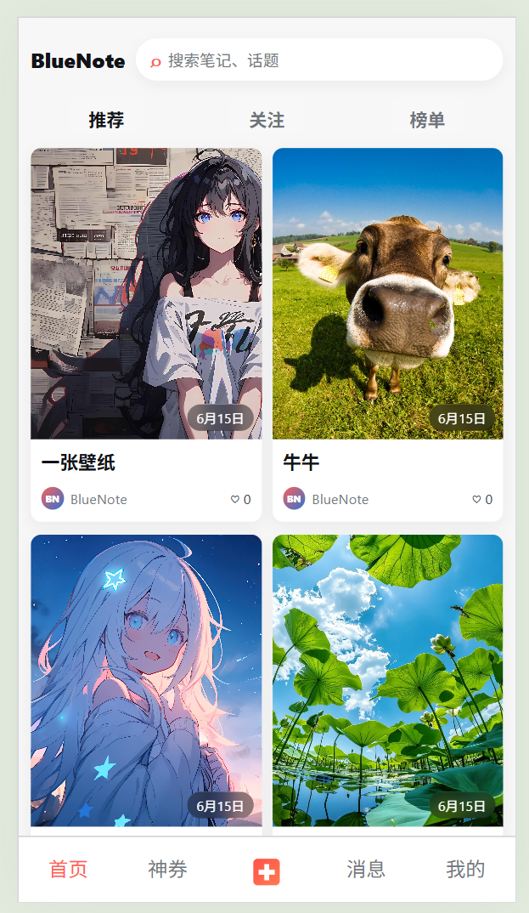
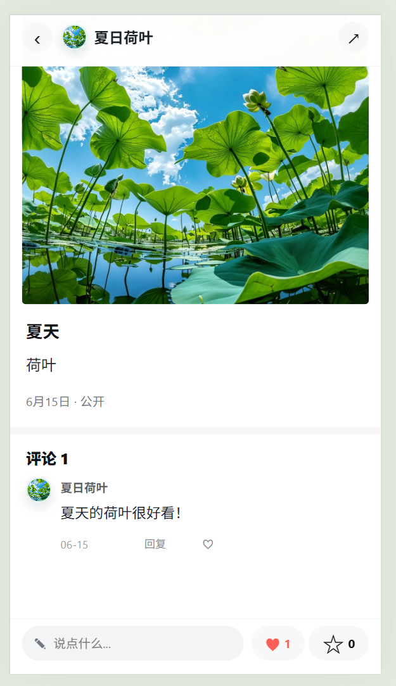
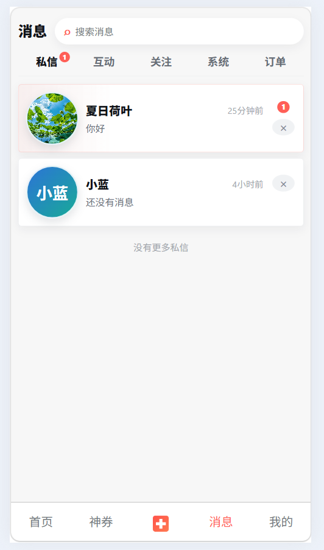
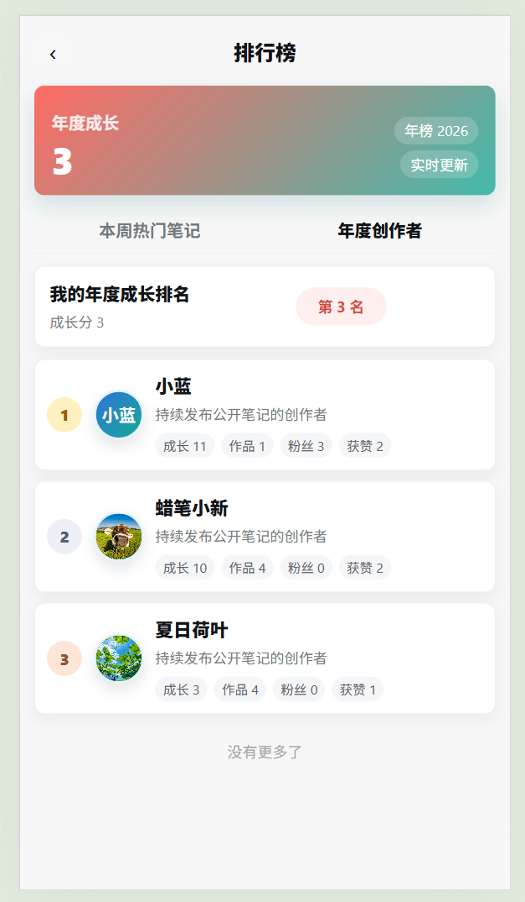
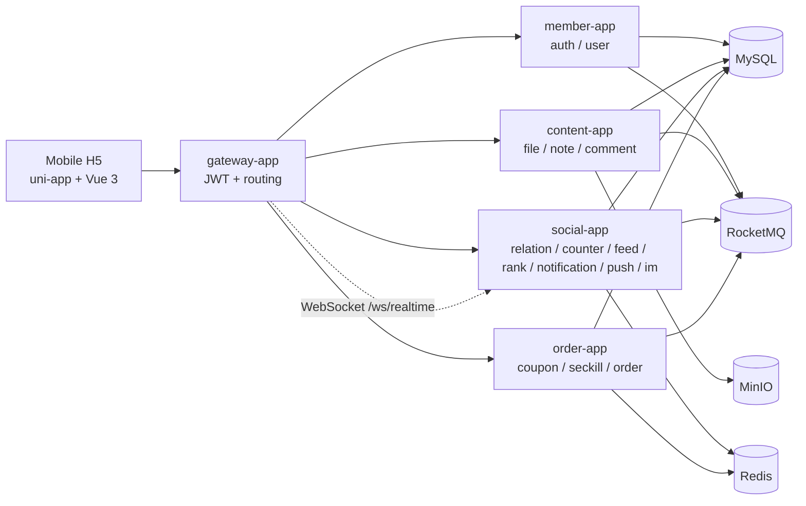

# BlueNote

[](#tech-stack)
[](#tech-stack)
[](#tech-stack)
[](#tech-stack)
[](#tech-stack)
[](LICENSE)

BlueNote is a content community system for full-stack and backend learning. It is not a practice repository that stops at Controller CRUD. Instead, it follows a realistic internet product style and separates modules such as user, content, comment, relation, feed, counter, notification, push, IM, order and ranking, with auditable contracts for APIs, databases, Redis, MQ and security boundaries.

The current project positioning is: **personally runnable, contract-first, module-complete, and suitable for learning backend-related knowledge**.

If you are looking for a project that can be learned module by module and used to understand architecture trade-offs, BlueNote's main value is here:

1. It **covers the major backend business flows of common community products**.
2. It explains logical service boundaries, merged physical deployment, database schemas, Redis read models and MQ events separately.
3. It includes a runnable Java backend, a multi-module project structure, local Docker Compose dependencies and a uni-app H5 mobile client.
4. It does not treat Redis or MQ as the only source of truth. Many modules keep MySQL facts, idempotency records, rebuild paths or fallback paths.
5. It keeps a large set of Chinese design documents so readers can review why the system is designed this way, not only what the final code looks like.

[中文说明 / Chinese README](README.zh-CN.md)

## At A Glance

```text
Register / login
  -> edit user profile and upload avatar / profile cover
  -> upload images and publish a note
  -> view note detail
  -> follow authors and read the following feed
  -> like, collect, comment and receive notifications
  -> realtime WebSocket delivery and IM single chat
  -> weekly hot note ranking and yearly creator growth ranking
  -> coupon seckill order and MOCK payment
```

The current project is more suitable for learning and showcasing backend design than for direct production deployment. A real production system would still need monitoring and alerting, real payment, real offline push channels, recommendation and search, moderation/admin systems and deployment security.

## Screenshots

The following images are captured from the local uni-app H5 pages.

Profile page:


Home page:



Comments / likes / collections:



IM:



Ranking:



## Tech Stack

| Area | Stack |
|---|---|
| Backend language | Java 21 |
| Backend framework | Spring Boot 3.5, Spring Cloud Gateway, Spring MVC |
| Persistence | MySQL 8, MyBatis / MyBatis-Plus XML |
| Cache and read models | Redis 7 |
| Messaging | RocketMQ 5, local transaction + outbox, idempotent consumption |
| Object storage | MinIO presigned direct upload |
| Mobile | uni-app, Vue 3, TypeScript, Pinia, Vite |
| Local environment | Docker Compose |

## Backend Applications

The project is logically designed around service boundaries, but the physical deployment is merged so it can run on a personal computer or small server.

| Physical app | Default port | Logical services | Description |
|---|---:|---|---|
| `bluenote-gateway-app` | 8080 | gateway | Unified entry, JWT validation, routing, user context headers, WebSocket forwarding |
| `bluenote-member-app` | 8081 | auth, user | Registration/login, tokens, device sessions, user profiles, user home header |
| `bluenote-content-app` | 8082 | file, note, comment | File upload, notes, comments, like/collect facts |
| `bluenote-social-app` | 8083 | relation, counter, feed, rank, notification, push, im | Follow relations, counters, feed, rankings, notifications, realtime delivery, single chat |
| `bluenote-order-app` | 8084 | order | Coupon activities, seckill, orders, MOCK payment, coupon issuing, stock operations |

Merged deployment does not mean blurred boundaries. The project still requires:

1. Each logical service owns its data.
2. No cross-schema joins.
3. Cross-service reads go through internal APIs or event-driven read models.

## Implemented Modules

| Module | Current capabilities | Backend learning points |
|---|---|---|
| Gateway | JWT authentication, public path allowlist, downstream user context headers, WebSocket forwarding | Unified gateway entry, authentication before routing, isolation between mobile client and internal services |
| Auth | Registration, login, token refresh, logout, password change, device session | Access/Refresh Token split, BCrypt, session rotation, login audit |
| User | Current profile, public profile, user home header, avatar/cover binding | Separation between user profile and login credentials, profile versioning, file ownership validation |
| File | Upload credential, upload confirmation, access URL, internal validation and binding | MinIO presigned direct upload, file metadata, business binding |
| Note | Drafts, publishing, deletion, detail, lists, likes, collections, my collections/likes | Content fact tables, media binding, idempotency, interaction facts, outbox |
| Comment | Top-level comments, replies, deletion, comment likes, my comments | Comment hierarchy, status control, comment count source, event publishing |
| Relation | Follow, unfollow, following/follower lists, follow status | Bidirectional relation read models, idempotent follow, feed and notification event source |
| Counter | Batch counts, event consumption, Redis online counters, MySQL snapshots, rebuild tasks, `CounterChanged` outbox | Eventually consistent counters, Redis/MySQL/source fallback, event idempotency |
| Feed | Following feed, inbox, fanout tasks, follow backfill, rebuild and retry | Write fanout, read models, Redis/MySQL fallback, push-pull evolution |
| Notification | Unread count, notification list, aggregated interaction notifications, comment/follow/order notifications, rebuild | Notification read model, aggregation strategy, unread count, Push request handoff |
| Push | Device registration, preferences, delivery request, WebSocket online delivery, ACK, delivery logs | Redis online routing, unified delivery entry, offline Push extension boundary |
| IM | Single-chat conversation, text message, unread, delivered, read | Message persistence, conversation sequence, send idempotency, online/offline reminder split |
| Order | Activity, seckill token, Redis Lua pre-deduction, async order creation, MOCK payment, coupon issuing, timeout close, stock reconciliation | Traffic peak shaving, inventory consistency, state machine, idempotency and compensation |
| Rank | Weekly hot notes, yearly creator growth ranking, Redis ZSet, MySQL score facts, snapshots, rebuild | Ranking score model, online ranking and snapshots, event-driven updates |

## Feature Matrix

| Domain | User-facing flow | Backend design focus | Status |
|---|---|---|---|
| Gateway | Unified mobile entry | JWT validation, public paths, user context headers, WebSocket forwarding | Implemented |
| Account | Register, login, refresh, logout | BCrypt, Access/Refresh Token, device session, login audit | Implemented |
| User | Profile, public profile, user home | Profile versioning, avatar/cover file binding, user home counter aggregation | Implemented |
| File | Note image, avatar, cover upload | MinIO presigned direct upload, upload confirmation, ownership validation, business binding | Implemented |
| Content | Draft, publish, detail, list, like, collect | Note facts, media binding, idempotent writes, interaction facts, outbox | Implemented |
| Comment | Comment, reply, delete, like | Comment hierarchy, status deletion, comment count source, event publishing | Implemented |
| Relation | Follow, unfollow, following/follower list | Bidirectional read models, idempotent follow, relation events | Implemented |
| Counter | Note/user/comment counts | Redis online counters, MySQL snapshots, source fallback, rebuild, CounterChanged | Implemented |
| Feed | Following feed | Inbox, fanout, Redis/MySQL fallback, follow backfill, rebuild | Implemented |
| Notification | Unread count, notification center | Aggregated notifications, detail notifications, unread rebuild, PushSendRequested | Implemented |
| Push | Online delivery | Devices, preferences, online routing, WebSocket, ACK, delivery logs | Foundation implemented |
| IM | Single chat, messages, unread, read | Message persistence, conversation sequence, send idempotency, Push request | Foundation implemented |
| Order | Coupon seckill, MOCK payment, user coupons | Seckill token, Redis Lua, async order creation, state machine, stock reconciliation | Foundation implemented |
| Ranking | Weekly hot notes, yearly creator growth | CounterChanged scoring, Redis ZSet, MySQL score facts, snapshot rebuild | Foundation implemented |

## Core Architecture



The core engineering principles are:

1. **Contract first**: define APIs, error codes, DDL, Redis keys, MQ events and permissions before implementation.
2. **Clear fact ownership**: user profiles, notes, comments, relations, orders and other business facts each have a clear write owner.
3. **Asynchronous decoupling**: counters, feed, rankings, notifications, Push and order status reminders are connected through events.
4. **Rebuildable read models**: Redis counters, feeds, rankings and unread counts are not the only source of truth.
5. **Controlled complexity for a personal project**: the design follows microservice-style logical boundaries, while physical deployment is merged into 5 apps so small machines can run it.

## Local Start

Prerequisites:

1. JDK 21
2. Maven
3. Node.js / npm
4. Docker Desktop or Docker Compose

Start local dependencies:

```bash
docker compose -f deploy/compose/compose.base.yml -f deploy/compose/compose.local.yml up -d
```

Compile backend:

```bash
cd backend
mvn -q -DskipTests compile
```

Start backend applications separately:

```bash
cd backend/bluenote-member-app
mvn -q -DskipTests spring-boot:run
```

```bash
cd backend/bluenote-content-app
mvn -q -DskipTests spring-boot:run
```

```bash
cd backend/bluenote-social-app
mvn -q -DskipTests spring-boot:run
```

```bash
cd backend/bluenote-order-app
mvn -q -DskipTests spring-boot:run
```

```bash
cd backend/bluenote-gateway-app
mvn -q -DskipTests spring-boot:run
```

Start the mobile H5 app:

```bash
cd mobile
npm install
npm run dev:h5
```

Default H5 URL:

```text
http://127.0.0.1:5173
```

## Verification

Main-chain smoke script:

```powershell
powershell -ExecutionPolicy Bypass -File scripts/verify-main-chain.ps1 -GatewayBaseUrl http://127.0.0.1:8080
```

This script automatically verifies:

1. Registering a temporary user.
2. Fetching the current user profile.
3. Requesting an image upload credential and uploading directly to MinIO.
4. Publishing a note.
5. Querying note detail.
6. Uploading avatar and profile cover.
7. Updating the user profile.
8. Querying the user home and verifying the returned counter aggregation.

Common checks:

```bash
cd backend
mvn -q -DskipTests compile
```

```bash
cd mobile
npm run typecheck
npm run build:h5
```

## Current Boundaries

Most foundation loops required for a personal project showcase are complete, but several areas are explicitly out of scope for now:

1. Real payment providers are not integrated. The current payment flow is MOCK payment.
2. Real uni-push / vendor offline Push channels are not integrated. The current focus is device registration, preferences, delivery requests, WebSocket online delivery and logs.
3. A complete recommendation system and full-text search are not implemented.
4. A complete moderation console, operations admin console and production-grade monitoring/alerting are not implemented.
5. Automated tests are still not sufficient. Current verification relies more on compilation, mobile build and the main-chain smoke script.

These boundaries are not defects. They are an honest scope statement for a personal project. This makes the project more credible and more suitable for discussing how it could evolve toward production.

## License

BlueNote is licensed under the [MIT License](LICENSE).
