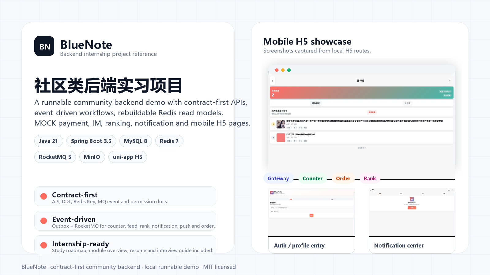
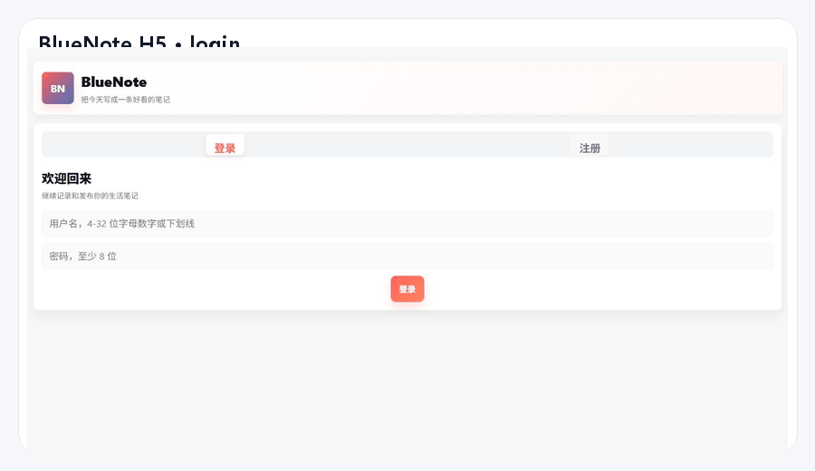
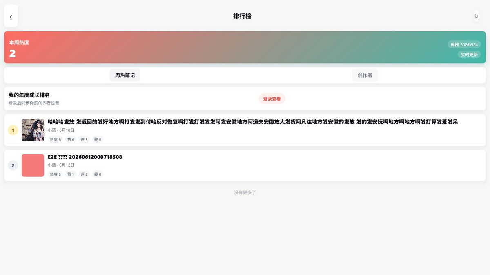
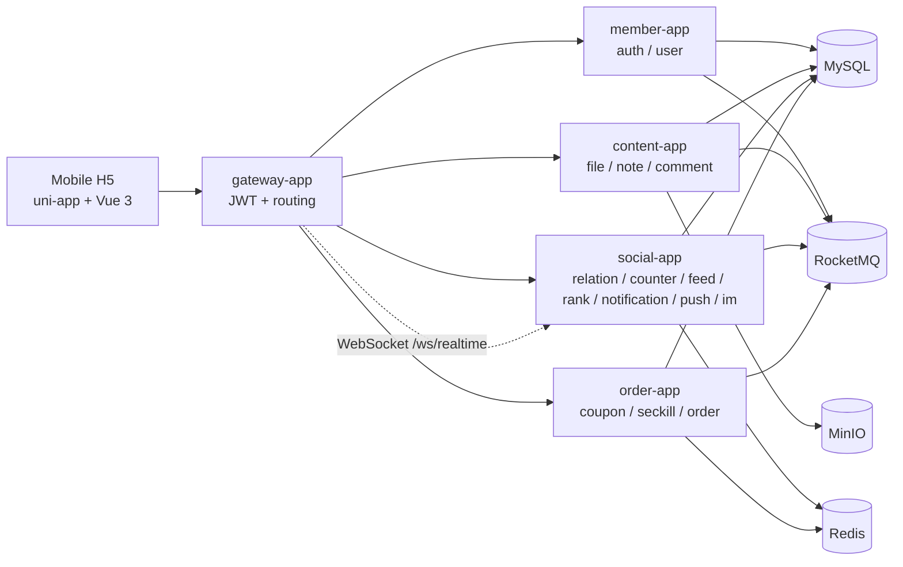

# BlueNote 中文说明

[](#技术栈)
[](#技术栈)
[](#技术栈)
[](#技术栈)
[](#技术栈)
[](LICENSE)



BlueNote 是一个面向后端实习项目展示的移动端社区系统。它不是一个只停留在 Controller CRUD 的练手仓库，而是按真实互联网业务的方式拆分了用户、内容、评论、关注、Feed、计数、通知、推送、IM、订单和排行榜等模块，并把 API、数据库、Redis、MQ 和权限边界写成了可核对的契约。

项目当前定位是：**个人可运行、契约优先、模块完整、适合后端实习生学习和面试讲解的社区类后端项目**。

如果你想找一个可以写进简历、可以按模块学习、可以在面试里讲清楚架构取舍的项目，BlueNote 的重点价值在这里：

1. 它覆盖了常见社区产品后端的主要业务链路。
2. 它把逻辑服务边界、物理应用合并部署、数据库 schema、Redis 读模型和 MQ 事件分开说明。
3. 它有可运行的 Java 后端、多模块工程、本地 Docker Compose 依赖和 uni-app H5 移动端。
4. 它没有把 Redis 或 MQ 当成唯一事实来源，很多模块都保留了 MySQL 事实、幂等记录、重建或降级路径。
5. 它保留了大量中文方案文档，适合读者复盘“为什么这么设计”，而不仅是看代码结果。

## 一眼看懂

```text
注册/登录
  -> 编辑用户资料和上传头像/主页封面
  -> 上传图片并发布笔记
  -> 查看笔记详情
  -> 关注作者并读取关注页 Feed
  -> 点赞、收藏、评论和接收通知
  -> WebSocket 实时投递和 IM 单聊
  -> 周热笔记榜、年度创作者成长榜
  -> 神券秒杀订单和 MOCK 支付
```

当前项目更适合学习和展示后端设计，不适合直接作为生产系统上线。真实生产还需要补齐监控告警、自动化测试、真实支付、真实离线 Push、推荐搜索、审核后台和部署安全等能力。

## 项目截图

下面的图片来自本地 uni-app H5 页面。排行榜截图使用本地后端返回的数据；未登录页面会保留登录引导状态。





## 技术栈

| 方向 | 技术 |
|---|---|
| 后端语言 | Java 21 |
| 后端框架 | Spring Boot 3.5、Spring Cloud Gateway、Spring MVC |
| 持久化 | MySQL 8、MyBatis / MyBatis-Plus XML |
| 缓存与读模型 | Redis 7 |
| 消息队列 | RocketMQ 5、本地事务 + outbox、消费幂等 |
| 对象存储 | MinIO 预签名直传 |
| 移动端 | uni-app、Vue 3、TypeScript、Pinia、Vite |
| 本地环境 | Docker Compose |

## 后端应用划分

项目逻辑上按服务边界设计，但为了个人电脑和小服务器能跑起来，物理部署上做了合并。

| 物理应用 | 默认端口 | 包含逻辑服务 | 说明 |
|---|---:|---|---|
| `bluenote-gateway-app` | 8080 | gateway | 统一入口、JWT 校验、路由、用户上下文 Header、WebSocket 转发 |
| `bluenote-member-app` | 8081 | auth、user | 注册登录、Token、设备会话、用户资料、主页头部 |
| `bluenote-content-app` | 8082 | file、note、comment | 文件上传、笔记、评论、点赞收藏明细 |
| `bluenote-social-app` | 8083 | relation、counter、feed、rank、notification、push、im | 关注、计数、Feed、榜单、通知、实时投递、单聊 |
| `bluenote-order-app` | 8084 | order | 神券活动、秒杀、订单、MOCK 支付、发券、库存运维 |

需要注意：合并部署不等于边界混乱。项目仍然要求：

1. 每个逻辑服务有自己的数据归属。
2. 不跨 schema join。
3. 跨服务查询走内部接口或事件读模型。
4. 写操作归属唯一。
5. Redis 是缓存或读模型，不是最终事实来源。

## 已实现模块

| 模块 | 当前能力 | 后端实习项目可讲点 |
|---|---|---|
| Gateway | JWT 鉴权、公开路径放行、下游用户上下文 Header、WebSocket 转发 | 网关统一入口、认证前置、移动端与内部服务隔离 |
| Auth | 注册、登录、刷新 Token、登出、修改密码、设备会话 | Access/Refresh Token、BCrypt、会话轮换、登录审计 |
| User | 当前资料、公开资料、主页头部、头像/封面绑定 | 用户资料与登录凭证分离、资料版本、文件归属校验 |
| File | 上传凭证、确认上传、访问地址、内部校验和绑定 | MinIO 预签名直传、文件元数据、业务绑定 |
| Note | 草稿、发布、删除、详情、列表、点赞、收藏、我的收藏/赞过 | 内容事实表、媒体绑定、幂等、互动明细、outbox |
| Comment | 一级评论、回复、删除、评论点赞、我的评论 | 评论层级、状态控制、评论计数来源、事件发布 |
| Relation | 关注、取关、关注/粉丝列表、关注状态 | 关系明细双向读模型、幂等关注、Feed 和通知事件源 |
| Counter | 批量计数、事件消费、Redis 在线计数、MySQL 快照、重建任务、`CounterChanged` outbox | 最终一致计数、Redis/MySQL/回源降级、事件幂等 |
| Feed | 关注页 Feed、收件箱、fanout 任务、关注补发、重建和重试 | 写扩散、读模型、Redis/MySQL 降级、推拉结合演进 |
| Notification | 未读数、通知列表、互动聚合通知、评论/关注/订单通知、重建 | 通知读模型、聚合策略、未读计数、Push 请求衔接 |
| Push | 设备注册、偏好、投递请求、WebSocket 在线投递、ACK、投递日志 | 在线状态 Redis 路由、统一投递入口、离线 Push 扩展边界 |
| IM | 单聊会话、文本消息、未读、送达、已读、Push 请求 | 消息持久化、会话序列、发送幂等、在线/离线提醒分工 |
| Order | 活动、秒杀 token、Redis Lua 预扣、异步下单、MOCK 支付、发券、超时关单、库存对账 | 高并发入口削峰、库存一致性、状态机、幂等和补偿 |
| Rank | 周热笔记榜、年度创作者成长榜、Redis ZSet、MySQL 分数事实、快照、重建 | 榜单分数模型、在线榜与快照、事件驱动更新 |

## 功能矩阵

| 业务域 | 用户可见流程 | 后端设计重点 | 当前状态 |
|---|---|---|---|
| 网关 | 移动端统一入口 | JWT 校验、公开路径、用户上下文 Header、WebSocket 转发 | 已实现 |
| 账号 | 注册、登录、刷新、登出 | BCrypt、Access/Refresh Token、设备会话、登录审计 | 已实现 |
| 用户 | 资料、公开资料、主页 | 资料版本、头像/封面文件绑定、主页计数聚合 | 已实现 |
| 文件 | 笔记图、头像、封面上传 | MinIO 预签名直传、上传确认、归属校验、业务绑定 | 已实现 |
| 内容 | 草稿、发布、详情、列表、点赞、收藏 | 笔记事实、媒体绑定、幂等写入、互动明细、outbox | 已实现 |
| 评论 | 评论、回复、删除、点赞 | 评论层级、状态删除、评论计数来源、事件发布 | 已实现 |
| 关系 | 关注、取关、关注/粉丝列表 | 双向读模型、幂等关注、关系事件 | 已实现 |
| 计数 | 笔记/用户/评论计数 | Redis 在线计数、MySQL 快照、来源回源、重建、CounterChanged | 已实现 |
| Feed | 关注页信息流 | 收件箱、fanout、Redis/MySQL 降级、关注补发、重建 | 已实现 |
| 通知 | 未读数、通知中心 | 聚合通知、明细通知、未读重建、PushSendRequested | 已实现 |
| Push | 在线下发 | 设备、偏好、在线路由、WebSocket、ACK、投递日志 | foundation 已实现 |
| IM | 单聊、消息、未读、已读 | 消息持久化、会话序列、发送幂等、Push 请求 | foundation 已实现 |
| 订单 | 神券秒杀、MOCK 支付、用户券 | 秒杀 token、Redis Lua、异步下单、状态机、库存对账 | foundation 已实现 |
| 排行榜 | 周热笔记、年度创作者成长 | CounterChanged 计分、Redis ZSet、MySQL 分数事实、快照重建 | foundation 已实现 |

## 核心架构



项目的核心工程原则是：

1. **契约优先**：先定义 API、错误码、DDL、Redis Key、MQ 事件和权限，再实现。
2. **事实归属清楚**：用户资料、笔记、评论、关系、订单等都有明确主写服务。
3. **异步解耦**：计数、Feed、榜单、通知、Push 和订单状态提醒通过事件串联。
4. **可重建读模型**：Redis 中的计数、Feed、榜单和未读数都不是唯一事实。
5. **个人项目控制复杂度**：逻辑上按微服务设计，物理上合并成 5 个应用，避免小机器跑不动。

## 推荐阅读顺序

如果你只是想快速判断项目值不值得看：

1. [README.md](README.md)
2. [README.zh-CN.md](README.zh-CN.md)
3. [后端实习项目学习路线](docs/engineering/04-backend-internship-study-roadmap.md)
4. [架构与核心业务流程讲解](docs/engineering/05-architecture-and-core-flows.md)
5. [功能模块设计总览](docs/engineering/07-module-design-overview.md)
6. [简历与面试讲解指南](docs/engineering/06-interview-and-resume-guide.md)

如果你想认真学习这个项目：

1. 先看 [契约目录总入口](docs/contracts/README.md)，理解“契约优先”。
2. 再看 [架构与核心业务流程讲解](docs/engineering/05-architecture-and-core-flows.md)，理解整体架构和核心流程。
3. 按 [后端实习项目学习路线](docs/engineering/04-backend-internship-study-roadmap.md) 从 auth/user/file/note 逐步读到 counter/feed/order/rank。
4. 看 [功能模块设计总览](docs/engineering/07-module-design-overview.md)，用统一模板理解每个模块的具体架构、流程和方案选型。
5. 遇到具体模块时，再去看 `方案/services/` 下的详细设计。
6. 最后看 [简历与面试讲解指南](docs/engineering/06-interview-and-resume-guide.md)，整理成简历和面试讲法。

## 本地启动

前置要求：

1. JDK 21
2. Maven
3. Node.js / npm
4. Docker Desktop 或 Docker Compose

启动本地依赖：

```bash
docker compose -f deploy/compose/compose.base.yml -f deploy/compose/compose.local.yml up -d
```

编译后端：

```bash
cd backend
mvn -q -DskipTests compile
```

分别启动后端应用：

```bash
cd backend/bluenote-member-app
mvn -q -DskipTests spring-boot:run
```

```bash
cd backend/bluenote-content-app
mvn -q -DskipTests spring-boot:run
```

```bash
cd backend/bluenote-social-app
mvn -q -DskipTests spring-boot:run
```

```bash
cd backend/bluenote-order-app
mvn -q -DskipTests spring-boot:run
```

```bash
cd backend/bluenote-gateway-app
mvn -q -DskipTests spring-boot:run
```

启动移动端 H5：

```bash
cd mobile
npm install
npm run dev:h5
```

默认 H5 地址：

```text
http://127.0.0.1:5173
```

## 验证方式

主链路冒烟脚本：

```powershell
powershell -ExecutionPolicy Bypass -File scripts/verify-main-chain.ps1 -GatewayBaseUrl http://127.0.0.1:8080
```

这个脚本会自动验证：

1. 注册临时用户。
2. 获取当前用户资料。
3. 申请图片上传凭证并直传 MinIO。
4. 发布笔记。
5. 查询笔记详情。
6. 上传头像和主页封面。
7. 修改资料。
8. 查询用户主页，并验证 counter 聚合返回。

常用检查：

```bash
cd backend
mvn -q -DskipTests compile
```

```bash
cd mobile
npm run typecheck
npm run build:h5
```

## 适合写进简历的亮点

可以保守地写成：

1. 使用 Java 21 + Spring Boot 3.5 搭建社区类多模块后端，按 gateway、member、content、social、order 进行物理应用拆分。
2. 设计并实现契约优先的 API、DDL、Redis Key、MQ 事件和权限矩阵，移动端和后端围绕契约联调。
3. 实现笔记发布、图片直传、评论、点赞收藏、关注关系、关注页 Feed、站内通知、IM 单聊、排行榜和神券订单等核心链路。
4. 使用 RocketMQ + outbox 实现计数、Feed、榜单、通知、Push、订单等异步事件链路，并通过消费记录保证幂等。
5. 使用 Redis 承载在线计数、Feed 收件箱、排行榜 ZSet、通知未读数和秒杀库存，并保留 MySQL 快照、重建和降级路径。
6. 在订单模块中实现秒杀 token、Redis Lua 预扣、异步下单、MOCK 支付、超时关单和库存对账修复。

不建议夸大成：

1. “支撑高并发生产流量”。
2. “完整分布式事务系统”。
3. “生产级支付系统”。
4. “完整推荐系统”。
5. “真实厂商 Push 已上线”。

更好的表达是：**项目采用了生产系统中常见的拆分、异步、缓存、幂等和补偿思想，但当前定位是个人可运行的学习和展示项目。**

## 重要文档

| 文档 | 作用 |
|---|---|
| [docs/contracts/README.md](docs/contracts/README.md) | 契约目录总入口 |
| [docs/engineering/current-status.md](docs/engineering/current-status.md) | 当前工程状态 |
| [docs/engineering/02-local-main-chain-runbook.md](docs/engineering/02-local-main-chain-runbook.md) | 本地主链路联调手册 |
| [docs/engineering/03-github-demo-guide.md](docs/engineering/03-github-demo-guide.md) | GitHub 展示指南 |
| [docs/engineering/04-backend-internship-study-roadmap.md](docs/engineering/04-backend-internship-study-roadmap.md) | 后端实习项目学习路线 |
| [docs/engineering/05-architecture-and-core-flows.md](docs/engineering/05-architecture-and-core-flows.md) | 架构与核心业务流程讲解 |
| [docs/engineering/06-interview-and-resume-guide.md](docs/engineering/06-interview-and-resume-guide.md) | 简历与面试讲解指南 |
| [docs/engineering/07-module-design-overview.md](docs/engineering/07-module-design-overview.md) | 各功能模块设计总览 |
| `方案/services/` | 各逻辑服务的详细设计 |

## 当前边界

已经完成个人项目展示所需的大部分基础闭环，但仍有一些明确非目标：

1. 未接真实支付渠道，当前是 MOCK 支付。
2. 未接真实 uni-push / 厂商 Push 离线通道，当前重点是设备、偏好、投递请求、WebSocket 在线投递和日志。
3. 未实现完整推荐系统和全文搜索。
4. 未实现完整审核后台、运营后台和生产级监控告警。
5. 自动化测试还不充分，当前更多依赖编译、移动端构建和主链路冒烟脚本。

这些边界不是缺点，而是个人项目需要诚实说明的范围。它让项目更可信，也更适合在面试里讨论“如果要生产化，下一步怎么演进”。

## License

BlueNote 使用 [MIT License](LICENSE)。
