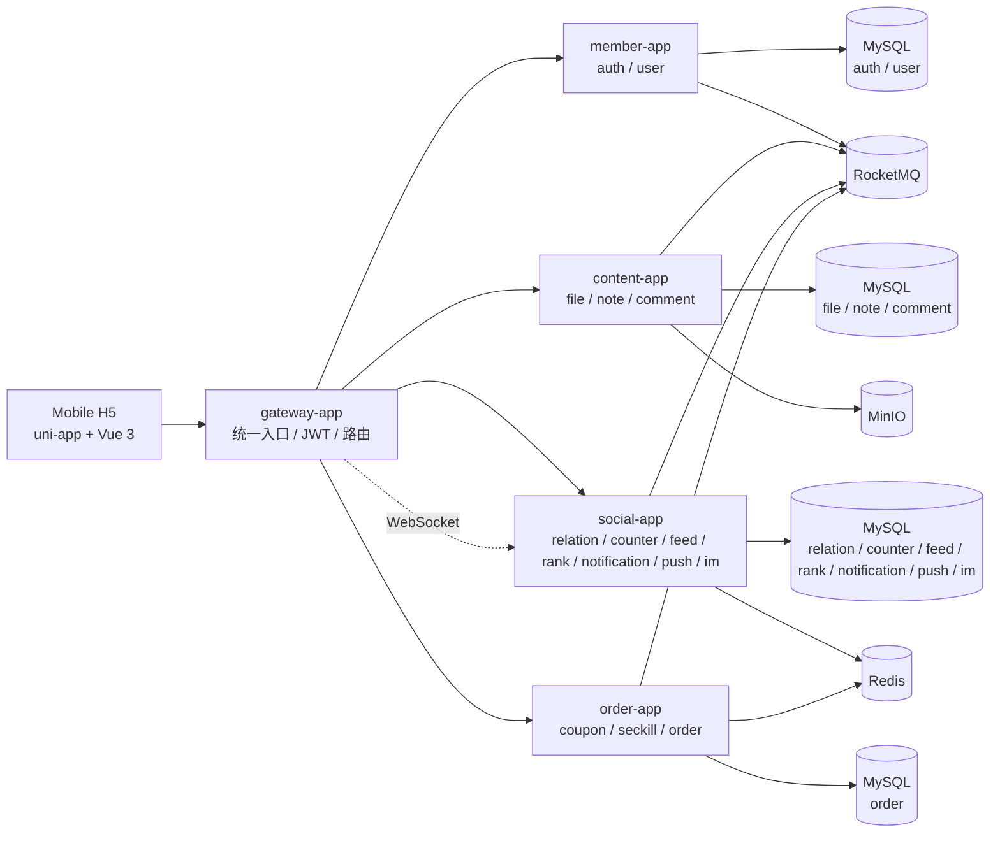
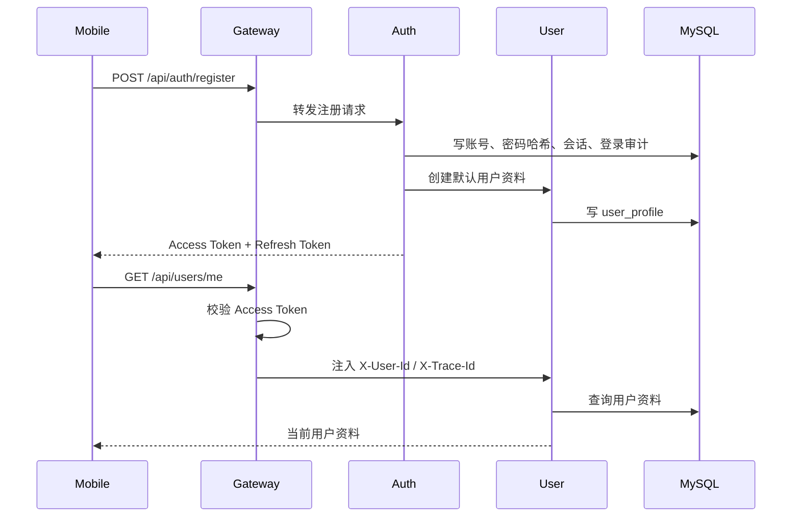
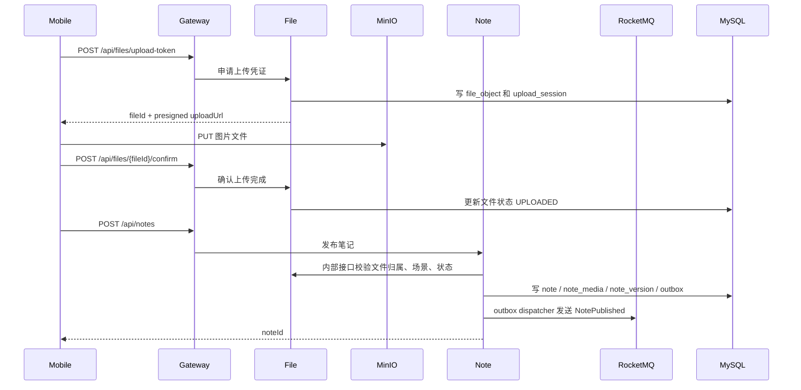
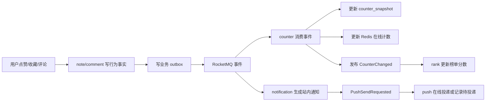
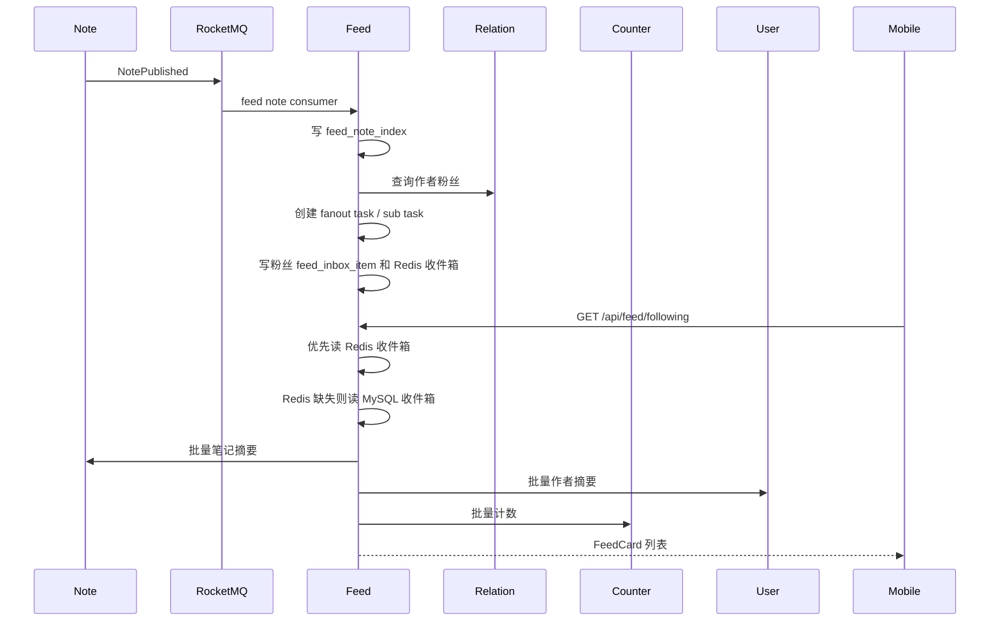
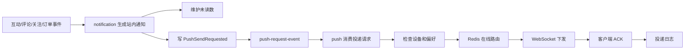
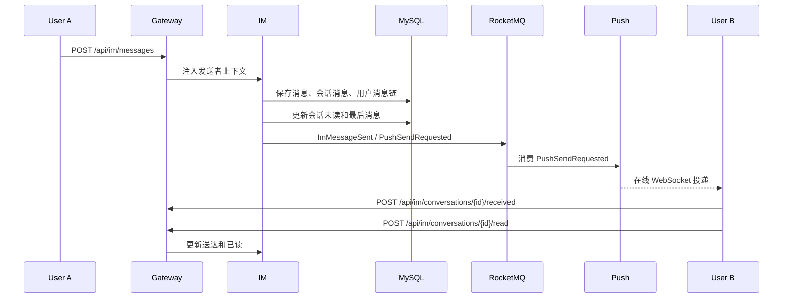
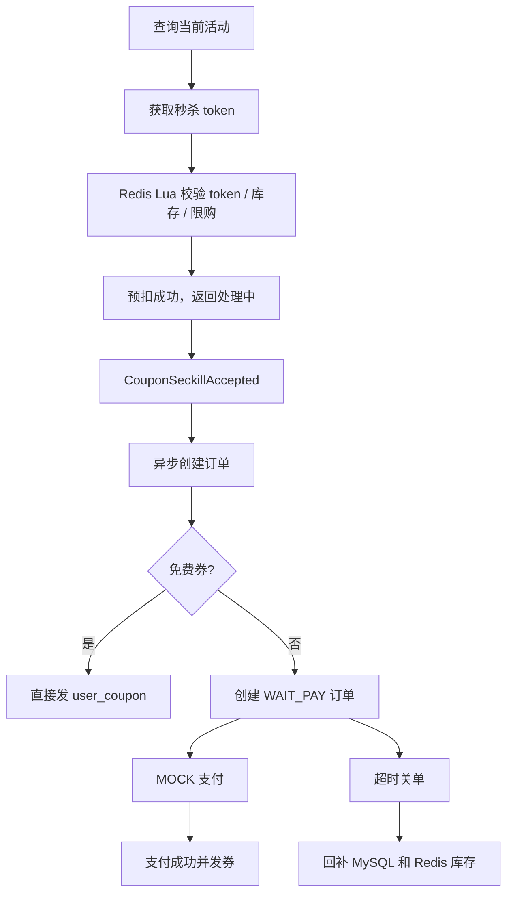
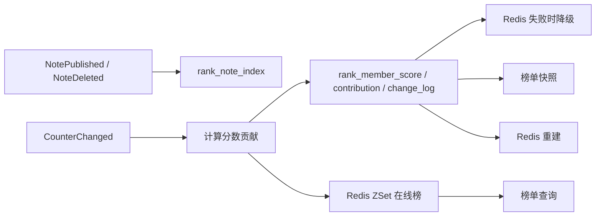

# BlueNote 架构与核心业务流程讲解

版本：v0.1
状态：GitHub 展示与项目讲解文档
更新时间：2026-06-13

## 1. 文档目标

本文用于把 BlueNote 的架构、服务边界、技术选型和核心业务流程讲清楚。它面向两类读者：

1. 想快速理解项目整体设计的人。
2. 想把项目作为后端实习项目，在简历或面试里讲清楚的人。

本文不列完整接口字段，完整字段以 `docs/contracts/` 为准。

## 2. 项目定位

BlueNote 是一个移动端社区类项目，业务上类似“图片笔记 + 关注关系 + 互动通知 + 私信 + 活动订单 + 排行榜”的组合。

它不是为了证明“功能列表很长”，而是为了展示一个后端项目如何处理这些常见工程问题：

1. 移动端请求如何统一进入后端。
2. 登录态如何校验并传给下游服务。
3. 图片如何直传对象存储。
4. 笔记、评论、关注、订单等事实数据如何归属。
5. 计数、Feed、通知、榜单这些读模型如何通过事件异步构建。
6. Redis 如何用作缓存和在线读模型，而不是唯一事实来源。
7. RocketMQ 重复投递、失败重试和 outbox 如何处理。
8. 秒杀订单如何避免超卖、重复下单和状态错乱。

## 3. 总体架构



架构上有三个重点：

1. **统一入口**：移动端只通过 gateway 调用外部 API。
2. **逻辑边界**：auth、user、note、comment、relation、counter、feed、rank、notification、push、im、order 都是独立逻辑服务。
3. **物理合并**：为了个人项目和本地运行成本，多个低流量逻辑服务合并在同一个 Spring Boot 应用里。

## 4. 逻辑服务与物理应用

| 物理应用 | 逻辑服务 | 为什么这样放 |
|---|---|---|
| gateway-app | gateway | 公网入口、路由和鉴权需要独立 |
| member-app | auth、user | 登录和用户资料关联紧密，初期可合并 |
| content-app | file、note、comment | 内容、图片元数据和评论都围绕笔记主链路 |
| social-app | relation、counter、feed、rank、notification、push、im | 社交互动、分发、触达和单聊事件关系紧密，个人项目先合并 |
| order-app | order | 交易域状态机、库存和支付语义独立 |

这样设计的取舍：

1. 如果完全单体，项目很容易变成“所有模块互相查表”的大应用。
2. 如果完全拆十几个进程，本地运行和小服务器部署成本太高。
3. 当前方案保留逻辑服务、schema、接口和事件边界，同时把物理进程数量控制在个人项目能承受的范围。

## 5. 数据归属原则

BlueNote 的数据设计坚持一个原则：**谁拥有业务事实，谁负责主写。**

| 数据对象 | 主写服务 | 说明 |
|---|---|---|
| 登录账号、密码、会话 | auth | 密码哈希、Refresh Token 和登录审计不暴露给 user |
| 用户资料 | user | 昵称、头像、简介、主页背景 |
| 文件元数据 | file | 对象存储 key、上传状态、业务绑定 |
| 笔记 | note | 标题、正文、媒体、可见性、点赞收藏明细 |
| 评论 | comment | 一级评论、回复、评论点赞 |
| 关注关系 | relation | 关注、取关、粉丝和关注列表 |
| 计数快照 | counter | 点赞数、收藏数、评论数、关注数、粉丝数等聚合值 |
| Feed 收件箱 | feed | 关注页读模型和投递任务 |
| 通知 | notification | 站内通知记录、聚合通知、未读数 |
| 设备和投递 | push | 设备、偏好、在线路由、投递日志 |
| IM 会话和消息 | im | 会话、消息、未读、已读、送达 |
| 订单和券 | order | 活动、库存、订单、支付、用户券 |
| 榜单分数 | rank | 榜单定义、成员分数、贡献记录和快照 |

跨服务协作有两种方式：

1. 查询类即时结果：走内部接口，例如批量用户摘要、批量笔记摘要、批量计数。
2. 状态变化扩散：走 RocketMQ 事件，例如 `NotePublished`、`UserFollowed`、`CounterChanged`、`CouponIssued`。

项目禁止跨 schema join，因为这会把逻辑服务边界打穿。即使多个 schema 在同一个 MySQL 实例，也按服务边界约束访问方式。

## 6. 为什么使用这些技术

| 技术 | 在项目中的角色 | 选型原因 |
|---|---|---|
| Spring Cloud Gateway | API 网关 | 统一鉴权、路由、上下文传递，隐藏内部服务结构 |
| MySQL | 业务事实库 | 订单、用户、笔记、关系、消息等核心事实需要可靠落库 |
| Redis | 缓存和在线读模型 | 适合计数、Feed 收件箱、榜单 ZSet、在线设备、秒杀库存 |
| RocketMQ | 业务事件和异步任务 | 适合计数、Feed、通知、订单等业务消息场景 |
| Outbox | 可靠事件发送 | 解决“业务表写成功但消息发送失败”的一致性问题 |
| MinIO | 对象存储 | 图片不进 MySQL，移动端直传对象存储，后端保存元数据 |
| uni-app H5 | 移动端展示 | 让项目不只是后端接口，也能看到真实移动端主链路 |

关键边界：

1. Redis 不保存不可恢复的唯一业务事实。
2. MQ 事件可能重复、乱序或失败，消费者必须幂等。
3. Outbox 只保证最终发送，不替代消费者幂等。
4. 个人项目当前不引入 Seata、Kafka、Elasticsearch、Flink 和 Kubernetes。

## 7. 流程一：注册登录与用户上下文



设计要点：

1. 网关负责校验 Access Token。
2. 下游业务服务读取网关注入的用户上下文 Header。
3. auth 负责登录凭证和会话，user 负责展示资料。
4. 注册时创建默认用户资料，避免登录成功但用户资料不存在。

可讲点：

1. Access Token 短有效期，Refresh Token 支持轮换。
2. 密码使用 BCrypt 哈希。
3. 登录审计、设备会话和用户资料分表保存。

## 8. 流程二：图片上传与笔记发布



设计要点：

1. 图片二进制不经过后端应用转发，移动端直传 MinIO。
2. 后端保存文件元数据和上传会话。
3. 发布笔记时必须校验 fileId 是否属于当前用户、是否已上传完成、场景是否匹配。
4. 笔记发布成功后写 outbox，由 dispatcher 异步发送 `NotePublished`。

可讲点：

1. 预签名上传减少后端带宽压力。
2. 上传确认避免业务引用未上传成功的文件。
3. 文件绑定关系让同一个 file 服务支持笔记图片、头像和主页封面。

## 9. 流程三：互动、计数、通知和榜单



设计要点：

1. 点赞、收藏、评论先写各自的行为事实表。
2. 计数不是在互动写接口里同步强更新所有展示字段，而是由 counter 消费事件聚合。
3. counter 生成 `CounterChanged` 后，rank 再消费计数变化更新榜单。
4. notification 独立维护通知读模型和未读数。

counter 查询优先级：

```text
Redis 在线计数
  -> MySQL counter_snapshot
  -> 来源服务回源
  -> 回填 MySQL 快照和 Redis
```

可讲点：

1. 点赞收藏必须有明细表，否则无法判断用户是否已点赞，也无法重建计数。
2. Redis 计数用于高频读写，但 MySQL 快照和来源服务保证可恢复。
3. MQ 消费用消费记录和业务唯一约束保证幂等。
4. 排行榜消费 `CounterChanged`，避免直接耦合所有互动行为明细。

## 10. 流程四：关注页 Feed



设计要点：

1. 作者发布笔记后，feed 服务消费 `NotePublished` 建立轻量索引。
2. 普通作者采用写扩散，把笔记投递到粉丝收件箱。
3. 关注作者后，feed 会补作者近期公开笔记。
4. 取关、笔记删除、私密、下架后，feed 会清理或标记不可见。
5. 读路径优先 Redis，再 MySQL，再必要时降级回源。

可讲点：

1. Feed 是典型读模型，不是笔记事实来源。
2. 收件箱适合关注页这种“我关注的人发布了什么”场景。
3. 大 V 推拉结合、清理任务后台化和失败任务批量补偿是后续演进，不在当前个人项目强行做满。

## 11. 流程五：通知、Push 和实时投递



设计要点：

1. notification 负责站内通知，不负责 WebSocket 连接。
2. push 负责设备、偏好、投递请求、在线路由和投递日志。
3. 移动端登录后注册设备并建立 WebSocket。
4. 真实厂商离线 Push 当前是后续扩展点，项目已经完成在线投递基础。

可讲点：

1. 通知和 Push 分离，避免通知服务被具体通道实现绑死。
2. Push 投递失败不影响业务事实，客户端仍能通过通知列表、IM 消息列表或订单详情拉取最终状态。
3. 用户偏好、免打扰、IM 预览这些都应该在 push 或 im 边界处理。

## 12. 流程六：IM 单聊



设计要点：

1. IM 消息先入库，再投递。
2. `clientMsgId` 可用于发送幂等，避免移动端重试产生重复消息。
3. 会话列表、消息列表和未读数都从 IM 服务获取。
4. Push 只负责提醒和下发，不保存 IM 消息事实。

可讲点：

1. 消息系统最重要的是不丢消息，所以不能先投递再落库。
2. 未读数可以 Redis 加速，但 MySQL 需要能兜底重建。
3. 当前实现是单聊文字消息 foundation，群聊、撤回、编辑、富媒体是后续扩展。

## 13. 流程七：神券秒杀订单



设计要点：

1. 活动开始前预热库存到 Redis。
2. 用户先获取秒杀 token，减少直接刷抢券接口。
3. Redis Lua 原子完成 token 校验、库存扣减和用户限购。
4. 抢券入口返回“处理中”，订单消费者异步落 MySQL。
5. 免费券直接发券，付费券进入 WAIT_PAY。
6. MOCK 支付用于个人项目跑通购买逻辑。
7. 超时关单通过状态机 CAS 关闭订单并回补库存。
8. 库存不一致时支持 Redis 重建和库存对账修复。

可讲点：

1. Redis 承担高并发入口削峰，MySQL 仍是最终事实。
2. 一人一券依赖 Redis 限购和 MySQL 唯一约束双保险。
3. 支付成功和超时关单并发时，需要状态机 CAS 避免重复发券或错误回补。

## 14. 流程八：排行榜



设计要点：

1. `NotePublished` 只建立候选索引，不直接代表上榜。
2. `CounterChanged` 驱动热度分和成长分变化。
3. Redis ZSet 用于在线排名。
4. MySQL 保存分数事实、贡献记录和变更日志。
5. 笔记删除、私密或下架会暂停贡献并从榜单移除。

可讲点：

1. 榜单不是强一致场景，可以接受秒级延迟。
2. Redis 适合 Top 榜读写，但必须有 MySQL 快照和重建能力。
3. 分数贡献记录能解释“为什么这个成员有这个分”，便于排查和扣回。

## 15. Outbox 和消费幂等

BlueNote 中很多写操作都会写 outbox。基本模式是：

```text
本地事务：
  写业务事实表
  写 outbox_event

异步 dispatcher：
  扫描 INIT / FAILED
  发送 RocketMQ
  成功标记 SENT
  失败记录 retry_count 和 next_retry_at

消费者：
  根据 eventId + consumerGroup 做幂等记录
  再执行业务处理
  失败可重试
```

为什么需要 outbox：

1. 如果业务写库成功但 MQ 发送失败，下游永远不知道这次变化。
2. 如果先发 MQ 再写库，下游可能消费到一个还没提交的事实。
3. 本地事务 + outbox 是个人项目能落地、复杂度可控的最终一致方案。

为什么消费者仍要幂等：

1. MQ 可能重复投递。
2. dispatcher 可能重复发送。
3. 消费者处理成功但返回失败，也可能被重试。
4. 业务唯一约束和状态机 CAS 仍然是最后防线。

## 16. 降级和重建思路

BlueNote 中很多“读起来很快”的数据都不是唯一事实来源。

| 数据 | 快速读 | 事实或重建来源 |
|---|---|---|
| 笔记计数 | Redis Hash | `counter_snapshot`、点赞收藏评论明细、来源接口 |
| 用户计数 | Redis Hash | relation/note/comment 来源和 counter 快照 |
| Feed 收件箱 | Redis ZSet | MySQL 收件箱、关注关系、作者近期笔记 |
| 通知未读数 | Redis 缓存 | `notification_unread_counter` |
| 在线设备 | Redis 路由 | WebSocket 连接心跳和设备表 |
| 排行榜 | Redis ZSet | rank 分数事实和快照 |
| 秒杀库存 | Redis Key | MySQL 活动库存和库存流水 |
| IM 未读 | Redis 加速可扩展 | IM 会话成员和用户消息链 |

这套思路适合面试表达：

1. 快速读数据可以放 Redis。
2. Redis 失效不能导致业务事实丢失。
3. 需要有 MySQL 快照、行为明细、重建任务或回源降级。
4. 项目中每个缓存都要能说清楚写入方、读取方、TTL 和重建方式。

## 17. 当前非目标

为了让个人项目真实可信，必须清楚说明当前还没有做什么。

| 能力 | 当前状态 | 为什么没有强行做 |
|---|---|---|
| 真实支付 | 使用 MOCK 支付 | 个人项目不适合直接接真实资金流，先验证订单状态机 |
| 真实离线 Push | 完成设备、偏好、WebSocket 在线投递和日志，厂商通道待扩展 | 厂商 Push 需要平台凭证和真机环境 |
| 推荐系统 | 未实现 | 推荐需要行为埋点、召回、排序和评估，不适合作为当前收口重点 |
| 全文搜索 | 未引入 Elasticsearch | 当前重点是社区主链路，搜索可后续单独设计 |
| 生产监控告警 | 文档有方案，配置未完整落地 | GitHub 展示阶段优先保证本地可运行和架构可讲 |
| 自动化测试 | 仍是短板 | 当前有编译、移动端构建和主链路冒烟，后续应补集成测试 |

这样的边界会让项目更可信。后端实习面试并不要求个人项目真的达到生产规模，但要求你知道离生产还差什么。

## 18. 总结

BlueNote 的架构可以用一句话概括：

```text
用个人项目可运行的复杂度，实现一个契约优先、服务边界清楚、事件驱动、Redis 可重建读模型明确的社区类后端系统。
```

如果要向面试官介绍，建议围绕四条主线：

1. 内容主链路：登录、文件上传、发笔记、评论和互动。
2. 社交分发链路：关注、Feed、计数、通知和榜单。
3. 实时链路：设备、WebSocket、Push 请求和 IM 单聊。
4. 交易链路：秒杀 token、Redis Lua、异步下单、支付和超时关单。

每条链路都说清楚“事实在哪里、读模型在哪里、事件怎么流、失败怎么补”，这就是这个项目最适合后端实习展示的地方。
