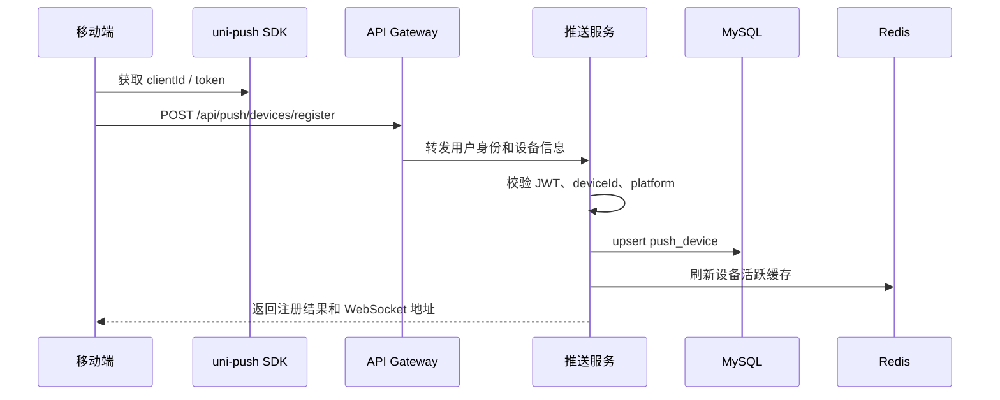
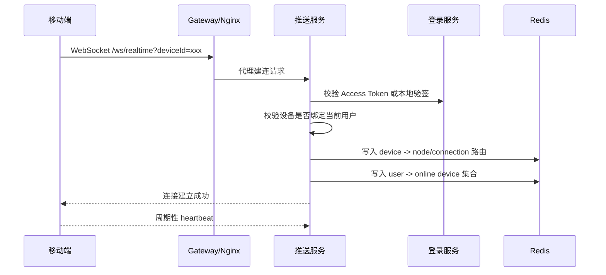
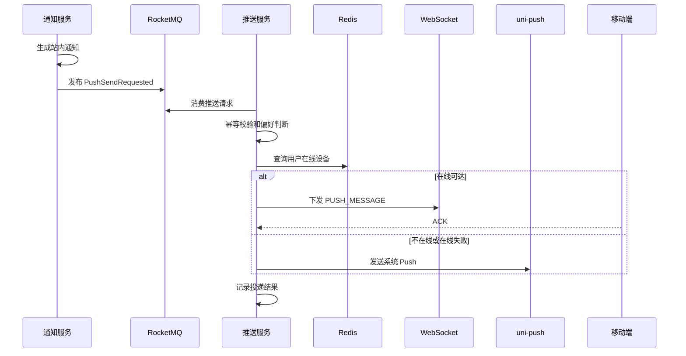
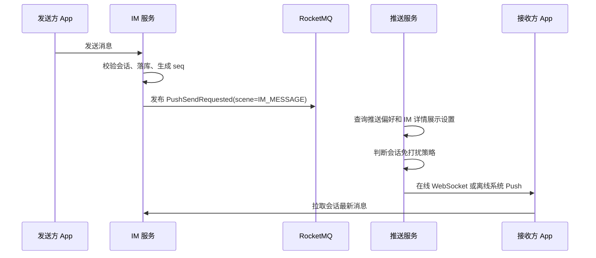
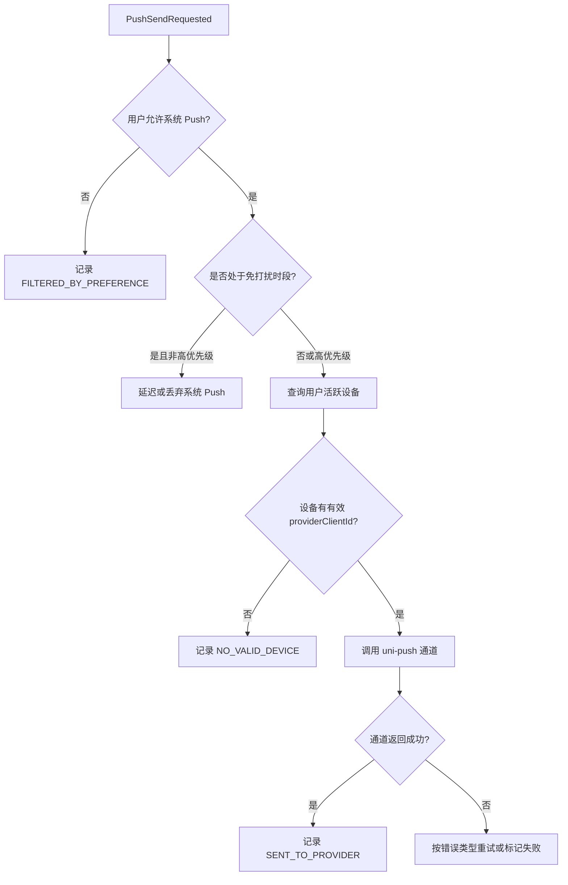
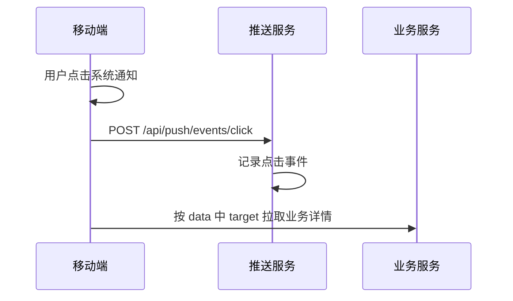
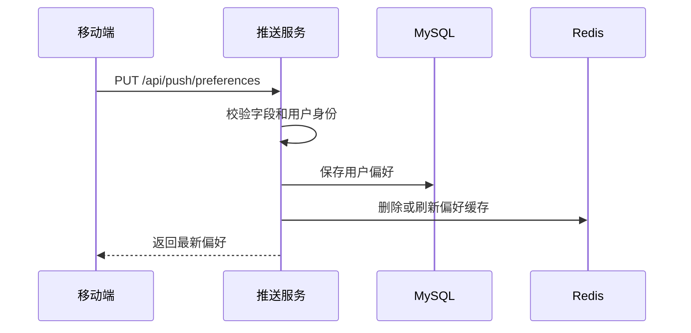

# BlueNote 推送与实时投递服务设计

## 1. 背景与目标

推送与实时投递服务负责 BlueNote 的统一下行投递能力。它不产生点赞、评论、关注、IM 消息、订单状态等业务事实，也不负责通知中心列表，而是为这些业务服务提供统一的在线实时提醒、离线系统通知、设备管理、用户推送偏好、投递日志和失败重试能力。

在移动端应用中，用户可能处于三种典型状态：

| 用户状态 | 说明 | 投递方式 |
|---|---|---|
| App 前台在线 | App 正在运行，并保持实时连接 | WebSocket 在线投递 |
| App 后台或被系统挂起 | App 不一定能维持自建长连接 | 厂商 Push / uni-push 离线通道 |
| 用户重新打开 App | 实时投递可能失败或延迟 | 业务服务接口拉取补偿 |

因此 BlueNote 的投递体系不能只依赖 WebSocket，也不能把离线 Push 当成强一致消息通道。正确的设计是：

```text
业务事实服务落库
  -> 业务服务或通知服务生成 PushSendRequested
  -> 推送服务按用户设备、在线状态、推送偏好选择通道
  -> 在线用户尝试 WebSocket 下发
  -> 离线或需要系统提醒时走 uni-push / 厂商 Push
  -> 用户点击或打开 App 后，再到业务服务拉取详情
```

设计目标：

1. 提供统一的设备注册、解绑、设备状态和推送 token 管理能力。
2. 支持用户级推送偏好，包括全局开关、通知类型开关、IM 预览开关和免打扰设置。
3. 支持小规模 WebSocket 在线实时投递，满足通知角标刷新、IM 新消息提示、订单状态提醒等场景。
4. 支持离线提醒，第一阶段通过 uni-push 2.0 或其封装的厂商通道完成，不自研完整 APNs、FCM、华为、小米、OPPO、vivo 等多通道直连接入。
5. 提供内部统一投递接口和 `push-request-event` 消费能力，避免通知、IM、订单等服务分别对接推送通道。
6. 保存投递请求、投递结果和失败原因，便于排查、重试和统计。
7. 明确 Push 只负责提醒和投递，不作为业务事实来源。
8. 支持后续演进为独立 Push Gateway / Realtime Gateway。

关键约束：

1. MySQL 中的业务表仍然是通知、IM、订单等业务事实来源。
2. 推送服务的投递成功不代表业务已读、消息已读或订单已处理。
3. 厂商 Push、系统通知栏、WebSocket 都可能丢失、延迟或被用户关闭，客户端必须通过业务接口拉取补偿。
4. 推送 payload 只携带必要摘要和跳转参数，不传完整业务上下文和敏感数据。
5. 第一阶段用户量很小，但服务边界、接口、幂等、日志和扩展点按企业级设计。

## 2. 功能范围

### 2.1 第一阶段支持

| 功能 | 说明 |
|---|---|
| 设备注册 | 移动端登录后上报 `deviceId`、平台、App 版本、uni-push `clientId` 等信息 |
| 设备解绑 | 用户退出登录、卸载后重装、token 失效时解除设备绑定 |
| 多设备支持 | 同一用户可绑定多个设备，推送策略支持全部设备或最近活跃设备 |
| WebSocket 在线连接 | App 前台在线时建立实时连接，用于轻量提醒和角标刷新 |
| 在线状态维护 | Redis 保存用户和设备在线状态，MySQL 保存设备事实 |
| 离线 Push | 通过 uni-push 2.0 / 厂商 Push 通道发送系统通知栏提醒 |
| 统一投递请求 | 通知、IM、订单等服务通过内部接口或 MQ 请求推送 |
| 投递策略 | 支持在线优先、离线 Push、在线+离线、仅站内不 Push 等策略 |
| 用户推送偏好 | 支持全局开关、互动通知、关注通知、系统通知、订单通知、IM 消息开关 |
| IM 内容预览设置 | 支持“显示消息详情”和“隐藏消息详情”两种策略 |
| 会话免打扰配合 | IM 服务传入会话免打扰结果或 Push 服务查询 IM 内部接口 |
| 免打扰时间段 | 第一阶段支持简单夜间免打扰配置 |
| 投递幂等 | 按 `requestId`、`sourceBizType`、`sourceBizId` 去重 |
| 投递日志 | 保存每次投递请求、通道尝试、失败原因和最终状态 |
| 点击回传 | 移动端点击系统通知后上报点击事件，用于日志和后续统计 |
| 限流保护 | 对单用户、单设备、单业务来源做推送频率限制 |
| 通道抽象 | 默认接 uni-push，后续可替换为 APNs、FCM、厂商 Push 直连或第三方聚合服务 |

### 2.2 第一阶段不支持

| 功能 | 暂不支持原因 |
|---|---|
| 自研完整海量 Push 集群 | 当前用户量和机器资源不需要独立 pusher 集群、Push Gateway 和复杂路由 |
| 直接对接所有厂商 Push SDK | 维护成本高，第一阶段通过 uni-push 聚合通道降低复杂度 |
| 精准营销推送 | 需要运营后台、用户分群、推荐策略和合规审计 |
| 大规模全量广播 | 第一阶段只支持小规模系统通知，避免对用户造成打扰 |
| 富媒体 Push | 图片、大图、按钮等富通知后续再接入 |
| 短信、邮件 | 成本和合规复杂度较高，暂不作为第一阶段目标 |
| WebSocket 承载完整 IM 上行协议 | 第一阶段推送服务只做统一下行投递，IM 发消息接口仍由 IM 服务负责 |
| 强保证投递 | Push 是提醒通道，不承诺必达；业务一致性由业务服务拉取补偿保证 |

### 2.3 后续扩展

后续可以扩展：

1. 将 WebSocket 部分拆成独立 `bluenote-realtime-gateway`。
2. 直接接入 APNs、FCM、华为、小米、OPPO、vivo、荣耀等厂商 Push。
3. 支持标签推送、用户分群、运营活动推送和灰度推送。
4. 支持富媒体 Push、通知操作按钮、通知分组。
5. 支持 Push 到达、展示、点击、关闭等更完整的回执统计。
6. 支持多节点连接路由、长连接平滑迁移、连接 drain 和灰度发布。
7. 支持端到端加密消息摘要，提升 IM 隐私能力。
8. 支持短信、邮件、站外消息等多通道触达。

## 3. 服务边界

### 3.1 推送服务负责

推送服务负责：

1. 移动端设备注册、绑定、解绑。
2. uni-push `clientId`、厂商 token、平台和 App 版本等设备投递信息管理。
3. WebSocket 建连鉴权、心跳、断开和在线状态维护。
4. 用户推送偏好和隐私设置。
5. 内部统一推送请求接入。
6. 按场景选择在线投递、离线 Push 或仅记录不下发。
7. 推送 payload 规范校验、大小限制和敏感字段拦截。
8. 投递幂等、失败重试、限流和熔断。
9. 投递日志、通道尝试日志和点击回传记录。
10. 对外发布投递结果事件，供通知、IM、订单和运营后续使用。

### 3.2 非推送服务职责

推送服务不负责：

1. 生成站内通知列表。
2. 保存点赞、收藏、评论、关注等互动事实。
3. 保存 IM 消息正文、会话、消息序号和聊天未读数。
4. 判断订单是否支付、取消或超时关闭。
5. 判断某条通知是否已读。
6. 判断某条 IM 消息是否已读。
7. 生成复杂业务文案和业务详情页数据。
8. 承担推荐、营销分群和运营策略。
9. 在移动端未登录时为用户发送业务 Push。

### 3.3 与通知服务的边界

通知服务负责站内通知事实和通知中心体验：

1. 消费点赞、收藏、评论、关注、系统事件。
2. 生成通知记录。
3. 维护通知聚合、已读、未读和删除状态。
4. 决定某类通知是否需要请求 Push。
5. 发布 `NotificationCreated` 和 `PushSendRequested`。

推送服务只负责投递：

1. 接收通知服务的推送请求。
2. 根据用户设置、设备状态和通道状态决定是否投递。
3. 投递内容只包含通知摘要和 `notificationId`。
4. 用户点击后由移动端调用通知服务拉取详情。

### 3.4 与 IM 服务的边界

IM 服务负责聊天业务事实：

1. 会话、成员、消息、消息序号、消息 ACK。
2. 聊天未读数。
3. 单聊、群聊、会话免打扰、仅 @ 我等聊天策略。
4. 生成 IM 消息推送摘要和跳转参数。

推送服务负责下行提醒：

1. 在线时通过 WebSocket 发送 `IM_MESSAGE` 提醒。
2. 离线时通过系统 Push 发送消息预览或“你收到一条新消息”。
3. 根据用户“显示消息详情”设置决定是否展示 IM 文本摘要。
4. 不保存 IM 完整正文，不参与会话消息排序。

第一阶段可以采用：

```text
移动端发送 IM 消息
  -> 调用 IM 服务发送接口
  -> IM 服务落库并生成消息序号
  -> IM 服务发布 PushSendRequested
  -> 推送服务向接收方设备投递提醒
  -> 接收方打开会话后从 IM 服务拉取消息详情
```

### 3.5 与订单服务的边界

订单服务负责订单事实和状态机：

1. 订单创建、支付、取消、关闭。
2. 支付回调验签。
3. 超时关单。
4. 订单详情查询。

推送服务只负责订单提醒：

1. 支付成功提醒。
2. 订单关闭提醒。
3. 退款或售后状态提醒，后续扩展。

移动端点击订单 Push 后，必须调用订单服务查询最新订单状态。

### 3.6 依赖关系

| 依赖 | 方式 | 用途 |
|---|---|---|
| 登录服务 | 同步接口 / JWT 校验 | WebSocket 建连鉴权、设备绑定用户 |
| 用户服务 | 同步接口 | 校验用户状态、获取用户是否禁用 |
| 通知服务 | MQ / 内部接口 | 接收站内通知投递请求 |
| IM 服务 | MQ / 内部接口 | 接收 IM 消息投递请求、查询会话免打扰后续 |
| 订单服务 | MQ / 内部接口 | 接收订单状态提醒请求 |
| Redis | 存储 | 在线状态、连接路由、偏好缓存、限流、幂等短缓存 |
| MySQL | 存储 | 设备、偏好、投递请求、投递日志 |
| RocketMQ | 消息 | 接收 `push-request-event`，发布 `push-event` |
| uni-push / 厂商 Push | 外部通道 | 离线系统通知栏提醒 |
| Nacos | 配置 | 通道开关、限流阈值、供应商配置 |

## 4. 核心概念

### 4.1 推送请求

推送请求是业务服务提交给推送服务的一次投递意图。

| 字段 | 说明 |
|---|---|
| `requestId` | 请求唯一 ID，业务方生成或推送服务生成 |
| `sourceService` | 来源服务，例如 `bluenote-notification`、`bluenote-im` |
| `sourceBizType` | 来源业务类型，例如 `NOTIFICATION`、`IM_MESSAGE`、`ORDER` |
| `sourceBizId` | 来源业务 ID，例如 `notificationId`、`messageId`、`orderId` |
| `scene` | 投递场景，例如 `COMMENT_NOTIFICATION`、`IM_MESSAGE` |
| `targetUserId` | 接收用户 |
| `targetDevicePolicy` | 目标设备策略 |
| `deliveryStrategy` | 投递策略 |
| `title` | 系统通知标题或在线消息标题 |
| `body` | 系统通知摘要 |
| `data` | 跳转参数和轻量业务参数 |
| `priority` | 优先级 |
| `expireAt` | 过期时间 |

推送请求不是业务事实。即使请求失败，通知、IM 消息、订单状态仍然以对应业务服务为准。

### 4.2 设备

设备是移动端安装实例和用户登录关系的投递载体。

| 概念 | 说明 |
|---|---|
| `deviceId` | BlueNote 自定义设备 ID，App 首次启动生成并持久化 |
| `userId` | 当前绑定用户，退出登录后解除或标记解绑 |
| `platform` | `IOS`、`ANDROID`、`H5` |
| `pushProvider` | `UNI_PUSH`、`APNS`、`FCM`、`HUAWEI` 等 |
| `providerClientId` | uni-push clientId 或厂商 Push token |
| `appVersion` | App 版本 |
| `status` | `ACTIVE`、`UNBOUND`、`DISABLED` |

同一用户允许多个设备同时在线。第一阶段默认对用户所有活跃设备投递，后续可配置只投最近活跃设备。

### 4.3 在线连接

在线连接是 App 与推送服务之间的 WebSocket 会话。

| 概念 | 说明 |
|---|---|
| `connectionId` | 单次 WebSocket 连接 ID |
| `nodeId` | 推送服务实例 ID |
| `deviceId` | 绑定设备 |
| `userId` | 绑定用户 |
| `sessionId` | 登录会话 ID，可来自登录服务 |
| `lastHeartbeatAt` | 最近心跳时间 |
| `connectionStatus` | `CONNECTED`、`DISCONNECTED`、`EXPIRED` |

在线连接信息以 Redis 为主，不作为长期事实保存。MySQL 可以保存连接日志用于排查，但不依赖它判断在线。

### 4.4 投递通道

| 通道 | channel | 说明 |
|---|---|---|
| WebSocket | `WEBSOCKET` | App 前台在线实时下发 |
| uni-push | `UNI_PUSH` | 第一阶段主要离线 Push 通道 |
| APNs | `APNS` | iOS 原生通道，后续可直连 |
| FCM | `FCM` | 海外 Android 通道，后续可直连 |
| 厂商 Push | `VENDOR_PUSH` | 国内 Android 厂商通道，后续可直连 |

第一阶段服务内部用通道适配器封装：

```text
PushChannelAdapter
  -> WebSocketChannelAdapter
  -> UniPushChannelAdapter
  -> ApnsChannelAdapter        后续
  -> FcmChannelAdapter         后续
  -> VendorPushChannelAdapter  后续
```

### 4.5 投递策略

| 策略 | 说明 |
|---|---|
| `ONLINE_ONLY` | 只投在线 WebSocket，不走系统 Push |
| `OFFLINE_PUSH_ONLY` | 只走离线系统 Push |
| `ONLINE_THEN_OFFLINE` | 在线优先，在线不可达时走离线 Push |
| `ONLINE_AND_OFFLINE` | 在线提醒和系统 Push 都发送，适合高优先级订单等少量场景 |
| `NO_PUSH` | 只生成业务记录，不触发 Push |

默认策略：

| 场景 | 默认策略 |
|---|---|
| 点赞、收藏 | `ONLINE_THEN_OFFLINE`，但受用户互动通知开关和聚合策略限制 |
| 评论、回复 | `ONLINE_THEN_OFFLINE` |
| 关注 | `ONLINE_THEN_OFFLINE` |
| 系统公告 | 根据优先级选择 `ONLINE_THEN_OFFLINE` 或 `NO_PUSH` |
| IM 单聊 | `ONLINE_THEN_OFFLINE` |
| 订单状态 | `ONLINE_AND_OFFLINE` 或 `ONLINE_THEN_OFFLINE`，由订单服务指定 |

### 4.6 用户推送偏好

第一阶段支持的偏好：

| 偏好 | 默认值 | 说明 |
|---|---|---|
| 全局 Push 开关 | 开 | 关闭后不发送系统 Push，但站内通知仍生成 |
| 互动通知 Push | 开 | 点赞、收藏、评论、回复 |
| 关注通知 Push | 开 | 新关注提醒 |
| 系统通知 Push | 开 | 审核、下架、公告 |
| 订单通知 Push | 开 | 支付、关闭、退款后续 |
| IM 消息 Push | 开 | 单聊和群聊消息提醒 |
| 显示 IM 消息详情 | 开 | 开启显示文本摘要，关闭只显示“你收到一条新消息” |
| 夜间免打扰 | 关 | 开启后在配置时间段内降低普通 Push |

站内通知和 IM 消息不受系统 Push 开关影响：

```text
用户关闭点赞 Push
  -> 通知服务仍生成点赞通知
  -> 未读数仍增加
  -> 推送服务不发送系统通知栏提醒
```

### 4.7 推送内容

推送内容分两层：

1. `display`：给系统通知栏或在线提示展示的标题和摘要。
2. `data`：给客户端点击跳转使用的轻量参数。

普通通知示例：

```json
{
  "scene": "COMMENT_NOTIFICATION",
  "title": "你收到一条新评论",
  "body": "有人评论了你的笔记",
  "data": {
    "notificationId": "n_1001",
    "targetType": "NOTE",
    "targetId": "note_2001"
  }
}
```

IM 消息示例：

```json
{
  "scene": "IM_MESSAGE",
  "title": "张三",
  "body": "今晚几点吃饭？",
  "data": {
    "conversationId": "c_1001",
    "messageId": "m_9001",
    "senderId": "u_123",
    "messageType": "TEXT"
  }
}
```

如果用户关闭 IM 消息详情展示，则推送服务改写为：

```json
{
  "scene": "IM_MESSAGE",
  "title": "BlueNote",
  "body": "你收到一条新消息",
  "data": {
    "conversationId": "c_1001",
    "messageId": "m_9001",
    "messageType": "TEXT"
  }
}
```

推送 payload 不允许携带：

1. 完整 IM 消息历史。
2. 文件下载临时 token。
3. 支付凭证、手机号、地址等敏感数据。
4. 大字段正文。
5. 后端内部权限字段。

## 5. 核心流程

### 5.1 设备注册流程



关键规则：

1. 设备注册必须在用户登录后进行。
2. 同一 `deviceId` 重复注册时更新 `providerClientId`、App 版本和最近活跃时间。
3. 同一设备切换用户登录时，必须解除旧用户绑定，再绑定新用户。
4. `providerClientId` 变化时更新设备投递 token。
5. 服务端不信任移动端传入的 `userId`，以网关注入的登录用户为准。

### 5.2 WebSocket 建连流程



连接只承载轻量控制消息和下行提醒：

1. `HEARTBEAT`：心跳。
2. `PUSH_MESSAGE`：普通下行提醒。
3. `BADGE_CHANGED`：角标或未读数变化提示。
4. `KICK_OUT`：用户禁用、设备被挤下线、token 失效。
5. `ACK`：客户端确认收到在线提醒。

第一阶段不在推送服务中承载完整 IM 上行发消息协议。IM 发消息仍调用 IM 服务接口。

### 5.3 普通通知投递流程



通知服务仍然是通知事实来源。移动端收到 Push 后不直接相信 payload 中的状态，而是：

1. 刷新未读数。
2. 点击后跳转通知页或目标页。
3. 调用通知服务查询通知详情。

### 5.4 IM 消息提醒流程



IM 推送 payload 可以携带消息预览，但必须遵守：

1. 文本消息只携带短摘要。
2. 图片、语音、视频展示为 `[图片]`、`[语音]`、`[视频]`。
3. 用户关闭消息详情时只显示“你收到一条新消息”。
4. 真正消息详情以 IM 服务为准。

### 5.5 离线 Push 流程



离线 Push 只表示请求已提交给通道，不代表用户一定看到。系统可能因为以下原因不展示：

1. 用户关闭系统通知权限。
2. 厂商通道限流。
3. 设备网络不可达。
4. token 失效。
5. 系统省电策略。
6. App 被卸载。

### 5.6 点击回传流程



点击回传用于统计和排查，不作为通知已读或 IM 已读依据。通知已读必须调用通知服务，IM 已读必须调用 IM 服务。

### 5.7 用户偏好更新流程



偏好更新后立即影响新的推送请求。已经提交给厂商通道的 Push 不保证能撤回。

## 6. 异常流程

### 6.1 重复推送请求

同一业务事件可能因为 MQ 重试、业务方重发或接口超时而重复进入推送服务。

处理方式：

1. `requestId` 全局唯一时按 `requestId` 幂等。
2. 没有 `requestId` 时按 `sourceService + sourceBizType + sourceBizId + targetUserId + scene` 建唯一约束。
3. 重复请求返回或记录为 `DUPLICATE`，不重复调用外部 Push 通道。
4. 如果第一次请求处于 `PROCESSING`，第二次请求不抢占，交由补偿任务处理。

### 6.2 用户关闭 Push

用户关闭某类 Push 时：

1. 推送服务记录 `FILTERED_BY_PREFERENCE`。
2. 不调用 WebSocket 和离线 Push 通道。
3. 不影响通知服务生成站内通知。
4. 不影响 IM 服务保存消息和未读数。

### 6.3 设备无效或 token 失效

通道返回设备无效、token 失效、App 已卸载等错误时：

1. 标记设备为 `DISABLED` 或 `TOKEN_INVALID`。
2. 后续不再对该设备投递。
3. 用户重新打开 App 并注册设备后恢复。
4. 保留失败日志便于排查。

### 6.4 WebSocket 路由过期

Redis 中显示用户在线，但实际连接已断开时：

1. 在线投递失败。
2. 清理过期连接路由。
3. 根据策略转离线 Push。
4. 记录 `STALE_CONNECTION`。

### 6.5 通道调用失败

uni-push 或厂商通道失败时按错误类型处理：

| 错误类型 | 处理 |
|---|---|
| 网络超时 | 指数退避重试 |
| 限流 | 延迟重试并触发告警 |
| 参数错误 | 标记失败，不重试 |
| token 无效 | 标记设备 token 失效 |
| 服务不可用 | 熔断通道，转入补偿任务 |

### 6.6 payload 超限

如果业务服务传入标题、摘要或 data 过大：

1. 普通通知摘要截断。
2. IM 文本预览只保留固定长度。
3. data 超限直接拒绝请求并记录 `PAYLOAD_TOO_LARGE`。
4. 不允许把长正文塞入 Push data。

### 6.7 免打扰时间段

免打扰时间段内：

1. IM 单聊可以根据用户设置继续提醒或静默。
2. 点赞、收藏、关注等低优先级提醒默认不发系统 Push。
3. 订单支付、账号安全、系统高优先级通知可以绕过免打扰。
4. 被过滤的请求记录为 `FILTERED_BY_QUIET_HOURS`。

### 6.8 用户被禁用

用户被禁用或账号风险状态变化时：

1. 推送服务消费用户状态事件或由登录服务调用内部接口。
2. 断开 WebSocket 连接。
3. 停止向该用户投递业务 Push。
4. 标记设备绑定状态为不可用或等待重新登录。

### 6.9 MQ 堆积

`push-request-event` 堆积时：

1. 高优先级请求优先处理。
2. 过期请求直接标记 `EXPIRED`。
3. 对低优先级点赞、收藏推送可降级为只保留站内通知。
4. 触发消费延迟告警。

## 7. 存储设计

### 7.1 MySQL 表设计

#### 7.1.1 push_device

用途：保存用户设备与推送通道信息。

| 字段 | 类型 | 说明 |
|---|---|---|
| `id` | BIGINT | 主键 |
| `device_id` | VARCHAR(64) | BlueNote 设备 ID |
| `user_id` | BIGINT | 当前绑定用户 |
| `platform` | VARCHAR(16) | `IOS`、`ANDROID`、`H5` |
| `push_provider` | VARCHAR(32) | `UNI_PUSH`、`APNS`、`FCM` 等 |
| `provider_client_id` | VARCHAR(255) | uni-push clientId 或厂商 token |
| `vendor` | VARCHAR(32) | `APPLE`、`HUAWEI`、`XIAOMI`、`OPPO`、`VIVO` 等 |
| `app_version` | VARCHAR(32) | App 版本 |
| `os_version` | VARCHAR(64) | 系统版本 |
| `device_model` | VARCHAR(128) | 设备型号 |
| `status` | TINYINT | 1 ACTIVE，2 UNBOUND，3 DISABLED，4 TOKEN_INVALID |
| `last_register_at` | DATETIME | 最近注册时间 |
| `last_active_at` | DATETIME | 最近活跃时间 |
| `created_at` | DATETIME | 创建时间 |
| `updated_at` | DATETIME | 更新时间 |
| `deleted` | TINYINT | 逻辑删除 |

约束：

1. `uk_device_id`：`device_id` 唯一。
2. `idx_user_status_active`：`user_id, status, last_active_at`。
3. `idx_provider_client`：`push_provider, provider_client_id`。

#### 7.1.2 push_user_preference

用途：保存用户推送偏好和隐私设置。

| 字段 | 类型 | 说明 |
|---|---|---|
| `id` | BIGINT | 主键 |
| `user_id` | BIGINT | 用户 ID |
| `global_push_enabled` | TINYINT | 全局系统 Push 开关 |
| `interaction_push_enabled` | TINYINT | 互动通知 Push |
| `follow_push_enabled` | TINYINT | 关注通知 Push |
| `system_push_enabled` | TINYINT | 系统通知 Push |
| `order_push_enabled` | TINYINT | 订单通知 Push |
| `im_push_enabled` | TINYINT | IM 消息 Push |
| `im_preview_enabled` | TINYINT | 是否显示 IM 消息详情 |
| `quiet_hours_enabled` | TINYINT | 是否开启免打扰时间段 |
| `quiet_start` | TIME | 免打扰开始 |
| `quiet_end` | TIME | 免打扰结束 |
| `created_at` | DATETIME | 创建时间 |
| `updated_at` | DATETIME | 更新时间 |

约束：

1. `uk_user_id`：`user_id` 唯一。
2. 用户首次注册时可以不立即创建记录，查询时使用默认值，首次修改时落库。

#### 7.1.3 push_request

用途：保存推送请求主记录，用于幂等、重试和排查。

| 字段 | 类型 | 说明 |
|---|---|---|
| `id` | BIGINT | 主键 |
| `request_id` | VARCHAR(64) | 推送请求唯一 ID |
| `source_service` | VARCHAR(64) | 来源服务 |
| `source_biz_type` | VARCHAR(64) | 来源业务类型 |
| `source_biz_id` | VARCHAR(128) | 来源业务 ID |
| `scene` | VARCHAR(64) | 投递场景 |
| `target_user_id` | BIGINT | 接收用户 |
| `target_device_policy` | VARCHAR(32) | 设备策略 |
| `delivery_strategy` | VARCHAR(32) | 投递策略 |
| `priority` | TINYINT | 优先级 |
| `title` | VARCHAR(128) | 标题 |
| `body` | VARCHAR(512) | 摘要 |
| `data_json` | JSON | 跳转参数 |
| `status` | TINYINT | 请求状态 |
| `expire_at` | DATETIME | 过期时间 |
| `first_sent_at` | DATETIME | 首次处理时间 |
| `finished_at` | DATETIME | 完成时间 |
| `fail_reason` | VARCHAR(512) | 失败原因 |
| `retry_count` | INT | 重试次数 |
| `trace_id` | VARCHAR(64) | 链路 ID |
| `created_at` | DATETIME | 创建时间 |
| `updated_at` | DATETIME | 更新时间 |

状态枚举：

| 状态 | 含义 |
|---|---|
| `INIT` | 已接收 |
| `PROCESSING` | 处理中 |
| `SENT` | 至少一个通道提交成功 |
| `FILTERED` | 被用户偏好、免打扰或限流过滤 |
| `FAILED` | 最终失败 |
| `EXPIRED` | 过期未投递 |
| `DUPLICATE` | 重复请求 |

约束：

1. `uk_request_id`：`request_id` 唯一。
2. `uk_source_target`：`source_service, source_biz_type, source_biz_id, target_user_id, scene`。
3. `idx_target_created`：`target_user_id, created_at`。
4. `idx_status_retry`：`status, retry_count, updated_at`。
5. `idx_source_biz`：`source_biz_type, source_biz_id`。

#### 7.1.4 push_delivery_log

用途：保存每个通道、每个设备的投递尝试记录。

| 字段 | 类型 | 说明 |
|---|---|---|
| `id` | BIGINT | 主键 |
| `request_id` | VARCHAR(64) | 推送请求 ID |
| `target_user_id` | BIGINT | 用户 ID |
| `device_id` | VARCHAR(64) | 设备 ID |
| `channel` | VARCHAR(32) | `WEBSOCKET`、`UNI_PUSH` 等 |
| `provider` | VARCHAR(32) | 供应商 |
| `provider_client_id` | VARCHAR(255) | 通道 clientId 或 token，可脱敏存储 |
| `status` | TINYINT | 投递状态 |
| `provider_msg_id` | VARCHAR(128) | 供应商返回消息 ID |
| `error_code` | VARCHAR(64) | 错误码 |
| `error_message` | VARCHAR(512) | 错误摘要 |
| `sent_at` | DATETIME | 发送时间 |
| `acked_at` | DATETIME | 在线 ACK 时间 |
| `clicked_at` | DATETIME | 点击时间 |
| `created_at` | DATETIME | 创建时间 |
| `updated_at` | DATETIME | 更新时间 |

状态枚举：

| 状态 | 含义 |
|---|---|
| `PENDING` | 待发送 |
| `SENT_TO_CONNECTION` | 已写入 WebSocket |
| `ACKED` | 客户端在线 ACK |
| `SENT_TO_PROVIDER` | 已提交离线 Push 通道 |
| `PROVIDER_ACCEPTED` | 供应商接受，后续可由回调更新 |
| `FAILED` | 发送失败 |
| `FILTERED` | 被过滤 |
| `CLICKED` | 用户点击 |

索引：

1. `idx_request`：`request_id`。
2. `idx_user_created`：`target_user_id, created_at`。
3. `idx_device_created`：`device_id, created_at`。
4. `idx_channel_status`：`channel, status, created_at`。
5. `idx_provider_msg`：`provider, provider_msg_id`。

#### 7.1.5 push_event_consume_log

用途：记录 MQ 消费幂等。

| 字段 | 类型 | 说明 |
|---|---|---|
| `id` | BIGINT | 主键 |
| `event_id` | VARCHAR(64) | MQ 事件 ID |
| `topic` | VARCHAR(128) | Topic |
| `event_type` | VARCHAR(64) | 事件类型 |
| `consumer_group` | VARCHAR(128) | 消费组 |
| `status` | TINYINT | 1 PROCESSING，2 SUCCESS，3 FAILED |
| `error_message` | VARCHAR(512) | 错误摘要 |
| `created_at` | DATETIME | 创建时间 |
| `updated_at` | DATETIME | 更新时间 |

约束：

1. `uk_event_consumer`：`event_id, consumer_group` 唯一。
2. `idx_status_updated`：`status, updated_at`。

#### 7.1.6 push_outbox_event

用途：保存推送服务需要发布的事件，保证本地事务与消息发送最终一致。

| 字段 | 类型 | 说明 |
|---|---|---|
| `id` | BIGINT | 主键 |
| `event_id` | VARCHAR(64) | 事件 ID |
| `event_type` | VARCHAR(64) | 事件类型 |
| `aggregate_type` | VARCHAR(64) | 聚合类型 |
| `aggregate_id` | VARCHAR(128) | 聚合 ID |
| `payload_json` | JSON | 事件内容 |
| `status` | TINYINT | 1 INIT，2 SENT，3 FAILED |
| `retry_count` | INT | 重试次数 |
| `next_retry_at` | DATETIME | 下次重试时间 |
| `created_at` | DATETIME | 创建时间 |
| `updated_at` | DATETIME | 更新时间 |

索引：

1. `uk_event_id`：`event_id` 唯一。
2. `idx_status_retry`：`status, next_retry_at`。

### 7.2 索引设计

常用查询与索引对应关系：

| 查询场景 | 索引 |
|---|---|
| 按用户查询活跃设备 | `push_device.idx_user_status_active` |
| 设备重复注册 | `push_device.uk_device_id` |
| 供应商 token 定位设备 | `push_device.idx_provider_client` |
| 查询用户推送偏好 | `push_user_preference.uk_user_id` |
| 推送请求幂等 | `push_request.uk_request_id`、`push_request.uk_source_target` |
| 查询某个业务对象的推送记录 | `push_request.idx_source_biz` |
| 后台重试失败请求 | `push_request.idx_status_retry` |
| 排查某次请求的投递通道 | `push_delivery_log.idx_request` |
| 统计某用户近期投递 | `push_delivery_log.idx_user_created` |
| MQ 消费幂等 | `push_event_consume_log.uk_event_consumer` |

### 7.3 Redis Key 设计

Key 统一前缀：

```text
bluenote:{env}:push:{key}
```

| Key | 类型 | TTL | 说明 |
|---|---|---|---|
| `device:route:{deviceId}` | String | 心跳续期 | 设备在线连接路由，值为 `nodeId:connectionId` |
| `user:online_devices:{userId}` | Set | 心跳续期 | 用户在线设备集合 |
| `connection:{connectionId}` | Hash | 心跳续期 | 连接详情 |
| `device:last_seen:{deviceId}` | String | 7 天 | 设备最近在线时间 |
| `pref:user:{userId}` | Hash | 30 分钟 | 用户推送偏好缓存 |
| `dedupe:request:{requestId}` | String | 24 小时 | 推送请求短期幂等 |
| `rate:user:{userId}:{scene}:{minute}` | String | 2 分钟 | 单用户场景限流 |
| `rate:source:{sourceService}:{minute}` | String | 2 分钟 | 来源服务限流 |
| `provider:circuit:{provider}` | String | 1 分钟 | 供应商通道熔断标记 |
| `retry:lock:{requestId}` | String | 5 分钟 | 重试任务锁 |

Redis 使用规则：

1. 在线状态以 Redis 为准，但必须能从心跳和连接事件重建。
2. 设备事实以 MySQL 为准。
3. 偏好缓存失效后回源 MySQL。
4. Redis 丢失后，所有用户视为离线，后续由 WebSocket 重连恢复在线状态。
5. 限流 Key 只用于保护系统，不作为业务事实。

## 8. 接口设计

### 8.1 移动端接口

所有移动端接口经 Gateway 访问，必须携带登录态。

#### 8.1.1 注册设备

```http
POST /api/push/devices/register
```

请求：

```json
{
  "deviceId": "device_abc",
  "platform": "ANDROID",
  "pushProvider": "UNI_PUSH",
  "providerClientId": "uni_client_id_xxx",
  "vendor": "XIAOMI",
  "appVersion": "1.0.0",
  "osVersion": "Android 14",
  "deviceModel": "Xiaomi 14"
}
```

响应：

```json
{
  "deviceId": "device_abc",
  "registered": true,
  "websocketUrl": "wss://api.bluenote.example.com/ws/realtime"
}
```

#### 8.1.2 解绑设备

```http
POST /api/push/devices/unbind
```

请求：

```json
{
  "deviceId": "device_abc"
}
```

用于退出登录或用户主动解除设备。

#### 8.1.3 查询推送偏好

```http
GET /api/push/preferences
```

响应：

```json
{
  "globalPushEnabled": true,
  "interactionPushEnabled": true,
  "followPushEnabled": true,
  "systemPushEnabled": true,
  "orderPushEnabled": true,
  "imPushEnabled": true,
  "imPreviewEnabled": true,
  "quietHoursEnabled": false,
  "quietStart": "23:00:00",
  "quietEnd": "08:00:00"
}
```

#### 8.1.4 更新推送偏好

```http
PUT /api/push/preferences
```

请求：

```json
{
  "globalPushEnabled": true,
  "interactionPushEnabled": false,
  "followPushEnabled": true,
  "systemPushEnabled": true,
  "orderPushEnabled": true,
  "imPushEnabled": true,
  "imPreviewEnabled": false,
  "quietHoursEnabled": true,
  "quietStart": "23:00:00",
  "quietEnd": "08:00:00"
}
```

#### 8.1.5 点击回传

```http
POST /api/push/events/click
```

请求：

```json
{
  "requestId": "push_req_1001",
  "deviceId": "device_abc",
  "scene": "COMMENT_NOTIFICATION",
  "clickedAt": "2026-06-04T20:00:00+08:00"
}
```

点击回传不等于已读。移动端进入目标页后仍需调用通知服务或 IM 服务接口。

### 8.2 WebSocket 协议

连接地址：

```text
wss://api.bluenote.example.com/ws/realtime?deviceId={deviceId}
```

鉴权：

1. Header 携带 `Authorization: Bearer {accessToken}`。
2. Gateway 支持 WebSocket 升级请求透传。
3. 推送服务校验 token 与设备绑定关系。

服务端下发消息格式：

```json
{
  "packetId": "pkt_1001",
  "packetType": "PUSH_MESSAGE",
  "occurredAt": "2026-06-04T20:00:00+08:00",
  "payload": {
    "requestId": "push_req_1001",
    "scene": "COMMENT_NOTIFICATION",
    "title": "你收到一条新评论",
    "body": "有人评论了你的笔记",
    "data": {
      "notificationId": "n_1001",
      "targetType": "NOTE",
      "targetId": "note_2001"
    }
  }
}
```

客户端 ACK：

```json
{
  "packetType": "ACK",
  "packetId": "pkt_1001",
  "receivedAt": "2026-06-04T20:00:01+08:00"
}
```

心跳：

```json
{
  "packetType": "HEARTBEAT",
  "deviceId": "device_abc",
  "sentAt": "2026-06-04T20:00:00+08:00"
}
```

### 8.3 内部接口

内部接口只允许服务间调用，不对移动端开放。

#### 8.3.1 单用户推送

```http
POST /internal/push/send
```

请求：

```json
{
  "requestId": "push_req_1001",
  "sourceService": "bluenote-notification",
  "sourceBizType": "NOTIFICATION",
  "sourceBizId": "n_1001",
  "scene": "COMMENT_NOTIFICATION",
  "targetUserId": 10001,
  "targetDevicePolicy": "ALL_ACTIVE_DEVICES",
  "deliveryStrategy": "ONLINE_THEN_OFFLINE",
  "priority": 5,
  "title": "你收到一条新评论",
  "body": "有人评论了你的笔记",
  "data": {
    "notificationId": "n_1001",
    "targetType": "NOTE",
    "targetId": "note_2001"
  },
  "expireAt": "2026-06-04T20:10:00+08:00"
}
```

响应：

```json
{
  "requestId": "push_req_1001",
  "accepted": true,
  "status": "INIT"
}
```

#### 8.3.2 批量推送

```http
POST /internal/push/batch-send
```

第一阶段只用于小规模系统通知，不支持海量营销推送。

请求：

```json
{
  "requestBatchId": "batch_1001",
  "sourceService": "bluenote-notification",
  "scene": "SYSTEM_NOTICE",
  "targetUserIds": [10001, 10002, 10003],
  "deliveryStrategy": "ONLINE_THEN_OFFLINE",
  "title": "系统通知",
  "body": "BlueNote 将在今晚进行短暂维护",
  "data": {
    "notificationId": "n_sys_1001"
  }
}
```

#### 8.3.3 查询在线状态

```http
GET /internal/push/users/{userId}/online-state
```

响应：

```json
{
  "userId": 10001,
  "online": true,
  "onlineDevices": [
    {
      "deviceId": "device_abc",
      "platform": "ANDROID",
      "lastHeartbeatAt": "2026-06-04T20:00:00+08:00"
    }
  ]
}
```

#### 8.3.4 踢下线

```http
POST /internal/push/users/{userId}/kick
```

用于账号禁用、登录态失效、风控处理。

请求：

```json
{
  "reason": "USER_DISABLED",
  "message": "账号状态异常，请重新登录"
}
```

## 9. 安全与风控设计

### 9.1 建连鉴权

1. WebSocket 建连必须校验 Access Token。
2. `deviceId` 必须已经绑定当前登录用户。
3. Token 过期后断开连接，客户端重新获取 token 后重连。
4. 用户被禁用、登出或设备解绑后，推送服务应断开相关连接。
5. WebSocket 只允许 TLS，即生产环境使用 `wss://`。

### 9.2 内部接口鉴权

1. `/internal/push/**` 只允许内部服务访问。
2. 通过网关、内网、服务鉴权或签名机制限制调用方。
3. 请求必须包含 `sourceService`，并校验是否在允许名单中。
4. 内部接口需要限流，防止某个服务异常刷爆推送通道。

### 9.3 payload 安全

1. 禁止推送手机号、地址、支付凭证、身份证等敏感信息。
2. IM 消息摘要必须按用户隐私设置改写。
3. 推送 data 只包含 ID 和跳转参数，不包含服务端权限字段。
4. 文本摘要需要过滤控制字符，避免通知栏展示异常。
5. payload 大小限制在通道允许范围内，超过直接拒绝或截断。

### 9.4 用户打扰控制

1. 支持全局 Push 开关。
2. 支持按通知类型关闭 Push。
3. 支持 IM 会话免打扰。
4. 支持夜间免打扰。
5. 对点赞、收藏等高频互动进行聚合或限流，避免频繁打扰。
6. 对系统公告和订单提醒设置优先级，避免重要消息被普通限流误伤。

### 9.5 限流策略

| 维度 | 说明 |
|---|---|
| 用户维度 | 同一用户同一场景每分钟最大推送次数 |
| 设备维度 | 同一设备每分钟最大推送次数 |
| 来源服务维度 | 防止某个服务异常产生大量推送 |
| 通道维度 | 防止 uni-push 或厂商通道被打爆 |
| 批量任务维度 | 限制批量推送并发和目标用户数 |

### 9.6 供应商凭证安全

1. uni-push、厂商 Push 的 appKey、secret 等配置放在 Nacos 或安全配置中。
2. 不写入代码仓库。
3. 日志中不打印完整 token、secret 和 providerClientId。
4. 供应商接口调用需要设置超时、重试和熔断。

## 10. 前后端实现要点

### 10.1 移动端

移动端实现要点：

1. 登录成功后初始化 uni-push，获取 `clientId`。
2. 调用设备注册接口绑定当前用户和设备。
3. App 前台时建立 WebSocket 连接。
4. WebSocket 断开后按退避策略重连。
5. 收到在线 `PUSH_MESSAGE` 后，根据 `scene` 决定刷新角标、通知列表或会话列表。
6. 收到 IM 提醒后，从 IM 服务拉取最新消息，不直接把 Push payload 当最终消息。
7. 收到通知提醒后，从通知服务拉取未读数或通知详情。
8. 用户点击系统通知后，上报点击事件，再跳转目标页面。
9. 提供推送设置页面：全局开关、通知类型开关、IM 详情展示、免打扰。
10. 用户退出登录时解绑设备或标记当前设备不再接收该用户 Push。

移动端页面建议：

| 页面 | 内容 |
|---|---|
| 设置 / 通知设置 | 全局通知、互动通知、关注通知、系统通知、订单通知 |
| 设置 / 聊天通知 | IM 消息通知、显示消息详情、会话免打扰入口 |
| 会话设置页 | 单聊或群聊免打扰 |

### 10.2 后端

后端实现要点：

1. 控制器层区分移动端 API、内部 API、WebSocket endpoint。
2. 设备注册使用 upsert，避免重复注册报错。
3. 推送请求进入服务后先做幂等落库，再异步投递。
4. 对 WebSocket、uni-push 等通道使用适配器模式。
5. 投递前统一执行用户偏好、免打扰、限流和 payload 校验。
6. 通道调用失败按错误类型重试，不无限重试。
7. 投递日志和主请求状态分开保存，便于按设备排查。
8. WebSocket 在线状态写 Redis，连接断开和心跳超时都要清理。
9. 多实例部署时通过 Redis 路由找到设备所在节点。
10. 优雅停机时先停止接收新连接，再等待已有连接断开或通知客户端重连。

### 10.3 通道适配器

通道适配器接口可以按以下职责设计：

```text
PushChannelAdapter
  supports(channel, platform, provider)
  send(PushDeliveryContext context)
  handleCallback(callback)
  classifyError(error)
```

第一阶段至少实现：

1. `WebSocketChannelAdapter`
2. `UniPushChannelAdapter`

后续再实现：

1. `ApnsChannelAdapter`
2. `FcmChannelAdapter`
3. `HuaweiPushChannelAdapter`
4. `XiaomiPushChannelAdapter`
5. `OppoPushChannelAdapter`
6. `VivoPushChannelAdapter`

## 11. 数据一致性与事件

### 11.1 一致性原则

推送服务遵循：

1. 推送请求可以最终一致，不参与业务主事务。
2. 业务服务必须先完成业务事实落库，再请求推送。
3. 推送失败不回滚通知、IM 消息或订单状态。
4. 推送服务保存请求和日志，支持重试和排查。
5. 客户端收到 Push 后必须拉取业务详情，防止 payload 过期或不一致。

### 11.2 订阅事件

推送服务订阅：

| Topic | EventType | 来源 | 用途 |
|---|---|---|---|
| `push-request-event` | `PushSendRequested` | 通知、IM、订单等服务 | 接收统一投递请求 |
| `user-event` | `UserDisabled`、`UserEnabled` 后续 | 用户服务 | 用户状态变化后停止或恢复投递 |

第一阶段也可以通过内部接口接入推送请求。对于需要更高可靠性的业务，优先使用业务 Outbox + `push-request-event`。

### 11.3 发布事件

推送服务发布：

| Topic | EventType | 触发时机 |
|---|---|---|
| `push-event` | `PushRequestAccepted` | 推送请求已接收 |
| `push-event` | `PushDeliverySucceeded` | 至少一个通道投递成功或提交成功 |
| `push-event` | `PushDeliveryFailed` | 所有通道投递失败 |
| `push-event` | `PushDeliveryFiltered` | 被偏好、免打扰、限流过滤 |
| `push-event` | `PushNotificationClicked` | 移动端点击系统通知 |
| `push-event` | `PushDeviceRegistered` | 设备注册或绑定成功 |
| `push-event` | `PushDeviceUnbound` | 设备解绑 |

### 11.4 PushSendRequested 事件结构

```json
{
  "eventId": "evt_1001",
  "eventType": "PushSendRequested",
  "eventVersion": 1,
  "occurredAt": "2026-06-04T20:00:00+08:00",
  "producer": "bluenote-notification",
  "traceId": "trace_abc",
  "bizKey": "push_req_1001",
  "payload": {
    "requestId": "push_req_1001",
    "sourceService": "bluenote-notification",
    "sourceBizType": "NOTIFICATION",
    "sourceBizId": "n_1001",
    "scene": "COMMENT_NOTIFICATION",
    "targetUserId": 10001,
    "targetDevicePolicy": "ALL_ACTIVE_DEVICES",
    "deliveryStrategy": "ONLINE_THEN_OFFLINE",
    "priority": 5,
    "title": "你收到一条新评论",
    "body": "有人评论了你的笔记",
    "data": {
      "notificationId": "n_1001",
      "targetType": "NOTE",
      "targetId": "note_2001"
    },
    "expireAt": "2026-06-04T20:10:00+08:00"
  }
}
```

### 11.5 幂等与重试

幂等策略：

1. 消费 MQ 前先写 `push_event_consume_log`。
2. 推送请求写入 `push_request`，依赖唯一索引防重复。
3. 通道投递前创建 `push_delivery_log`。
4. 同一 `requestId + deviceId + channel` 不重复投递。

重试策略：

1. 网络超时和供应商 5xx 可以重试。
2. 参数错误、用户关闭、token 无效不重试。
3. 重试次数超过阈值后标记失败。
4. 请求过期后不再重试。
5. 补偿任务只扫描 `FAILED`、`PROCESSING` 超时和可重试错误。

### 11.6 与业务服务的推荐集成方式

通知服务：

```text
生成 Notification
  -> 本地 outbox 写 PushSendRequested
  -> RocketMQ 投递 push-request-event
  -> 推送服务投递
```

IM 服务：

```text
消息入库并生成 seq
  -> 本地 outbox 写 PushSendRequested
  -> 推送服务投递 IM_MESSAGE
  -> 接收端拉取 IM 消息详情
```

订单服务：

```text
订单状态变更
  -> 本地 outbox 写 PushSendRequested
  -> 推送服务投递 ORDER_STATUS_CHANGED
  -> 用户点击后拉取订单详情
```

## 12. 日志、指标与告警

### 12.1 关键日志

必须记录：

1. 设备注册、解绑日志。
2. WebSocket 建连、断开、鉴权失败日志。
3. 推送请求接收日志。
4. 用户偏好过滤日志。
5. 在线投递日志。
6. 离线通道调用日志。
7. 通道错误分类日志。
8. MQ 消费和重试日志。
9. 点击回传日志。

日志字段：

| 字段 | 说明 |
|---|---|
| `traceId` | 链路 ID |
| `requestId` | 推送请求 ID |
| `eventId` | MQ 事件 ID |
| `sourceService` | 来源服务 |
| `sourceBizType` | 来源业务类型 |
| `sourceBizId` | 来源业务 ID |
| `targetUserId` | 目标用户 |
| `deviceId` | 设备 ID |
| `channel` | 投递通道 |
| `provider` | 供应商 |
| `status` | 状态 |
| `errorCode` | 错误码 |

敏感字段需要脱敏：

1. `providerClientId`
2. access token
3. 供应商 secret
4. IM 文本摘要，生产日志中不建议完整打印

### 12.2 核心指标

| 指标 | 说明 |
|---|---|
| `push_device_registered_total` | 设备注册次数 |
| `push_online_connections` | 当前 WebSocket 在线连接数 |
| `push_send_request_total` | 推送请求数 |
| `push_delivery_success_total` | 投递成功数 |
| `push_delivery_failed_total` | 投递失败数 |
| `push_delivery_filtered_total` | 被偏好、免打扰、限流过滤数 |
| `push_delivery_latency_ms` | 投递耗时 |
| `push_provider_error_total` | 供应商错误数 |
| `push_websocket_ack_timeout_total` | WebSocket ACK 超时数 |
| `push_mq_lag` | 推送请求消费延迟 |
| `push_retry_task_total` | 补偿重试任务数 |

### 12.3 告警

需要告警：

1. `push-request-event` 消费延迟持续升高。
2. uni-push 或厂商通道失败率超过阈值。
3. WebSocket 在线连接数异常下降。
4. WebSocket 鉴权失败异常升高。
5. 投递请求失败率异常升高。
6. 数据库 `PROCESSING` 请求积压。
7. 供应商通道熔断。
8. 单个来源服务推送量异常。

## 13. 测试重点

### 13.1 正常流程

1. 登录后注册设备成功。
2. 同设备重复注册更新 token。
3. 用户多设备绑定后全部可投递。
4. WebSocket 建连、心跳、下发、ACK 成功。
5. App 离线时通过 uni-push 投递。
6. 用户点击 Push 后回传成功。
7. 更新推送偏好后立即生效。

### 13.2 异常流程

1. 未登录注册设备失败。
2. `deviceId` 与用户不匹配时建连失败。
3. token 过期导致 WebSocket 断开。
4. Redis 在线路由过期后转离线 Push。
5. uni-push 调用超时后重试。
6. provider token 无效后禁用设备。
7. MQ 重复消息不会重复投递。
8. payload 超限拒绝或截断。

### 13.3 用户设置

1. 全局关闭 Push 后不发送系统 Push。
2. 关闭互动通知后点赞、收藏不 Push。
3. 关闭 IM 消息详情后只显示“你收到一条新消息”。
4. 会话免打扰时 IM 服务传入静默策略后不 Push。
5. 夜间免打扰过滤低优先级通知。
6. 高优先级订单提醒可绕过普通免打扰。

### 13.4 安全与权限

1. 移动端不能调用内部推送接口。
2. 内部服务伪造 `sourceService` 被拒绝。
3. 设备注册不能绑定其他用户。
4. WebSocket 建连必须校验 JWT。
5. 日志中不输出完整 token 和供应商 secret。
6. Push payload 不允许携带敏感字段。

### 13.5 数据一致性

1. 业务服务已落库但推送失败时，业务详情仍可查询。
2. Push 成功但通知未读状态不自动变已读。
3. IM Push 成功但 IM 消息已读状态不自动变化。
4. MQ 消费失败后可重试。
5. Redis 丢失后，设备事实仍在 MySQL，在线状态通过重连恢复。

### 13.6 性能与稳定性

1. 单用户高频互动触发限流。
2. 多设备用户投递不会阻塞主消费线程。
3. 供应商通道慢响应时不拖垮整个消费组。
4. WebSocket 连接断开后 Redis 路由被清理。
5. 2 核 4G 部署下限制连接数、线程数和批量任务并发。

## 14. 部署与资源约束

第一阶段部署建议：

| 组件 | 部署建议 |
|---|---|
| `bluenote-push` | 单实例或与低流量服务合并部署，优先放 2 核 4G 云服务器 |
| WebSocket 入口 | 通过 Nginx / Caddy 支持 WebSocket 反向代理 |
| Redis | 保存在线状态和限流，不能部署在不稳定的内网穿透链路上 |
| MySQL | 保存设备、偏好、请求和日志 |
| uni-push | 外部通道，凭证通过配置中心管理 |

资源控制：

1. 限制 WebSocket 最大连接数。
2. 限制 Netty worker 线程和业务线程池。
3. 投递请求消费线程数按机器资源配置。
4. 批量推送第一阶段限制目标用户数量。
5. 投递日志按时间归档或清理，避免表无限增长。
6. 低优先级 Push 在 MQ 堆积时允许降级。

如果未来用户量增长，可演进为：

```text
Gateway/Nginx
  -> Push Gateway
  -> 多个 pusher 节点
  -> Redis 保存 deviceId -> pusher 节点路由
  -> Push service 负责调度和通道适配
```

## 15. 与参考资料方案的取舍

`参考资料/06.海量推送系统.pdf` 中的核心思想包括：

1. WebSocket 长连接。
2. pusher 节点维护设备连接。
3. Push Gateway 做下行路由。
4. Redis 保存设备到 pusher 节点的映射。
5. 支持单点、多点、全局推送。
6. pusher 平滑升级和扩容。

BlueNote 第一阶段采用其中的边界思想，但不完整照搬海量推送架构：

| 资料方案能力 | BlueNote 第一阶段取舍 |
|---|---|
| 分布式 pusher 集群 | 预留，多用户量后再拆 |
| Push Gateway | 预留，当前由 `bluenote-push` 内部承担 |
| Redis 设备路由 | 小规模 WebSocket 已使用 |
| 单点推送 | 支持 |
| 多点推送 | 支持同用户多设备，小规模批量 |
| 全局推送 | 第一阶段限制规模，不做运营级广播 |
| 平滑扩容 | 文档预留，第一阶段只做优雅停机和重连 |

这样设计可以避免当前过度建设，同时保留后续演进路径。

## 16. 风险与后续演进

### 16.1 主要风险

| 风险 | 影响 | 应对 |
|---|---|---|
| 离线 Push 不必达 | 用户可能收不到系统通知 | 站内通知和 IM 拉取兜底 |
| 用户关闭系统通知权限 | 系统通知栏不展示 | App 内提示开启权限，但不强制 |
| 厂商通道差异 | Android 各机型表现不同 | 第一阶段使用 uni-push 聚合，后续按渠道优化 |
| WebSocket 连接不稳定 | 在线提醒丢失 | 心跳、重连、拉取补偿 |
| 推送打扰用户 | 用户卸载或关闭通知 | 偏好设置、免打扰、限流、聚合 |
| payload 泄露隐私 | 锁屏展示敏感内容 | IM 预览开关、敏感字段禁止 |
| 推送服务变成业务聚合层 | 服务边界混乱 | 只接收摘要和跳转参数，详情归业务服务 |

### 16.2 后续演进路径

推荐演进路径：

1. 第一阶段：`bluenote-push` 单服务，支持设备、偏好、WebSocket 小规模在线投递、uni-push 离线通道。
2. 第二阶段：按投递量拆分 WebSocket pusher 节点和 Push 调度服务。
3. 第三阶段：直接接入 APNs、FCM 和国内主流厂商 Push，减少对聚合服务依赖。
4. 第四阶段：建设运营推送、用户分群、A/B 实验和触达统计。
5. 第五阶段：将实时通道扩展为统一 Realtime Gateway，承载通知、IM、订单、系统事件等轻量实时消息。

### 16.3 与后续服务设计的关系

后续文档需要按以下边界继续：

1. `11-通知服务设计.md`：负责站内通知生成、列表、未读、已读、聚合，并在需要时发布 `PushSendRequested`。
2. `12-IM服务设计.md`：负责会话、消息、ACK、未读、消息拉取，并使用推送服务做下行提醒。
3. `13-订单服务设计.md`：负责订单状态机和超时关单，并使用推送服务做状态提醒。

推送服务不改变这些服务的事实归属，只提供统一投递能力。
