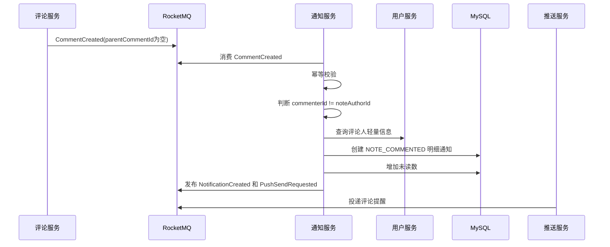
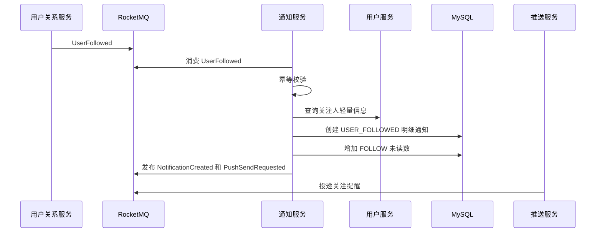
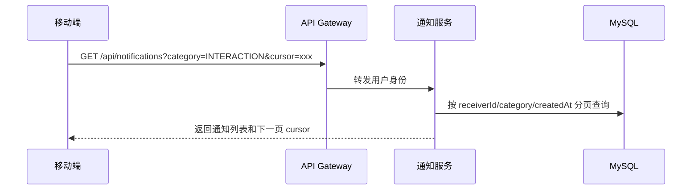

# BlueNote 通知服务设计

## 1. 背景与目标

通知服务负责 BlueNote 的站内通知中心。它把其他业务服务已经发生的事实事件，转换成用户可以在通知页看到的通知记录，并维护通知聚合、已读未读、删除隐藏、通知列表和通知未读数。

通知服务不是实时推送系统。实时在线下发、离线系统 Push、设备 token、WebSocket 连接和厂商 Push 通道由 `bluenote-push` 负责。通知服务只在需要提醒用户时发布 `PushSendRequested`，由推送服务根据用户设备、在线状态、推送偏好和免打扰策略完成投递。

整体链路：

```text
笔记、评论、关系、系统等服务发布业务事件
  -> 通知服务消费事件
  -> 判断是否需要生成站内通知
  -> 生成通知记录或更新聚合通知
  -> 更新通知未读数
  -> 写 notification-event 和 PushSendRequested outbox
  -> 推送服务负责在线或离线提醒
  -> 用户打开 App 后查询通知列表和业务详情
```

设计目标：

1. 支持互动通知、关注通知、系统通知，订单通知预留。
2. 点赞、收藏等高频互动支持聚合，避免通知列表刷屏。
3. 评论、回复等有上下文的内容保留明细，方便用户直接定位。
4. 通知未读数由通知服务维护，不依赖计数服务。
5. 通过事件幂等、业务幂等和本地 outbox 保证通知生成最终一致。
6. MySQL 保存通知事实，Redis 只做未读数缓存和短期去重。
7. 通知服务不保存业务最终事实，只保存展示快照和跳转参数。
8. 点击通知后由移动端调用笔记、评论、用户等业务服务查询最新详情。
9. 支持通知清理、归档和后续扩展 Push、短信、邮件等触达通道。

关键原则：

1. 站内通知生成与系统 Push 投递解耦。
2. 站内通知可以生成，但 Push 可以被用户偏好、免打扰或限流过滤。
3. 推送失败不影响通知记录和未读数。
4. 通知已读不代表业务对象已处理，例如订单已读不代表订单已支付。
5. 通知中的用户昵称、头像、笔记标题、评论摘要都是展示快照，不是最终事实。

## 2. 功能范围

### 2.1 第一阶段支持

| 功能 | 说明 |
|---|---|
| 点赞通知 | 用户点赞笔记后通知笔记作者，支持聚合 |
| 收藏通知 | 用户收藏笔记后通知笔记作者，支持聚合 |
| 评论通知 | 用户评论笔记后通知笔记作者，保留明细 |
| 回复通知 | 用户回复评论后通知被回复用户，保留明细 |
| 关注通知 | 用户关注后通知被关注者，第一阶段不聚合 |
| 系统通知 | 支持内容审核失败、下架提醒、系统公告 |
| 通知列表 | 按分类分页查询通知 |
| 未读数 | 查询总未读数和分类未读数 |
| 标记已读 | 单条已读、按分类全部已读、全部已读 |
| 删除通知 | 用户侧删除或隐藏通知，不物理删除业务数据 |
| 通知聚合 | 点赞、收藏按 `receiverId + type + targetId` 聚合未读通知 |
| 展示快照 | 保存触发人、目标对象、摘要等轻量快照 |
| Push 请求 | 需要提醒时发布 `PushSendRequested` 给推送服务 |
| 消费幂等 | 对 `interaction-event`、`relation-event`、`comment-event` 等做幂等 |
| 失败补偿 | MQ 消费失败、outbox 发送失败、未读数异常可补偿 |
| 生命周期 | 普通通知保留 180 天，系统重要通知可保留 1 年或长期 |

### 2.2 第一阶段不支持

| 功能 | 暂不支持原因 |
|---|---|
| IM 消息通知中心化 | IM 消息属于 IM 服务，不进入普通站内通知列表 |
| 短信、邮件 | 成本和合规复杂度高，后续由推送服务扩展多通道 |
| 完整营销通知 | 需要运营后台、用户分群、合规审计 |
| 复杂通知订阅体系 | 第一阶段只做基础通知类型和 Push 偏好 |
| 全量历史通知永久保存 | 数据会持续增长，普通通知按生命周期清理 |
| 通知搜索 | 当前不引入 Elasticsearch |
| 通知跨端同步复杂状态 | 第一阶段只做用户维度已读、删除和列表 |
| 取消点赞后撤回通知 | 点赞通知是当时事实提醒，取消点赞不主动撤回 |
| 强实时提醒 | 实时投递由推送服务处理，通知服务只发布请求 |

### 2.3 后续扩展

后续可以扩展：

1. 订单状态通知。
2. 活动、运营、创作者激励通知。
3. 通知模板后台配置。
4. 通知按用户分群批量发送。
5. 通知搜索和历史归档。
6. 更细粒度的通知订阅设置。
7. 多语言模板。
8. 通知回执统计，包括展示、点击、转化。
9. 与推送服务配合做富媒体 Push。
10. 管理后台发送系统公告和审核通知。

## 3. 服务边界

### 3.1 通知服务负责

通知服务负责：

1. 消费业务事件并判断是否生成站内通知。
2. 创建通知记录。
3. 维护通知聚合记录。
4. 维护通知未读数。
5. 提供移动端通知列表、详情、未读数、已读、删除接口。
6. 保存通知展示快照和跳转参数。
7. 发布 `NotificationCreated`、`NotificationRead` 等通知生命周期事件。
8. 在需要提醒时发布 `PushSendRequested`。
9. 消费幂等、业务去重、失败重试和补偿任务。
10. 通知生命周期清理和归档。

### 3.2 非通知服务职责

通知服务不负责：

1. 保存点赞、收藏、评论、关注等业务事实。
2. 维护点赞数、收藏数、评论数、粉丝数等展示计数。
3. 维护 WebSocket 长连接。
4. 对接 APNs、FCM、uni-push 或厂商 Push。
5. 保存 IM 消息、会话和聊天未读数。
6. 判断订单状态。
7. 判断笔记最终是否存在或可见。
8. 承担内容审核服务本身。
9. 直接访问其他服务数据库。

### 3.3 与推送服务的边界

| 能力 | 通知服务 | 推送服务 |
|---|---|---|
| 站内通知记录 | 负责 | 不负责 |
| 通知未读数 | 负责 | 不负责 |
| 通知已读/删除 | 负责 | 不负责 |
| 是否需要提醒 | 按业务类型给出请求意图 | 根据偏好、在线状态和通道执行 |
| WebSocket 投递 | 不负责 | 负责 |
| 离线系统 Push | 不负责 | 负责 |
| 设备 token | 不负责 | 负责 |
| 点击回传 | 可消费或查询结果 | 负责接收点击回传 |

通知服务发布给推送服务的是轻量提醒请求：

```json
{
  "scene": "COMMENT_NOTIFICATION",
  "targetUserId": 10001,
  "title": "你收到一条新评论",
  "body": "有人评论了你的笔记",
  "data": {
    "notificationId": "n_1001",
    "targetType": "NOTE",
    "targetId": "note_2001"
  }
}
```

移动端点击后必须调用通知服务或目标业务服务查询最新详情。

### 3.4 与计数服务的边界

计数服务负责点赞数、收藏数、评论数、关注数、粉丝数等展示计数。

通知服务只负责：

1. 通知总未读数。
2. 各分类未读数。
3. 通知聚合中的 actor 数量。

通知未读数不交给通用计数服务，原因是通知未读数和通知已读、删除、聚合强相关，属于通知服务内部读模型。

### 3.5 与笔记服务的边界

笔记服务负责：

1. 笔记发布、编辑、删除、状态。
2. 点赞、收藏行为明细。
3. 笔记作者、可见性和媒体元数据。

通知服务负责：

1. 消费 `NoteLiked`、`NoteCollected`。
2. 给笔记作者生成点赞、收藏通知。
3. 保存笔记标题、封面、作者等展示快照。
4. 点击后让移动端跳转笔记详情。

如果笔记后续删除、下架或私密，通知服务不修改业务事实。移动端进入详情时由笔记服务返回不可见状态。后续可以消费 `NoteDeleted`、`NoteStatusChanged` 更新通知展示为“内容已不可见”。

### 3.6 与评论服务的边界

评论服务负责：

1. 评论和回复的创建、删除、状态。
2. 评论点赞。
3. 评论可见性和评论作者。

通知服务负责：

1. 消费 `CommentCreated`。
2. 判断是评论笔记还是回复评论。
3. 给笔记作者或被回复用户生成通知。
4. 保存评论摘要和跳转参数。

评论删除后，通知记录可以保留，但点击后由评论服务或笔记详情页展示“评论已删除”。

### 3.7 与用户关系服务的边界

用户关系服务负责关注、取关、拉黑、关注列表和粉丝列表。

通知服务负责：

1. 消费 `UserFollowed`。
2. 给被关注者生成关注通知。
3. 一般不处理 `UserUnfollowed`，取消关注不生成通知。

如果用户拉黑对方，后续可以由关系服务事件触发通知隐藏或后续不再生成相关通知。

### 3.8 依赖关系

| 依赖 | 方式 | 用途 |
|---|---|---|
| 笔记服务 | MQ + 内部接口 | 消费互动事件，批量查询笔记摘要 |
| 评论服务 | MQ + 内部接口 | 消费评论事件，批量查询评论上下文 |
| 用户关系服务 | MQ | 消费关注事件 |
| 用户服务 | 内部接口 | 查询触发人昵称、头像和用户状态 |
| 推送服务 | MQ | 发布 `PushSendRequested` |
| Redis | 存储 | 未读数缓存、聚合锁、短期去重 |
| MySQL | 存储 | 通知、聚合、未读数、幂等、outbox |
| RocketMQ | 消息 | 订阅业务事件，发布通知和推送请求事件 |

## 4. 核心概念

### 4.1 通知分类

通知分类用于移动端分 Tab 展示和未读数统计。

| category | 说明 | 第一阶段 |
|---|---|---|
| `INTERACTION` | 互动通知，点赞、收藏、评论、回复 | 支持 |
| `FOLLOW` | 关注通知 | 支持 |
| `SYSTEM` | 系统通知，审核、下架、公告 | 支持 |
| `ORDER` | 订单通知 | 支持 |

### 4.2 通知类型

| notificationType | category | 说明 | 聚合 |
|---|---|---|---|
| `NOTE_LIKED` | `INTERACTION` | 有人点赞你的笔记 | 是 |
| `NOTE_COLLECTED` | `INTERACTION` | 有人收藏你的笔记 | 是 |
| `NOTE_COMMENTED` | `INTERACTION` | 有人评论你的笔记 | 否 |
| `COMMENT_REPLIED` | `INTERACTION` | 有人回复你的评论 | 否 |
| `USER_FOLLOWED` | `FOLLOW` | 有人关注你 | 否 |
| `NOTE_AUDIT_REJECTED` | `SYSTEM` | 笔记审核失败 | 否 |
| `NOTE_OFFLINE` | `SYSTEM` | 笔记下架 | 否 |
| `SYSTEM_ANNOUNCEMENT` | `SYSTEM` | 系统公告 | 否 |
| `ORDER_STATUS_CHANGED` | `ORDER` | 订单状态变化 | 否 |

### 4.3 通知主体

通知主体是一条移动端列表可展示的记录。它可以是明细通知，也可以是聚合通知。

关键字段：

| 字段 | 说明 |
|---|---|
| `notificationId` | 通知 ID |
| `receiverId` | 接收用户 |
| `actorId` | 最近触发用户，系统通知为空 |
| `category` | 通知分类 |
| `notificationType` | 通知类型 |
| `targetType` | 目标对象类型，例如 `NOTE`、`COMMENT`、`USER` |
| `targetId` | 目标对象 ID |
| `sourceType` | 来源对象类型，例如 `LIKE`、`COMMENT`、`FOLLOW` |
| `sourceId` | 来源对象 ID，例如 commentId、followId |
| `title` | 展示标题 |
| `content` | 展示摘要 |
| `snapshotJson` | 展示快照 |
| `jumpJson` | 跳转参数 |
| `readStatus` | 未读或已读 |
| `visibleStatus` | 正常、隐藏、归档 |

### 4.4 聚合通知

聚合通知用于点赞、收藏这类高频行为。

第一阶段聚合规则：

| 场景 | 聚合 Key |
|---|---|
| 点赞同一篇笔记 | `receiverId + NOTE_LIKED + noteId` |
| 收藏同一篇笔记 | `receiverId + NOTE_COLLECTED + noteId` |

聚合策略：

1. 如果存在同一聚合 Key 的未读聚合通知，则更新这条通知。
2. 如果原聚合通知已读，则创建新的聚合通知。
3. 聚合通知保存最近触发人、触发人数、最近触发时间和最新 actor 列表。
4. 同一 actor 对同一对象重复点赞或收藏不重复计入聚合。
5. 取消点赞、取消收藏不主动撤回历史通知。

展示示例：

```text
张三等 5 人点赞了你的笔记
李四等 3 人收藏了你的笔记
```

### 4.5 明细通知

明细通知用于评论、回复、关注和系统通知。

第一阶段明细规则：

1. 一条评论生成一条评论通知。
2. 一条回复生成一条回复通知。
3. 一个关注行为生成一条关注通知。
4. 系统公告按目标用户生成通知。
5. 同一业务事件重复投递时不重复生成通知。

### 4.6 通知状态

| 状态 | 字段 | 说明 |
|---|---|---|
| 未读 | `read_status = 0` | 用户还未读 |
| 已读 | `read_status = 1` | 用户已读 |
| 正常可见 | `visible_status = 1` | 列表展示 |
| 用户删除 | `visible_status = 2` | 用户侧隐藏 |
| 系统归档 | `visible_status = 3` | 超过生命周期后归档 |

删除是用户侧隐藏，不影响业务事实，也不影响其他用户。

### 4.7 展示快照

通知服务保存展示快照，用于列表快速展示：

```json
{
  "actor": {
    "userId": 10002,
    "nickname": "张三",
    "avatarUrl": "https://..."
  },
  "target": {
    "targetType": "NOTE",
    "targetId": "note_1001",
    "title": "今天的晚霞",
    "coverUrl": "https://..."
  },
  "comment": {
    "commentId": "c_1001",
    "summary": "拍得真好看"
  }
}
```

快照只是展示缓存。用户改昵称、换头像、笔记改标题后，历史通知不强制同步，点击详情时以业务服务最新数据为准。

### 4.8 未读数

通知未读数分两层：

1. 总未读数：通知入口角标。
2. 分类未读数：互动、关注、系统、订单。

MySQL 的 `notification_unread_counter` 是事实来源，Redis 是缓存。Redis 丢失后可以从 MySQL 或通知表重建。

### 4.9 Push 请求

通知服务生成站内通知后，可以按场景写出 `PushSendRequested`。

默认策略：

| 通知类型 | 是否请求 Push | 策略 |
|---|---|---|
| `NOTE_LIKED` | 是 | 聚合后请求，受推送服务偏好过滤 |
| `NOTE_COLLECTED` | 是 | 聚合后请求，受推送服务偏好过滤 |
| `NOTE_COMMENTED` | 是 | 明细请求 |
| `COMMENT_REPLIED` | 是 | 明细请求 |
| `USER_FOLLOWED` | 是 | 明细请求 |
| `NOTE_AUDIT_REJECTED` | 是 | 系统高优先级 |
| `NOTE_OFFLINE` | 是 | 系统高优先级 |
| `SYSTEM_ANNOUNCEMENT` | 视优先级 | 普通公告可以只站内 |

最终是否投递由推送服务判断。

## 5. 核心流程

### 5.1 点赞通知流程

```mermaid
sequenceDiagram
    participant Note as 笔记服务
    participant MQ as RocketMQ
    participant Notify as 通知服务
    participant User as 用户服务
    participant DB as MySQL
    participant Redis as Redis
    participant Push as 推送服务

    Note->>MQ: NoteLiked
    Notify->>MQ: 消费 NoteLiked
    Notify->>Notify: 事件幂等校验
    Notify->>Notify: 判断 actorId != noteAuthorId
    Notify->>User: 查询触发人轻量信息
    Notify->>DB: 查找未读聚合通知
    alt 存在未读聚合
        Notify->>DB: 更新 actorCount、latestActor、updatedAt
    else 不存在
        Notify->>DB: 创建 NOTE_LIKED 聚合通知
        Notify->>DB: 增加未读数
    end
    Notify->>Redis: 刷新未读数缓存
    Notify->>MQ: 发布 NotificationCreated 和 PushSendRequested
    Push->>MQ: 消费 PushSendRequested
```

关键规则：

1. 自己点赞自己的笔记不生成通知。
2. 重复点赞事件不重复生成通知。
3. 取消点赞不主动撤回历史通知。
4. 聚合更新后，未读数只在创建新通知时增加；更新已有未读聚合不增加未读数。

### 5.2 收藏通知流程

收藏通知与点赞通知类似。

差异：

1. 通知类型为 `NOTE_COLLECTED`。
2. 聚合 Key 为 `receiverId + NOTE_COLLECTED + noteId`。
3. 文案为“张三等 N 人收藏了你的笔记”。
4. 收藏取消不生成通知，也不撤回历史通知。

### 5.3 评论笔记通知流程



关键规则：

1. 自己评论自己的笔记不生成通知。
2. 评论通知不聚合。
3. 通知快照保存评论摘要，最长按配置截断。
4. 评论删除后不删除通知，点击时由评论服务返回最新状态。

### 5.4 回复评论通知流程

评论服务的 `CommentCreated` 事件中如果存在 `replyToUserId` 或 `parentCommentId`，通知服务生成回复通知。

接收人选择：

1. 优先通知被回复用户 `replyToUserId`。
2. 如果是二级回复但没有明确被回复人，则通知父评论作者。
3. 如果接收人与回复人相同，不生成通知。
4. 如果接收人与笔记作者不同，且评论服务也需要通知笔记作者，必须避免重复。

第一阶段规则：

| 场景 | 接收人 |
|---|---|
| A 评论笔记作者 B 的笔记 | B |
| C 回复 A 的评论 | A |
| B 回复自己笔记下 A 的评论 | A |
| A 回复自己的评论 | 不通知 |

### 5.5 关注通知流程



关键规则：

1. 关注通知第一阶段不聚合。
2. 取消关注不生成通知。
3. 重复关注事件不重复生成通知。
4. 后续可根据拉黑、风控状态过滤关注通知。

### 5.6 系统通知流程

系统通知来源包括：

1. 笔记审核失败。
2. 笔记下架。
3. 系统公告。
4. 订单状态通知，后续。

流程：

```text
系统来源服务或管理后台
  -> 调用内部接口或发布系统事件
  -> 通知服务创建 SYSTEM 通知
  -> 按优先级决定是否请求 Push
  -> 用户在系统通知 Tab 查看
```

第一阶段如果没有管理后台，可以只支持内部接口和系统事件，不做运营配置页面。

### 5.7 查询通知列表流程



查询规则：

1. 只查询当前登录用户自己的通知。
2. 默认按 `createdAt` 或 `lastEventAt` 倒序。
3. 聚合通知使用最近更新时间排序。
4. 用户删除的通知不返回。
5. 已归档通知第一阶段不返回普通列表。

### 5.8 标记已读流程

单条已读：

```text
移动端点击或操作通知
  -> 通知服务校验通知属于当前用户
  -> read_status 从未读改为已读
  -> 扣减分类未读数和总未读数
  -> 发布 NotificationRead
```

全部已读：

```text
移动端点击全部已读
  -> 通知服务按 receiverId 和 category 批量更新未读通知
  -> 未读计数置 0
  -> 删除 Redis 未读缓存
  -> 发布 NotificationReadBatch
```

批量已读需要保证幂等，重复调用不能把未读数扣成负数。

### 5.9 删除通知流程

删除通知是用户侧隐藏：

```text
移动端删除通知
  -> 校验通知属于当前用户
  -> visible_status = USER_DELETED
  -> 如果未读则同步扣减未读数
```

删除不影响：

1. 点赞、评论、关注业务事实。
2. 其他用户通知。
3. 推送投递日志。

## 6. 异常流程

### 6.1 重复事件

同一 MQ 事件可能重复投递。

处理：

1. 使用 `notification_event_consume_log` 按 `eventId + consumerGroup` 幂等。
2. 业务层再按 `sourceService + sourceEventType + sourceBizId + receiverId` 做唯一约束。
3. 已成功处理的事件直接跳过。
4. 处理中超时的事件由补偿任务检查。

### 6.2 自己触发自己的通知

以下场景不生成通知：

1. 自己点赞自己的笔记。
2. 自己收藏自己的笔记。
3. 自己评论自己的笔记。
4. 自己回复自己的评论。
5. 自己关注自己，关系服务本身也应禁止。

处理结果记录为 `SKIPPED_SELF_ACTION`，便于排查。

### 6.3 接收人不存在或被禁用

如果接收人不存在、已注销、被禁用：

1. 不生成通知。
2. 记录跳过原因。
3. 不请求 Push。

如果触发人被禁用：

1. 可以不生成通知。
2. 或生成通知但展示为“用户已注销”，第一阶段建议直接跳过高风险触发人。

### 6.4 目标对象不可见

事件到达时目标笔记或评论已经删除、下架或不可见：

1. 能通过事件中状态判断的，不生成普通互动通知。
2. 已生成的历史通知不强制删除。
3. 用户点击时由目标业务服务返回不可见。
4. 后续可消费状态事件更新通知文案。

### 6.5 快照查询失败

通知生成时需要用户、笔记、评论轻量快照。如果同步查询失败：

处理策略：

1. 事件中已有足够快照时直接使用事件快照。
2. 事件快照不足时使用降级文案，例如“有人评论了你的笔记”。
3. 记录待补全任务，后续异步补全快照。
4. 不因为头像或昵称查询失败阻塞通知生成。

### 6.6 未读数异常

可能原因：

1. 批量已读和单条已读并发。
2. 消费重试重复扣减。
3. Redis 缓存丢失。
4. 数据库异常导致通知和计数不一致。

处理：

1. MySQL 更新未读数时使用 `GREATEST(count - delta, 0)`。
2. 单条已读只允许 `read_status` 从未读变已读时扣减。
3. 定时任务按通知表重算用户未读数。
4. Redis 未读数可随时删除并回源 MySQL。

### 6.7 Push 请求失败

通知已经生成，但 `PushSendRequested` 发送失败：

1. 不回滚通知。
2. outbox 记录保持 `INIT` 或 `FAILED`。
3. 后台任务重试发送。
4. 超过重试次数后记录失败，用户仍可在通知中心看到通知。

### 6.8 MQ 消费失败

消费业务事件失败：

1. 可重试错误抛出，由 RocketMQ 重试。
2. 不可重试错误记录失败表，避免无限重试。
3. 对失败事件保留 `eventId`、payload、错误摘要和 traceId。
4. 提供内部重放能力。

### 6.9 聚合并发冲突

多个用户同时点赞同一篇笔记可能同时更新同一聚合通知。

处理：

1. 使用 MySQL 唯一约束保证同一未读聚合 Key 只有一条活跃记录。
2. 创建冲突时重新查询并更新。
3. 对 actor 去重使用 `notification_aggregate_actor` 唯一约束。
4. 必要时使用 Redis 短锁降低并发冲突。

### 6.10 通知已删除后又收到同类事件

如果用户删除了某条聚合通知，后续同类新事件到达：

1. 不恢复已删除通知。
2. 创建新的通知记录。
3. 未读数按新通知增加。

## 7. 存储设计

### 7.1 MySQL 表设计

#### 7.1.1 notification_record

用途：保存通知主体记录，既支持明细通知，也支持聚合通知。

| 字段 | 类型 | 说明 |
|---|---|---|
| `id` | BIGINT | 主键 |
| `notification_id` | VARCHAR(64) | 通知业务 ID |
| `receiver_id` | BIGINT | 接收用户 ID |
| `category` | VARCHAR(32) | `INTERACTION`、`FOLLOW`、`SYSTEM`、`ORDER` |
| `notification_type` | VARCHAR(64) | 通知类型 |
| `aggregate_flag` | TINYINT | 0 明细，1 聚合 |
| `aggregate_key` | VARCHAR(255) | 聚合 Key，明细为空 |
| `actor_id` | BIGINT | 最近触发人，系统通知为空 |
| `actor_count` | INT | 聚合触发人数，明细为 1 |
| `target_type` | VARCHAR(32) | `NOTE`、`COMMENT`、`USER`、`ORDER` |
| `target_id` | VARCHAR(64) | 目标对象 ID |
| `source_service` | VARCHAR(64) | 来源服务 |
| `source_event_type` | VARCHAR(64) | 来源事件类型 |
| `source_biz_id` | VARCHAR(128) | 来源业务 ID |
| `title` | VARCHAR(128) | 展示标题 |
| `content` | VARCHAR(512) | 展示摘要 |
| `snapshot_json` | JSON | 展示快照 |
| `jump_json` | JSON | 跳转参数 |
| `read_status` | TINYINT | 0 未读，1 已读 |
| `read_at` | DATETIME | 已读时间 |
| `visible_status` | TINYINT | 1 正常，2 用户删除，3 归档 |
| `last_event_at` | DATETIME | 最近触发时间 |
| `expire_at` | DATETIME | 过期时间 |
| `created_at` | DATETIME | 创建时间 |
| `updated_at` | DATETIME | 更新时间 |
| `deleted` | TINYINT | 逻辑删除 |

约束：

1. `uk_notification_id`：`notification_id` 唯一。
2. `uk_source_receiver`：`source_service, source_event_type, source_biz_id, receiver_id`，防止同一业务事件重复生成通知。
3. `idx_receiver_category_time`：`receiver_id, category, visible_status, last_event_at`。
4. `idx_receiver_read`：`receiver_id, read_status, visible_status`。
5. `idx_aggregate_unread`：`receiver_id, aggregate_key, read_status, visible_status`。
6. `idx_expire`：`expire_at, visible_status`。

#### 7.1.2 notification_aggregate_actor

用途：保存聚合通知中的触发人，用于去重和展示最近几个 actor。

| 字段 | 类型 | 说明 |
|---|---|---|
| `id` | BIGINT | 主键 |
| `notification_id` | VARCHAR(64) | 聚合通知 ID |
| `receiver_id` | BIGINT | 接收用户 ID |
| `actor_id` | BIGINT | 触发用户 ID |
| `source_biz_id` | VARCHAR(128) | 来源业务 ID |
| `actor_snapshot_json` | JSON | 触发人快照 |
| `created_at` | DATETIME | 创建时间 |
| `updated_at` | DATETIME | 更新时间 |

约束：

1. `uk_notification_actor`：`notification_id, actor_id`。
2. `idx_notification_time`：`notification_id, created_at`。
3. `idx_receiver_actor`：`receiver_id, actor_id`。

说明：

1. 同一用户对同一聚合通知只计一次。
2. 取消点赞不删除 actor 记录。
3. 展示时取最近 3 个 actor 快照即可。

#### 7.1.3 notification_unread_counter

用途：保存用户通知未读数。

| 字段 | 类型 | 说明 |
|---|---|---|
| `id` | BIGINT | 主键 |
| `user_id` | BIGINT | 用户 ID |
| `category` | VARCHAR(32) | 分类，`ALL` 表示总数 |
| `unread_count` | INT | 未读数 |
| `created_at` | DATETIME | 创建时间 |
| `updated_at` | DATETIME | 更新时间 |

约束：

1. `uk_user_category`：`user_id, category` 唯一。
2. 更新时防止小于 0。
3. 可以按通知表重建。

#### 7.1.4 notification_template

用途：保存通知模板配置。第一阶段也可以代码枚举，保留表结构便于后续管理后台。

| 字段 | 类型 | 说明 |
|---|---|---|
| `id` | BIGINT | 主键 |
| `template_code` | VARCHAR(64) | 模板编码 |
| `notification_type` | VARCHAR(64) | 通知类型 |
| `category` | VARCHAR(32) | 分类 |
| `title_template` | VARCHAR(128) | 标题模板 |
| `content_template` | VARCHAR(512) | 内容模板 |
| `push_enabled_default` | TINYINT | 默认是否请求 Push |
| `priority` | TINYINT | 默认优先级 |
| `status` | TINYINT | 1 启用，2 停用 |
| `created_at` | DATETIME | 创建时间 |
| `updated_at` | DATETIME | 更新时间 |

约束：

1. `uk_template_code`：`template_code` 唯一。
2. `idx_type_status`：`notification_type, status`。

#### 7.1.5 notification_event_consume_log

用途：记录 MQ 消费幂等。

| 字段 | 类型 | 说明 |
|---|---|---|
| `id` | BIGINT | 主键 |
| `event_id` | VARCHAR(64) | 事件 ID |
| `topic` | VARCHAR(128) | Topic |
| `event_type` | VARCHAR(64) | 事件类型 |
| `consumer_group` | VARCHAR(128) | 消费组 |
| `biz_key` | VARCHAR(128) | 业务 Key |
| `status` | TINYINT | 1 PROCESSING，2 SUCCESS，3 FAILED，4 SKIPPED |
| `skip_reason` | VARCHAR(128) | 跳过原因 |
| `error_message` | VARCHAR(512) | 错误摘要 |
| `created_at` | DATETIME | 创建时间 |
| `updated_at` | DATETIME | 更新时间 |

约束：

1. `uk_event_consumer`：`event_id, consumer_group` 唯一。
2. `idx_status_updated`：`status, updated_at`。

#### 7.1.6 notification_outbox_event

用途：通知服务本地 outbox，发布 `notification-event` 和 `push-request-event`。

| 字段 | 类型 | 说明 |
|---|---|---|
| `id` | BIGINT | 主键 |
| `event_id` | VARCHAR(64) | 事件 ID |
| `topic` | VARCHAR(128) | 目标 Topic |
| `event_type` | VARCHAR(64) | 事件类型 |
| `aggregate_type` | VARCHAR(64) | 聚合类型 |
| `aggregate_id` | VARCHAR(128) | 聚合 ID |
| `payload_json` | JSON | 事件内容 |
| `status` | TINYINT | 1 INIT，2 SENT，3 FAILED |
| `retry_count` | INT | 重试次数 |
| `next_retry_at` | DATETIME | 下次重试时间 |
| `created_at` | DATETIME | 创建时间 |
| `updated_at` | DATETIME | 更新时间 |

约束：

1. `uk_event_id`：`event_id` 唯一。
2. `idx_status_retry`：`status, next_retry_at`。
3. `idx_aggregate`：`aggregate_type, aggregate_id`。

#### 7.1.7 notification_cleanup_task

用途：记录通知归档、清理任务。

| 字段 | 类型 | 说明 |
|---|---|---|
| `id` | BIGINT | 主键 |
| `task_id` | VARCHAR(64) | 任务 ID |
| `task_type` | VARCHAR(32) | `ARCHIVE_EXPIRED`、`REBUILD_UNREAD` |
| `status` | TINYINT | 1 INIT，2 RUNNING，3 SUCCESS，4 FAILED |
| `start_id` | BIGINT | 扫描起始 ID |
| `latest_id` | BIGINT | 已处理到的 ID |
| `batch_size` | INT | 批大小 |
| `error_message` | VARCHAR(512) | 错误摘要 |
| `created_at` | DATETIME | 创建时间 |
| `updated_at` | DATETIME | 更新时间 |

### 7.2 索引设计

| 查询场景 | 索引 | 说明 |
|---|---|---|
| 通知列表分页 | `idx_receiver_category_time` | 按用户、分类、可见状态、时间倒序 |
| 查询全部未读通知 | `idx_receiver_read` | 标记全部已读、统计未读 |
| 聚合通知定位 | `idx_aggregate_unread` | 点赞、收藏聚合更新 |
| 事件幂等 | `notification_event_consume_log.uk_event_consumer` | 防重复消费 |
| 业务幂等 | `notification_record.uk_source_receiver` | 防重复生成通知 |
| 查询聚合 actor | `notification_aggregate_actor.idx_notification_time` | 展示最近 actor |
| 用户未读数 | `notification_unread_counter.uk_user_category` | 快速查询和更新 |
| outbox 重试 | `notification_outbox_event.idx_status_retry` | 定时发送失败事件 |
| 过期归档 | `notification_record.idx_expire` | 生命周期任务扫描 |

### 7.3 Redis Key 设计

Key 统一前缀：

```text
bluenote:{env}:notification:{key}
```

| Key | 类型 | TTL | 说明 |
|---|---|---|---|
| `unread:{userId}` | Hash | 30 分钟 | 用户总未读和分类未读缓存 |
| `dedupe:event:{eventId}` | String | 24 小时 | 事件短期去重，MySQL 仍是最终幂等 |
| `lock:aggregate:{hash}` | String | 10 秒 | 聚合通知更新短锁 |
| `template:{notificationType}` | Hash | 30 分钟 | 通知模板缓存 |
| `rate:push:{userId}:{type}:{minute}` | String | 2 分钟 | 通知请求 Push 前的轻量限流 |
| `rebuild:unread:lock:{userId}` | String | 5 分钟 | 未读数重建锁 |

Redis 使用规则：

1. Redis 只做缓存、短锁和短期去重，不作为通知事实来源。
2. 未读数以 MySQL `notification_unread_counter` 为准。
3. Redis 未读数丢失后回源 MySQL。
4. 聚合短锁失败时可以退化为 MySQL 唯一约束冲突重试。
5. 模板缓存失效后回源 MySQL 或代码配置。

## 8. 接口设计

### 8.1 移动端接口

所有移动端接口经 Gateway 访问，用户身份以网关注入为准。

#### 8.1.1 查询未读数

```http
GET /api/notifications/unread-count
```

响应：

```json
{
  "totalUnread": 12,
  "categories": {
    "INTERACTION": 8,
    "FOLLOW": 3,
    "SYSTEM": 1,
    "ORDER": 0
  }
}
```

#### 8.1.2 查询通知列表

```http
GET /api/notifications?category=INTERACTION&pageSize=20&cursor=eyJ0aW1lIjoi..."}
```

响应：

```json
{
  "items": [
    {
      "notificationId": "n_1001",
      "category": "INTERACTION",
      "notificationType": "NOTE_LIKED",
      "aggregate": true,
      "actorCount": 5,
      "title": "张三等 5 人点赞了你的笔记",
      "content": "今天的晚霞",
      "read": false,
      "createdAt": "2026-06-04T20:00:00+08:00",
      "lastEventAt": "2026-06-04T20:10:00+08:00",
      "actors": [
        {
          "userId": 10002,
          "nickname": "张三",
          "avatarUrl": "https://..."
        }
      ],
      "target": {
        "targetType": "NOTE",
        "targetId": "note_1001",
        "coverUrl": "https://..."
      },
      "jump": {
        "page": "NOTE_DETAIL",
        "noteId": "note_1001"
      }
    }
  ],
  "nextCursor": "eyJ0aW1lIjoi...}",
  "hasMore": true
}
```

查询说明：

1. `category` 可为空，为空时查全部通知。
2. 使用 cursor 分页，不使用深分页 offset。
3. `pageSize` 最大 50。
4. 已删除和归档通知默认不返回。

#### 8.1.3 查询通知详情

```http
GET /api/notifications/{notificationId}
```

响应：

```json
{
  "notificationId": "n_1001",
  "category": "INTERACTION",
  "notificationType": "NOTE_COMMENTED",
  "title": "张三评论了你的笔记",
  "content": "拍得真好看",
  "read": false,
  "snapshot": {
    "actor": {
      "userId": 10002,
      "nickname": "张三",
      "avatarUrl": "https://..."
    },
    "target": {
      "targetType": "NOTE",
      "targetId": "note_1001",
      "title": "今天的晚霞"
    },
    "comment": {
      "commentId": "c_1001",
      "summary": "拍得真好看"
    }
  },
  "jump": {
    "page": "NOTE_DETAIL",
    "noteId": "note_1001",
    "commentId": "c_1001"
  }
}
```

#### 8.1.4 标记单条已读

```http
POST /api/notifications/{notificationId}/read
```

响应：

```json
{
  "notificationId": "n_1001",
  "read": true,
  "unreadCount": 11
}
```

#### 8.1.5 批量标记已读

```http
POST /api/notifications/read-all
```

请求：

```json
{
  "category": "INTERACTION"
}
```

`category` 为空表示全部分类已读。

响应：

```json
{
  "updatedCount": 8,
  "totalUnread": 4,
  "categories": {
    "INTERACTION": 0,
    "FOLLOW": 3,
    "SYSTEM": 1,
    "ORDER": 0
  }
}
```

#### 8.1.6 删除通知

```http
DELETE /api/notifications/{notificationId}
```

响应：

```json
{
  "notificationId": "n_1001",
  "deleted": true
}
```

#### 8.1.7 批量删除通知

```http
DELETE /api/notifications
```

请求：

```json
{
  "notificationIds": ["n_1001", "n_1002"]
}
```

第一阶段限制一次最多 50 条。

### 8.2 内部接口

#### 8.2.1 创建系统通知

```http
POST /internal/notifications/system
```

请求：

```json
{
  "requestId": "sys_req_1001",
  "notificationType": "SYSTEM_ANNOUNCEMENT",
  "receiverIds": [10001, 10002],
  "title": "系统通知",
  "content": "BlueNote 将在今晚进行短暂维护",
  "jump": {
    "page": "SYSTEM_NOTICE",
    "noticeId": "notice_1001"
  },
  "pushRequired": false,
  "expireAt": "2026-12-31T23:59:59+08:00"
}
```

说明：

1. 第一阶段只支持小规模接收人列表。
2. 大规模公告后续走运营推送或批处理任务。
3. 内部接口必须有服务鉴权。

#### 8.2.2 批量查询通知摘要

```http
POST /internal/notifications/batch-summary
```

请求：

```json
{
  "notificationIds": ["n_1001", "n_1002"]
}
```

用于推送服务、运营后台或排查工具后续调用。

#### 8.2.3 重建用户未读数

```http
POST /internal/notifications/users/{userId}/rebuild-unread
```

仅内部运维使用。

响应：

```json
{
  "userId": 10001,
  "rebuilt": true,
  "totalUnread": 12
}
```

#### 8.2.4 事件重放

```http
POST /internal/notifications/events/replay
```

请求：

```json
{
  "eventId": "evt_1001",
  "topic": "comment-event"
}
```

用于处理失败事件，不对移动端开放。

## 9. 安全与风控设计

### 9.1 权限控制

1. 移动端只能查询和操作自己的通知。
2. `notificationId` 必须校验 `receiverId == currentUserId`。
3. 内部系统通知接口只允许可信内部服务调用。
4. 通知服务不接受移动端指定 `receiverId` 创建通知。
5. 通知删除和已读操作必须幂等。

### 9.2 内容安全

1. 通知内容来自已发生业务事件，但仍需截断和过滤控制字符。
2. 评论摘要只保存前若干字符，避免大字段进入通知表。
3. 系统通知内容后续需要管理后台审核。
4. 不在通知中保存手机号、地址、支付凭证等敏感信息。
5. 删除、下架、审核失败的目标对象点击后必须由业务服务做权限校验。

### 9.3 防打扰设计

1. 点赞、收藏聚合。
2. 高频通知可限制 Push 请求频率。
3. 系统公告默认只站内，重要公告才请求 Push。
4. 推送偏好和免打扰由推送服务最终执行。
5. 通知列表仍保留用户应该看到的站内通知。

### 9.4 事件来源校验

1. 只消费明确登记的 topic 和 eventType。
2. 事件 payload 必须校验必要字段。
3. 来源服务、事件版本和业务 ID 必须记录。
4. 非法事件进入失败表，不生成通知。

### 9.5 隐私边界

1. 通知快照只保存展示必要字段。
2. IM 消息不进入普通通知服务。
3. 用户删除通知后列表不可见。
4. 用户注销后，后续需要按合规要求清理或匿名化通知中的用户快照。

## 10. 前后端实现要点

### 10.1 移动端

移动端实现要点：

1. 底部或“消息”入口展示通知未读总数。
2. 通知页按 `互动`、`关注`、`系统` 分 Tab。
3. 进入通知页时拉取未读数和当前 Tab 通知列表。
4. 点击通知时先调用已读接口，再跳转目标页面。
5. 跳转目标页面后由目标业务服务拉取详情。
6. 目标内容不可见时展示“内容已删除或不可见”。
7. 支持下拉刷新和 cursor 分页加载。
8. 支持单条删除、全部已读。
9. 收到推送服务的在线提醒后，只刷新未读数，不直接写本地通知事实。
10. App 回到前台时主动拉取未读数做补偿。

通知列表展示建议：

| 类型 | 展示 |
|---|---|
| 点赞 | 头像组 + “张三等 N 人点赞了你的笔记” + 笔记封面 |
| 收藏 | 头像组 + “张三等 N 人收藏了你的笔记” + 笔记封面 |
| 评论 | 评论人头像 + 评论摘要 + 笔记封面 |
| 回复 | 回复人头像 + 回复摘要 + 原评论上下文 |
| 关注 | 关注人头像 + 昵称 + 关注按钮状态后续 |
| 系统 | 系统图标 + 标题 + 摘要 |

### 10.2 后端

后端实现要点：

1. 消费器先做事件幂等，再做业务处理。
2. 通知创建、未读数更新、outbox 写入放在同一本地事务中。
3. 聚合通知使用唯一约束和短锁控制并发。
4. 未读数更新必须防止负数。
5. 查询列表使用 cursor 分页。
6. 通知展示快照构建失败时降级，不阻塞主流程。
7. outbox 定时任务负责发送 `notification-event` 和 `push-request-event`。
8. 删除、已读接口只操作当前用户数据。
9. 普通通知清理任务分批执行，避免大事务。
10. 所有日志包含 traceId、eventId、notificationId。

### 10.3 通知生成器

通知生成逻辑建议按类型拆分：

```text
NotificationEventHandler
  -> NoteLikedNotificationHandler
  -> NoteCollectedNotificationHandler
  -> CommentCreatedNotificationHandler
  -> UserFollowedNotificationHandler
  -> SystemNotificationHandler
```

每个 Handler 负责：

1. 校验事件字段。
2. 判断接收人。
3. 判断是否跳过。
4. 构建展示快照。
5. 创建明细通知或更新聚合通知。
6. 决定是否写 `PushSendRequested` outbox。

### 10.4 模板渲染

第一阶段可以代码枚举模板：

| notificationType | 模板 |
|---|---|
| `NOTE_LIKED` | `{actorName}等 {count} 人点赞了你的笔记` |
| `NOTE_COLLECTED` | `{actorName}等 {count} 人收藏了你的笔记` |
| `NOTE_COMMENTED` | `{actorName}评论了你的笔记` |
| `COMMENT_REPLIED` | `{actorName}回复了你的评论` |
| `USER_FOLLOWED` | `{actorName}关注了你` |
| `NOTE_AUDIT_REJECTED` | `你的笔记审核未通过` |
| `NOTE_OFFLINE` | `你的笔记已被下架` |

后续再把模板配置迁移到 `notification_template` 和管理后台。

## 11. 数据一致性与事件

### 11.1 一致性原则

通知服务采用最终一致：

1. 上游业务事实先落库，再发布事件。
2. 通知服务消费事件生成通知。
3. 通知失败不回滚上游业务。
4. Push 失败不回滚通知。
5. 通知已读不影响上游业务。
6. 可通过事件重放和补偿任务修复漏通知。

### 11.2 订阅事件

| Topic | EventType | 来源 | 用途 |
|---|---|---|---|
| `interaction-event` | `NoteLiked` | 笔记服务或互动模块 | 生成点赞通知 |
| `interaction-event` | `NoteCollected` | 笔记服务或互动模块 | 生成收藏通知 |
| `comment-event` | `CommentCreated` | 评论服务 | 生成评论或回复通知 |
| `relation-event` | `UserFollowed` | 用户关系服务 | 生成关注通知 |
| `note-event` | `NoteStatusChanged` 后续 | 笔记服务 | 系统状态通知或更新展示 |
| `order-event` | `OrderCreated`、`OrderPaid`、`OrderClosed`、`OrderCancelled`、`CouponIssued` | 订单服务 | 生成订单通知 |

当前订单通知阶段只生成站内通知。订单状态 Push 请求仍沿用订单服务已写出的 `PushSendRequested`，避免同一订单状态重复提醒；后续如收敛为通知服务统一发 Push，需要同步调整订单 MQ 契约和订单服务 outbox。

第一阶段不消费：

1. `NoteUnliked`
2. `NoteUncollected`
3. `UserUnfollowed`

这些事件不生成普通通知。

### 11.3 发布事件

| Topic | EventType | 触发时机 |
|---|---|---|
| `notification-event` | `NotificationCreated` | 创建通知或创建新聚合通知 |
| `notification-event` | `NotificationAggregated` | 更新已有聚合通知 |
| `notification-event` | `NotificationRead` | 单条通知已读 |
| `notification-event` | `NotificationReadBatch` | 批量已读 |
| `notification-event` | `NotificationDeleted` | 用户删除通知 |
| `push-request-event` | `PushSendRequested` | 通知需要在线或离线提醒 |

### 11.4 NotificationCreated 事件结构

```json
{
  "eventId": "evt_1001",
  "eventType": "NotificationCreated",
  "eventVersion": 1,
  "occurredAt": "2026-06-04T20:00:00+08:00",
  "producer": "bluenote-notification",
  "traceId": "trace_abc",
  "bizKey": "n_1001",
  "payload": {
    "notificationId": "n_1001",
    "receiverId": 10001,
    "category": "INTERACTION",
    "notificationType": "NOTE_COMMENTED",
    "targetType": "NOTE",
    "targetId": "note_1001",
    "sourceBizId": "comment_1001",
    "aggregate": false,
    "createdAt": "2026-06-04T20:00:00+08:00"
  }
}
```

### 11.5 PushSendRequested 事件结构

通知服务写给推送服务的事件示例：

```json
{
  "eventId": "evt_push_1001",
  "eventType": "PushSendRequested",
  "eventVersion": 1,
  "occurredAt": "2026-06-04T20:00:00+08:00",
  "producer": "bluenote-notification",
  "traceId": "trace_abc",
  "bizKey": "push_req_n_1001",
  "payload": {
    "requestId": "push_req_n_1001",
    "sourceService": "bluenote-notification",
    "sourceBizType": "NOTIFICATION",
    "sourceBizId": "n_1001",
    "scene": "COMMENT_NOTIFICATION",
    "targetUserId": 10001,
    "targetDevicePolicy": "ALL_ACTIVE_DEVICES",
    "deliveryStrategy": "ONLINE_THEN_OFFLINE",
    "priority": 5,
    "title": "你收到一条新评论",
    "body": "有人评论了你的笔记",
    "data": {
      "notificationId": "n_1001",
      "targetType": "NOTE",
      "targetId": "note_1001"
    },
    "expireAt": "2026-06-04T20:10:00+08:00"
  }
}
```

### 11.6 本地事务与 outbox

创建通知时，本地事务内完成：

1. 写入或更新 `notification_record`。
2. 写入 `notification_aggregate_actor`，如果是聚合通知。
3. 更新 `notification_unread_counter`。
4. 写入 `notification_outbox_event(NotificationCreated 或 NotificationAggregated)`。
5. 如需提醒，写入 `notification_outbox_event(PushSendRequested)`。
6. 写入或更新 `notification_event_consume_log`。

事务提交后，由 outbox 发送任务异步投递 RocketMQ。

### 11.7 补偿任务

补偿任务包括：

| 任务 | 说明 |
|---|---|
| outbox 重试 | 扫描未发送或发送失败事件 |
| 失败事件重放 | 对可恢复失败事件重新消费 |
| 未读数重建 | 按用户扫描未读通知重建 counter |
| 快照补全 | 对降级通知补全用户、笔记、评论快照 |
| 过期归档 | 将过期普通通知标记归档 |

## 12. 日志、指标与告警

### 12.1 关键日志

必须记录：

1. 事件消费日志。
2. 通知生成日志。
3. 聚合通知更新日志。
4. 未读数变更日志。
5. 已读、删除操作日志。
6. outbox 发送日志。
7. Push 请求生成日志。
8. 失败事件和补偿日志。

日志字段：

| 字段 | 说明 |
|---|---|
| `traceId` | 链路 ID |
| `eventId` | 来源事件 ID |
| `topic` | 来源 Topic |
| `consumerGroup` | 消费组 |
| `notificationId` | 通知 ID |
| `receiverId` | 接收用户 |
| `actorId` | 触发用户 |
| `notificationType` | 通知类型 |
| `sourceBizId` | 来源业务 ID |
| `aggregateKey` | 聚合 Key |
| `skipReason` | 跳过原因 |

### 12.2 核心指标

| 指标 | 说明 |
|---|---|
| `notification_created_total` | 创建通知数 |
| `notification_aggregated_total` | 聚合更新次数 |
| `notification_skipped_total` | 跳过通知数 |
| `notification_consume_failed_total` | 消费失败数 |
| `notification_outbox_pending` | 待发送 outbox 数 |
| `notification_unread_total` | 未读数总量 |
| `notification_read_total` | 已读操作数 |
| `notification_deleted_total` | 删除操作数 |
| `notification_push_requested_total` | 请求 Push 次数 |
| `notification_list_query_latency_ms` | 通知列表查询耗时 |

### 12.3 告警

需要告警：

1. `notification-consumer-group` 消费延迟持续升高。
2. 通知生成失败率超过阈值。
3. outbox 堆积超过阈值。
4. 未读数重建任务失败。
5. 数据库慢查询增加。
6. 聚合通知唯一约束冲突异常升高。
7. Push 请求生成失败。
8. 系统通知内部接口异常调用量升高。

## 13. 测试重点

### 13.1 正常流程

1. 点赞笔记生成聚合通知。
2. 收藏笔记生成聚合通知。
3. 评论笔记生成明细通知。
4. 回复评论通知被回复用户。
5. 关注用户生成关注通知。
6. 系统通知创建成功。
7. 查询通知列表分页正确。
8. 查询未读数正确。
9. 单条已读扣减未读数。
10. 全部已读置零。
11. 删除通知后列表不再展示。
12. 通知创建后写出 `PushSendRequested`。

### 13.2 异常流程

1. 重复 MQ 事件不重复生成通知。
2. 自己点赞、评论、回复不生成通知。
3. 接收人不存在时跳过。
4. 快照查询失败时降级文案可用。
5. outbox 发送失败后可重试。
6. Redis 丢失后未读数可回源 MySQL。
7. 聚合并发下只创建一条未读聚合通知。
8. 删除未读通知正确扣减未读数。

### 13.3 权限和安全

1. 用户不能查询别人的通知。
2. 用户不能标记别人的通知已读。
3. 用户不能删除别人的通知。
4. 移动端不能调用内部系统通知接口。
5. 通知内容不包含敏感字段。
6. 系统通知接口需要内部鉴权。

### 13.4 数据一致性

1. 通知创建、未读数、outbox 在同一事务中提交。
2. 通知生成成功但 Push 失败时通知仍可查询。
3. 单条已读重复调用不重复扣减。
4. 批量已读和单条已读并发时未读数不为负。
5. 未读数重建后与通知表一致。
6. 业务事件重放后不重复生成通知。

### 13.5 性能和容量

1. 通知列表使用 cursor 分页。
2. 点赞、收藏高频聚合不产生大量列表记录。
3. 批量全部已读限制单次更新范围。
4. 普通通知过期归档分批执行。
5. 查询接口在 2 核 4G 部署下不会产生明显慢查询。

## 14. 风险与后续演进

### 14.1 主要风险

| 风险 | 影响 | 应对 |
|---|---|---|
| 通知过多打扰用户 | 用户关闭 Push 或卸载 | 点赞收藏聚合，Push 偏好由推送服务执行 |
| 未读数不一致 | 角标错误 | MySQL 计数表 + 重建任务 + Redis 可失效 |
| 聚合并发冲突 | 重复聚合通知或 actor 计数错误 | 唯一约束 + 短锁 + 重试 |
| 上游事件漏发 | 通知缺失 | outbox、事件重放、补偿校准 |
| 快照过期 | 昵称头像不一致 | 列表使用快照，详情以业务服务为准 |
| Push 失败 | 用户没有及时看到提醒 | 站内通知兜底，Push outbox 重试 |
| 表数据增长 | 查询变慢 | 生命周期归档、索引、后续按时间分表 |

### 14.2 后续演进路径

推荐演进：

1. 第一阶段：互动、关注、系统通知，点赞收藏聚合，站内列表和未读数。
2. 第二阶段：订单通知接入。
3. 第三阶段：管理后台配置系统公告和通知模板。
4. 第四阶段：通知归档表或冷热分离。
5. 第五阶段：用户分群、运营通知、点击转化统计。
6. 第六阶段：更细粒度订阅偏好和多语言模板。

### 14.3 与后续服务设计的关系

后续服务需要遵守：

1. `12-IM服务设计.md`：IM 消息不进入通知服务，由 IM 服务直接请求推送服务做消息提醒。
2. `13-订单服务设计.md`：订单状态变更可以生成订单通知，通知服务只保存提醒和跳转，订单事实仍在订单服务。
3. 推送服务只承接 `PushSendRequested`，不反向修改通知已读状态。

## 15. 第一阶段通知策略汇总

| 场景 | 站内通知 | 聚合 | Push 请求 | 点击跳转 |
|---|---|---|---|---|
| 点赞笔记 | 是 | 是 | 是 | 笔记详情 |
| 收藏笔记 | 是 | 是 | 是 | 笔记详情 |
| 评论笔记 | 是 | 否 | 是 | 笔记详情 + 评论定位 |
| 回复评论 | 是 | 否 | 是 | 笔记详情 + 回复定位 |
| 关注你 | 是 | 否 | 是 | 触发人主页 |
| 笔记审核失败 | 是 | 否 | 是 | 笔记编辑或审核说明页 |
| 笔记下架 | 是 | 否 | 是 | 系统通知详情 |
| 系统公告 | 是 | 否 | 视优先级 | 系统通知详情 |
| IM 新消息 | 否 | 否 | 由 IM 服务请求推送 | 会话页 |
| 订单状态 | 后续 | 后续 | 后续 | 订单详情 |
