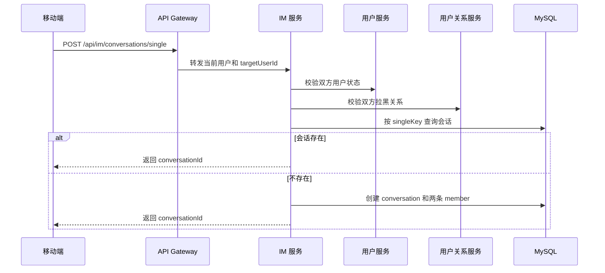
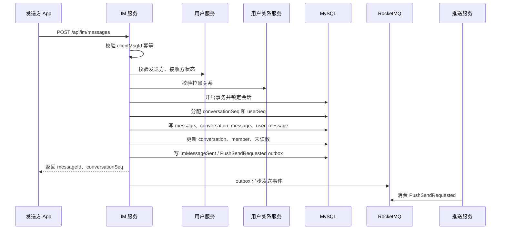
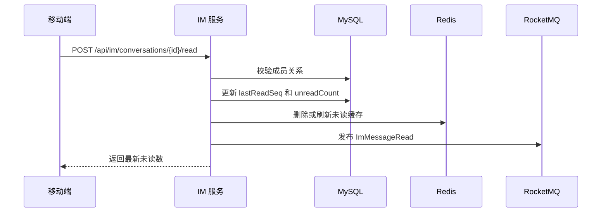

# BlueNote IM 服务设计

## 1. 背景与目标

IM 服务负责 BlueNote 用户之间的站内私信能力。第一阶段定位为企业级单聊服务，重点保证消息持久化、发送幂等、会话内顺序、离线消息拉取、聊天未读数、会话设置、权限校验和推送提醒。

IM 服务不维护通用 WebSocket 长连接，不直接对接 APNs、FCM、uni-push 或厂商 Push。实时在线提醒和离线系统通知由 `bluenote-push` 负责。IM 服务只负责聊天业务事实，并在消息入库后发布 `PushSendRequested`，由推送服务按在线状态、用户推送偏好、IM 消息预览开关和会话免打扰策略投递提醒。

第一阶段链路：

```text
发送方移动端
  -> HTTP 调用 IM 服务发送消息
  -> IM 服务校验会话权限、消息类型和幂等
  -> MySQL 事务写入消息、会话消息链、用户消息链、未读数
  -> 写 ImMessageSent 和 PushSendRequested outbox
  -> 推送服务在线 WebSocket 或离线 Push 提醒接收方
  -> 接收方从 IM 服务拉取消息详情
```

设计目标：

1. 支持用户之间一对一单聊。
2. 支持文本、图片、笔记卡片三类消息。
3. 使用 `clientMsgId` 保证移动端重复发送幂等。
4. 使用 `conversationSeq` 保证同一会话内消息严格有序展示。
5. 使用用户消息链支持用户维度离线消息拉取和后续多端同步。
6. 支持服务端 ACK、客户端接收 ACK、会话已读位置和聊天未读数。
7. 支持会话置顶、会话免打扰、用户侧删除会话。
8. 接入用户关系服务，支持拉黑后禁止发送。
9. 使用 MySQL 作为消息事实库，Redis 只做最近消息、会话列表和未读数缓存。
10. 通过 outbox + RocketMQ 发布 IM 事件和推送请求，保证最终一致。
11. 预留群聊、撤回、完整已读回执、多端同步、实时上行协议和高并发拆分能力。

关键约束：

1. IM 消息不进入通知服务。
2. Push 只负责提醒，不能作为消息事实来源。
3. 用户收到 Push 后必须从 IM 服务拉取消息详情。
4. 推送失败不影响消息入库和未读数。
5. Redis 丢失后，消息、会话、未读数必须能从 MySQL 重建。
6. 第一阶段不做完整群聊，不做大群架构，不做端到端加密。

## 2. 功能范围

### 2.1 第一阶段支持

| 功能 | 说明 |
|---|---|
| 单聊会话 | 两个用户之间创建或获取唯一单聊会话 |
| 文本消息 | 支持短文本消息，长度限制和内容过滤 |
| 图片消息 | 使用文件服务 `fileId`，不直接传图片二进制 |
| 笔记卡片消息 | 使用笔记服务 `noteId`，用于分享笔记 |
| 发送幂等 | 移动端传 `clientMsgId`，按 `senderId + clientMsgId` 去重 |
| 会话内顺序 | 为每条消息分配递增 `conversationSeq` |
| 会话消息链 | 按会话维度保存消息顺序 |
| 用户消息链 | 按用户维度保存应接收的消息 |
| 会话列表 | 查询最近会话、最近消息、未读数、置顶状态 |
| 消息拉取 | 按 `conversationId + afterSeq` 拉取新消息，按 `beforeSeq` 拉取历史消息 |
| 聊天未读数 | 维护会话未读和总聊天未读 |
| 已读位置 | 维护用户在会话中的 `lastReadSeq` |
| 客户端接收 ACK | 接收端拉到消息后可确认收到 |
| 会话置顶 | 用户维度设置会话置顶 |
| 会话免打扰 | 用户维度设置会话免打扰，影响 Push 请求 |
| 用户侧删除会话 | 只隐藏当前用户会话，不删除对方消息 |
| 拉黑拦截 | 发送前调用用户关系服务校验拉黑关系 |
| 推送提醒 | 消息入库后发布 `PushSendRequested` 给推送服务 |
| 事件发布 | 发布 `ImMessageSent`、`ImMessageAcked`、`ImMessageRead` |
| 失败补偿 | outbox 重试、未读数重建、缓存重建 |

### 2.2 第一阶段不支持

| 功能 | 暂不支持原因 |
|---|---|
| 群聊 | 群成员、群权限、@、群公告、大群扩散复杂度高 |
| 语音消息 | 需要录音、转码、时长、审核和播放器能力 |
| 视频消息 | 文件体积、转码、封面和审核复杂 |
| 普通文件消息 | 风险和存储治理复杂，后续再设计 |
| 消息撤回 | 涉及撤回窗口、双方展示、推送补偿和审计 |
| 消息编辑 | 需要历史版本和多端同步 |
| 完整已读回执展示 | 涉及隐私设置和多端一致性，先维护已读位置 |
| 端到端加密 | 密钥管理和搜索、审核、风控都有影响 |
| 多端复杂同步 | 第一阶段按单移动端为主，多设备只做基础兼容 |
| WebSocket 上行发消息 | 第一阶段发送消息走 HTTP，实时通道只做提醒 |
| 高并发多级 IM 集群 | 当前用户规模不需要拆 IM API、会话消息服务、用户消息服务 |

### 2.3 后续扩展

后续可以扩展：

1. 群聊和小群写扩散。
2. 大群读扩散。
3. 消息撤回、消息编辑、消息引用。
4. 语音、视频、文件消息。
5. 完整已读回执展示。
6. 多端登录和多端消息同步。
7. WebSocket 上行协议，通过实时网关发送消息。
8. 端到端加密或消息内容加密存储。
9. IM 风控、反垃圾消息、敏感词审核。
10. 将 IM 拆分为 IM API、会话消息服务、用户消息服务。

## 3. 服务边界

### 3.1 IM 服务负责

IM 服务负责：

1. 单聊会话创建和会话成员关系。
2. 消息发送、消息持久化和消息状态。
3. 文本、图片、笔记卡片消息的业务校验。
4. 会话消息链和用户消息链维护。
5. 会话内递增 `conversationSeq`。
6. 用户维度递增 `userSeq`。
7. 会话列表和消息列表查询。
8. 聊天未读数、已读位置、接收 ACK。
9. 会话置顶、免打扰、用户侧隐藏。
10. 发送权限校验和拉黑拦截。
11. 生成 IM 消息推送摘要。
12. 发布 IM 领域事件和 `PushSendRequested`。
13. 缓存、幂等、补偿、日志、指标和告警。

### 3.2 非 IM 服务职责

IM 服务不负责：

1. 维护通用 WebSocket 连接。
2. 对接离线 Push 厂商通道。
3. 保存普通站内通知。
4. 维护点赞、评论、关注等普通通知未读数。
5. 管理关注、粉丝、拉黑事实。
6. 管理文件上传和图片对象存储。
7. 管理笔记详情和笔记可见性。
8. 对聊天消息做复杂推荐或营销分发。
9. 承担客服系统、群运营后台等后续能力。

### 3.3 与推送服务的边界

| 能力 | IM 服务 | 推送服务 |
|---|---|---|
| 消息事实 | 负责 | 不负责 |
| 会话和成员 | 负责 | 不负责 |
| 聊天未读 | 负责 | 不负责 |
| 消息预览生成 | 负责 | 可按用户隐私设置改写 |
| 会话免打扰 | 负责 | 可执行最终过滤 |
| WebSocket 在线投递 | 不负责 | 负责 |
| 离线系统 Push | 不负责 | 负责 |
| 设备 token | 不负责 | 负责 |

IM 服务发布给推送服务的 `PushSendRequested` 只包含轻量摘要：

```json
{
  "scene": "IM_MESSAGE",
  "targetUserId": 10002,
  "title": "张三",
  "body": "今晚几点吃饭？",
  "data": {
    "conversationId": "c_1001",
    "messageId": "m_9001",
    "conversationSeq": 18,
    "senderId": 10001,
    "messageType": "TEXT"
  }
}
```

接收端收到提醒后，仍然从 IM 服务拉取消息。

### 3.4 与通知服务的边界

IM 消息不进入 `bluenote-notification`。

原因：

1. IM 消息有独立会话列表和聊天未读数。
2. IM 消息需要会话内顺序和 ACK。
3. IM 消息可能需要免打扰、置顶、已读位置。
4. 普通通知中心的聚合、已读和生命周期不适合聊天消息。

通知服务只负责点赞、收藏、评论、关注、系统通知等站内通知。

### 3.5 与文件服务的边界

图片消息不直接上传到 IM 服务。

流程：

```text
移动端先调用文件服务上传图片
  -> 文件服务返回 fileId
  -> 移动端发送 IMAGE 消息时携带 fileId
  -> IM 服务调用文件服务校验 fileId 归属、状态和用途
  -> IM 消息保存 fileId 和展示快照
```

IM 服务不保存图片二进制，也不生成图片访问签名。展示时由移动端通过文件服务或媒体访问规则加载。

### 3.6 与笔记服务的边界

笔记卡片消息只保存 `noteId` 和发送时快照。

IM 服务负责：

1. 校验笔记是否存在且可分享。
2. 保存笔记卡片快照，例如标题、封面、作者。
3. 点击后跳转笔记详情。

笔记详情和最新可见性仍以笔记服务为准。

### 3.7 与用户关系服务的边界

用户关系服务负责关注、拉黑等关系事实。

IM 发送前至少校验：

1. 发送方是否拉黑接收方。
2. 接收方是否拉黑发送方。
3. 后续是否允许陌生人私信。

第一阶段默认允许正常用户发起单聊，但必须支持拉黑拦截、频率限制和举报扩展。后续可增加“仅互关可私信”“仅我关注的人可私信”等隐私设置。

### 3.8 依赖关系

| 依赖 | 方式 | 用途 |
|---|---|---|
| 用户服务 | 内部接口 | 查询用户状态、昵称、头像 |
| 用户关系服务 | 内部接口 + MQ | 校验拉黑关系，消费拉黑事件 |
| 文件服务 | 内部接口 | 校验图片消息 fileId |
| 笔记服务 | 内部接口 | 校验笔记卡片 noteId |
| 推送服务 | MQ | 发布 `PushSendRequested` |
| Redis | 存储 | 最近消息、会话列表、未读缓存、幂等短缓存 |
| MySQL | 存储 | 会话、消息、消息链、未读、ACK、outbox |
| RocketMQ | 消息 | 发布 IM 事件和推送请求，后续用于有序异步写 |

## 4. 核心概念

### 4.1 会话

会话是用户之间聊天关系的容器。

第一阶段只开放单聊：

| conversationType | 说明 | 第一阶段 |
|---|---|---|
| `SINGLE` | 两个用户一对一聊天 | 支持 |
| `GROUP` | 多人群聊 | 预留 |

单聊会话唯一性：

```text
singleKey = min(userA, userB) + ":" + max(userA, userB)
```

同两个用户之间只能有一个单聊会话。

### 4.2 会话成员

会话成员记录某个用户在某个会话中的状态和设置。

关键字段：

1. `lastReadSeq`：用户已读到的最大会话序号。
2. `lastReceivedSeq`：用户客户端确认收到的最大会话序号。
3. `unreadCount`：当前会话未读数。
4. `pinned`：是否置顶。
5. `mute`：是否免打扰。
6. `hidden`：用户是否隐藏该会话。
7. `lastVisibleSeq`：用户删除会话后，从哪个 seq 之后重新展示。

会话成员是用户会话列表的事实来源。

### 4.3 消息

消息是聊天内容的事实主体。

第一阶段支持：

| messageType | 说明 |
|---|---|
| `TEXT` | 文本消息 |
| `IMAGE` | 图片消息，内容引用 fileId |
| `NOTE_CARD` | 笔记卡片消息，内容引用 noteId |

消息状态：

| status | 说明 |
|---|---|
| `NORMAL` | 正常可见 |
| `SENSITIVE_BLOCKED` | 因风控或审核不可见，后续 |
| `RECALLED` | 已撤回，后续 |
| `DELETED` | 系统删除，后续 |

第一阶段不做撤回，但表结构预留状态。

### 4.4 clientMsgId

`clientMsgId` 是移动端生成的消息幂等 ID。

规则：

1. 移动端每次发送消息前生成。
2. 同一用户下 `senderId + clientMsgId` 唯一。
3. 网络超时后移动端重试必须携带同一个 `clientMsgId`。
4. 服务端发现重复时返回已创建的 `messageId` 和 `conversationSeq`。

### 4.5 conversationSeq

`conversationSeq` 是消息在会话消息链中的序号。

规则：

1. 同一会话内严格递增。
2. 客户端按 `conversationSeq` 排序展示。
3. 消息推送和消息拉取都携带 `conversationSeq`。
4. 客户端发现 seq 空洞时，通过拉取接口补偿。

示例：

```text
本地最后展示 seq = 10
收到 Push 提醒 conversationSeq = 13
说明 11、12、13 可能都需要补拉
```

### 4.6 userSeq

`userSeq` 是消息在某个用户消息链中的序号。

用途：

1. 支持用户维度拉取离线消息。
2. 支持后续多端同步。
3. 支持用户最近消息统一增量同步。

第一阶段主要使用 `conversationSeq` 拉取单个会话消息，同时维护 `userSeq` 作为后续扩展基础。

### 4.7 会话消息链

会话消息链记录某个会话里消息的顺序：

```text
conversationId + conversationSeq -> messageId
```

它用于：

1. 拉取某个会话的新消息。
2. 拉取某个会话的历史消息。
3. 保证会话内展示顺序。

### 4.8 用户消息链

用户消息链记录某个用户应该收到哪些消息：

```text
userId + userSeq -> messageId + conversationId + conversationSeq
```

单聊发送时写两条用户消息链：

1. 发送方一条。
2. 接收方一条。

### 4.9 ACK

第一阶段 ACK 分三类：

| ACK | 说明 |
|---|---|
| 服务端 ACK | 发送接口成功返回，表示消息已入库 |
| 接收 ACK | 接收端拉到消息后确认收到 |
| 已读 ACK | 用户进入会话并读到某个 seq |

第一阶段可以维护接收 ACK 和已读位置，但不一定向发送方展示“对方已读”。后续可在 UI 上展示完整已读回执。

### 4.10 会话设置

第一阶段支持：

| 设置 | 说明 |
|---|---|
| 置顶 | 会话列表优先展示 |
| 免打扰 | 不触发 IM Push，但消息仍入库、未读仍增加 |
| 用户侧隐藏 | 删除会话列表项，不删除消息事实 |

## 5. 核心流程

### 5.1 创建或获取单聊会话



规则：

1. 不能和自己创建单聊。
2. 两个用户之间只有一个 `SINGLE` 会话。
3. 被拉黑时不能创建或继续发送。
4. 已隐藏会话重新发送或收到新消息时自动恢复展示。

### 5.2 发送文本消息



事务内写入：

1. `im_message`
2. `im_conversation_message`
3. 发送方 `im_user_message`
4. 接收方 `im_user_message`
5. `im_conversation.last_message_id`
6. `im_conversation_member.unread_count`
7. `im_outbox_event`

发送成功响应就是服务端 ACK。

### 5.3 发送图片消息

图片消息流程：

```text
移动端上传图片到文件服务
  -> 获得 fileId
  -> 发送 IMAGE 消息，content 中携带 fileId
  -> IM 服务调用文件服务校验 fileId
  -> IM 服务保存消息
```

校验规则：

1. `fileId` 必须属于发送者。
2. 文件状态必须是可用。
3. 文件类型必须是图片。
4. 文件不能超过 IM 图片消息大小限制。
5. 消息内容只保存 `fileId`、宽高、缩略图等必要快照。

### 5.4 发送笔记卡片消息

笔记卡片消息流程：

```text
移动端选择分享笔记
  -> 发送 NOTE_CARD 消息，携带 noteId
  -> IM 服务调用笔记服务校验笔记可分享
  -> 保存 noteId 和卡片快照
  -> 接收方点击后打开笔记详情
```

卡片快照包括：

1. `noteId`
2. 标题摘要。
3. 封面图。
4. 作者 ID 和昵称。

笔记后续删除或下架时，历史消息不强制删除。点击时以笔记服务最新可见性为准。

### 5.5 拉取会话消息

拉取新消息：

```http
GET /api/im/conversations/{conversationId}/messages?afterSeq=100&limit=30
```

流程：

```text
校验用户是会话成员
  -> 优先查 Redis 最近消息 ZSET
  -> 缓存缺失则查 im_conversation_message
  -> 批量查询 im_message
  -> 返回按 conversationSeq 升序排列的消息
```

拉取历史消息：

```http
GET /api/im/conversations/{conversationId}/messages?beforeSeq=100&limit=30
```

规则：

1. `afterSeq` 用于补拉新消息。
2. `beforeSeq` 用于上滑历史消息。
3. 不允许深分页 offset。
4. 返回结果必须按 `conversationSeq` 排序。
5. 用户隐藏会话后，只展示 `lastVisibleSeq` 之后的消息。

### 5.6 接收 ACK

接收方拉取到消息后，可以提交接收 ACK：

```text
移动端拉到 seq <= 120 的消息
  -> POST /api/im/conversations/{conversationId}/received
  -> IM 服务更新 lastReceivedSeq = max(lastReceivedSeq, 120)
  -> 发布 ImMessageAcked
```

接收 ACK 用于排查投递链路，不等于已读。

### 5.7 标记会话已读



规则：

1. `readSeq` 不能超过会话当前最大 seq。
2. 重复已读调用幂等。
3. 未读数不能小于 0。
4. 第一阶段已读位置用于自己未读数，不强制向对方展示已读。

### 5.8 查询会话列表

```text
移动端
  -> GET /api/im/conversations
  -> IM 服务按 userId 查询 conversation_member
  -> 置顶会话优先，再按 lastMessageAt 倒序
  -> 返回会话摘要、最近消息、未读数、置顶、免打扰
```

会话列表数据来源：

1. `im_conversation_member` 保存用户维度会话设置和未读。
2. `im_conversation` 保存最近消息。
3. `im_message` 查询最近消息摘要。
4. Redis 缓存最近会话列表。

### 5.9 会话免打扰

用户开启免打扰后：

1. 消息仍正常入库。
2. 接收方 `unreadCount` 仍增加。
3. IM 服务不生成普通响铃 Push 请求，或生成低优先级静默请求，第一阶段建议不生成 Push。
4. 用户打开 App 或会话列表时仍能看到未读。

### 5.10 用户侧删除会话

删除会话只影响当前用户：

```text
用户 A 删除和用户 B 的会话
  -> A 的 member.hidden = true
  -> A 的会话列表不显示
  -> B 不受影响
  -> 后续 B 发新消息给 A 时，A 的会话重新显示
```

删除不物理删除消息事实。

### 5.11 推送提醒流程

```text
消息入库成功
  -> IM 服务根据接收方会话设置判断是否需要提醒
  -> 写 PushSendRequested outbox
  -> 推送服务消费
  -> 在线 WebSocket 或离线 Push 提醒
  -> 接收方拉取 IM 消息详情
```

Push payload 中可以携带消息预览，但真正内容以 IM 服务为准。

## 6. 异常流程

### 6.1 重复发送

移动端超时后可能重试发送同一条消息。

处理：

1. 请求必须带 `clientMsgId`。
2. 服务端以 `senderId + clientMsgId` 唯一。
3. 如果已存在消息，直接返回原 `messageId`、`conversationId`、`conversationSeq`。
4. 不重复增加未读数，不重复请求 Push。

### 6.2 会话不存在

发送消息时如果未传 `conversationId`，但传了 `targetUserId`：

1. IM 服务按单聊 `singleKey` 获取或创建会话。
2. 如果用户被拉黑或状态异常，则创建失败。

如果传了 `conversationId`：

1. 必须校验当前用户是会话成员。
2. 会话不存在或已禁用时返回业务错误。

### 6.3 被拉黑

发送前校验双方拉黑关系：

1. 发送方拉黑接收方，不能发送。
2. 接收方拉黑发送方，不能发送。
3. 已有会话仍保留历史消息。
4. 拉黑后不删除历史聊天记录。

### 6.4 用户状态异常

如果发送方被禁用：

1. 不允许发送。
2. 可由登录或推送服务断开在线连接。

如果接收方被禁用或注销：

1. 不允许创建新会话。
2. 已有会话可以展示历史消息。
3. 不再生成 Push 请求。

### 6.5 消息内容非法

处理：

1. 文本为空或超长，拒绝发送。
2. 图片 `fileId` 不属于发送者，拒绝发送。
3. 图片状态不可用，拒绝发送。
4. 笔记不可分享，拒绝发送。
5. 命中敏感词或风控策略，拒绝或标记待审核，第一阶段先拒绝并记录。

### 6.6 分配 seq 并发冲突

同一会话并发发送消息时必须保证 `conversationSeq` 递增。

第一阶段处理：

1. 在事务内对 `im_conversation` 行 `SELECT FOR UPDATE`。
2. 读取 `last_seq`，新消息 `conversationSeq = last_seq + 1`。
3. 更新 `last_seq`。
4. 唯一约束 `conversation_id + conversation_seq` 兜底。

后续高并发演进：

1. 使用按 `conversationId` 的顺序消息。
2. 或使用专门的 sequence 表和 CAS。
3. 热点会话单独隔离。

### 6.7 Push 请求失败

消息已经入库，但 `PushSendRequested` 发送失败：

1. 不回滚消息。
2. outbox 定时任务重试。
3. 接收方下次打开 App 可通过消息拉取获得。
4. 监控 Push 请求失败率。

### 6.8 拉取消息出现空洞

客户端发现本地最后连续 seq 为 10，但收到提示 seq 为 13：

1. 客户端调用 `afterSeq=10` 拉取。
2. 服务端返回 11、12、13。
3. 客户端按 seq 补齐并展示。

如果服务端只返回 12、13，说明 11 不可见或异常：

1. 服务端需要返回缺失原因或继续补偿。
2. 第一阶段正常消息不应出现会话链空洞。
3. 出现空洞需要告警和数据校验。

### 6.9 未读数异常

可能原因：

1. 重复发送未幂等。
2. 已读并发扣减。
3. Redis 缓存丢失。
4. 消息链与 member 未读不一致。

处理：

1. 未读数以 MySQL 为事实来源。
2. 已读更新使用 `lastReadSeq` 重算或安全扣减。
3. 定时任务按 `conversationSeq > lastReadSeq` 重建未读。
4. Redis 缓存可删除后回源。

### 6.10 图片或笔记后续不可见

历史消息仍保留，但展示时：

1. 图片文件不可见，移动端展示“图片已失效”。
2. 笔记下架或删除，移动端展示“笔记不可见”。
3. IM 服务不主动删除消息。

### 6.11 MQ 消费失败

IM 服务消费 `UserBlocked` 等外部事件失败时：

1. 可重试错误交给 RocketMQ 重试。
2. 不可重试错误进入失败表。
3. 重要事件支持内部重放。

## 7. 存储设计

### 7.1 MySQL 表设计

#### 7.1.1 im_conversation

用途：保存会话主体。

| 字段 | 类型 | 说明 |
|---|---|---|
| `id` | BIGINT | 主键 |
| `conversation_id` | VARCHAR(64) | 会话 ID |
| `conversation_type` | VARCHAR(16) | `SINGLE`、`GROUP` 预留 |
| `single_key` | VARCHAR(128) | 单聊唯一 Key |
| `status` | TINYINT | 1 NORMAL，2 DISABLED |
| `member_count` | INT | 成员数，单聊为 2 |
| `last_seq` | BIGINT | 当前会话最大 seq |
| `last_message_id` | VARCHAR(64) | 最近消息 ID |
| `last_message_at` | DATETIME | 最近消息时间 |
| `created_at` | DATETIME | 创建时间 |
| `updated_at` | DATETIME | 更新时间 |
| `deleted` | TINYINT | 逻辑删除 |

约束：

1. `uk_conversation_id`：`conversation_id` 唯一。
2. `uk_single_key`：`single_key` 唯一，群聊为空。
3. `idx_last_message_at`：`last_message_at`。

#### 7.1.2 im_conversation_member

用途：保存用户与会话关系、会话设置和未读状态。

| 字段 | 类型 | 说明 |
|---|---|---|
| `id` | BIGINT | 主键 |
| `conversation_id` | VARCHAR(64) | 会话 ID |
| `user_id` | BIGINT | 用户 ID |
| `peer_user_id` | BIGINT | 单聊对方用户 ID |
| `role` | VARCHAR(16) | `MEMBER`，群聊后续扩展 |
| `member_status` | TINYINT | 1 NORMAL，2 LEFT，3 BLOCKED |
| `last_read_seq` | BIGINT | 已读到的最大会话 seq |
| `last_received_seq` | BIGINT | 客户端确认收到的最大会话 seq |
| `unread_count` | INT | 此会话未读数 |
| `pinned` | TINYINT | 是否置顶 |
| `mute` | TINYINT | 是否免打扰 |
| `hidden` | TINYINT | 是否用户侧隐藏 |
| `last_visible_seq` | BIGINT | 隐藏后重新展示起点 |
| `last_message_id` | VARCHAR(64) | 用户视角最近消息 |
| `last_message_at` | DATETIME | 用户视角最近消息时间 |
| `created_at` | DATETIME | 创建时间 |
| `updated_at` | DATETIME | 更新时间 |

约束：

1. `uk_conversation_user`：`conversation_id, user_id` 唯一。
2. `idx_user_list`：`user_id, hidden, pinned, last_message_at`。
3. `idx_peer_user`：`user_id, peer_user_id`。

#### 7.1.3 im_message

用途：保存消息主体。

| 字段 | 类型 | 说明 |
|---|---|---|
| `id` | BIGINT | 主键 |
| `message_id` | VARCHAR(64) | 消息 ID |
| `conversation_id` | VARCHAR(64) | 会话 ID |
| `conversation_seq` | BIGINT | 会话内 seq |
| `sender_id` | BIGINT | 发送者 |
| `client_msg_id` | VARCHAR(128) | 客户端消息幂等 ID |
| `message_type` | VARCHAR(32) | `TEXT`、`IMAGE`、`NOTE_CARD` |
| `content_json` | JSON | 消息内容 |
| `content_summary` | VARCHAR(512) | 列表和 Push 预览摘要 |
| `status` | TINYINT | 1 NORMAL，2 SENSITIVE_BLOCKED，3 RECALLED，4 DELETED |
| `sent_at` | DATETIME | 发送时间 |
| `created_at` | DATETIME | 创建时间 |
| `updated_at` | DATETIME | 更新时间 |
| `deleted` | TINYINT | 逻辑删除 |

约束：

1. `uk_message_id`：`message_id` 唯一。
2. `uk_sender_client_msg`：`sender_id, client_msg_id` 唯一。
3. `uk_conversation_seq`：`conversation_id, conversation_seq` 唯一。
4. `idx_conversation_time`：`conversation_id, sent_at`。
5. `idx_sender_time`：`sender_id, sent_at`。

#### 7.1.4 im_conversation_message

用途：会话消息链。

| 字段 | 类型 | 说明 |
|---|---|---|
| `id` | BIGINT | 主键 |
| `conversation_id` | VARCHAR(64) | 会话 ID |
| `conversation_seq` | BIGINT | 会话内 seq |
| `message_id` | VARCHAR(64) | 消息 ID |
| `sender_id` | BIGINT | 发送者 |
| `created_at` | DATETIME | 创建时间 |

约束：

1. `uk_conversation_seq`：`conversation_id, conversation_seq` 唯一。
2. `uk_message_id`：`message_id` 唯一。
3. `idx_conversation_id_desc`：`conversation_id, id`，用于历史翻页兜底。

#### 7.1.5 im_user_message

用途：用户消息链，记录某个用户应该看到的消息。

| 字段 | 类型 | 说明 |
|---|---|---|
| `id` | BIGINT | 主键 |
| `user_id` | BIGINT | 用户 ID |
| `user_seq` | BIGINT | 用户维度 seq |
| `conversation_id` | VARCHAR(64) | 会话 ID |
| `conversation_seq` | BIGINT | 会话内 seq |
| `message_id` | VARCHAR(64) | 消息 ID |
| `sender_id` | BIGINT | 发送者 |
| `delivery_status` | TINYINT | 1 PENDING，2 RECEIVED |
| `read_status` | TINYINT | 0 UNREAD，1 READ |
| `visible_status` | TINYINT | 1 VISIBLE，2 HIDDEN |
| `created_at` | DATETIME | 创建时间 |
| `updated_at` | DATETIME | 更新时间 |

约束：

1. `uk_user_seq`：`user_id, user_seq` 唯一。
2. `uk_user_message`：`user_id, message_id` 唯一。
3. `idx_user_conversation_seq`：`user_id, conversation_id, conversation_seq`。
4. `idx_user_unread`：`user_id, read_status, created_at`。

#### 7.1.6 im_user_sequence

用途：保存用户消息链 seq 分配状态。

| 字段 | 类型 | 说明 |
|---|---|---|
| `id` | BIGINT | 主键 |
| `user_id` | BIGINT | 用户 ID |
| `last_user_seq` | BIGINT | 当前用户最大 userSeq |
| `created_at` | DATETIME | 创建时间 |
| `updated_at` | DATETIME | 更新时间 |

约束：

1. `uk_user_id`：`user_id` 唯一。
2. 分配 userSeq 时事务内锁定当前用户行。

#### 7.1.7 im_message_ack

用途：记录消息接收 ACK 和已读 ACK。

| 字段 | 类型 | 说明 |
|---|---|---|
| `id` | BIGINT | 主键 |
| `ack_id` | VARCHAR(64) | ACK ID |
| `conversation_id` | VARCHAR(64) | 会话 ID |
| `user_id` | BIGINT | ACK 用户 |
| `ack_type` | VARCHAR(16) | `RECEIVED`、`READ` |
| `ack_seq` | BIGINT | ACK 到的会话 seq |
| `created_at` | DATETIME | 创建时间 |

约束：

1. `uk_ack_id`：`ack_id` 唯一。
2. `idx_conversation_user`：`conversation_id, user_id, ack_type, created_at`。

#### 7.1.8 im_outbox_event

用途：保存 IM 服务需要发布的领域事件和推送请求事件。

| 字段 | 类型 | 说明 |
|---|---|---|
| `id` | BIGINT | 主键 |
| `event_id` | VARCHAR(64) | 事件 ID |
| `topic` | VARCHAR(128) | 目标 Topic |
| `event_type` | VARCHAR(64) | 事件类型 |
| `aggregate_type` | VARCHAR(64) | 聚合类型 |
| `aggregate_id` | VARCHAR(128) | 聚合 ID |
| `payload_json` | JSON | 事件内容 |
| `status` | TINYINT | 1 INIT，2 SENT，3 FAILED |
| `retry_count` | INT | 重试次数 |
| `next_retry_at` | DATETIME | 下次重试时间 |
| `created_at` | DATETIME | 创建时间 |
| `updated_at` | DATETIME | 更新时间 |

约束：

1. `uk_event_id`：`event_id` 唯一。
2. `idx_status_retry`：`status, next_retry_at`。
3. `idx_aggregate`：`aggregate_type, aggregate_id`。

#### 7.1.9 im_event_consume_log

用途：记录 IM 消费外部事件的幂等。

| 字段 | 类型 | 说明 |
|---|---|---|
| `id` | BIGINT | 主键 |
| `event_id` | VARCHAR(64) | 事件 ID |
| `topic` | VARCHAR(128) | Topic |
| `event_type` | VARCHAR(64) | 事件类型 |
| `consumer_group` | VARCHAR(128) | 消费组 |
| `status` | TINYINT | 1 PROCESSING，2 SUCCESS，3 FAILED，4 SKIPPED |
| `error_message` | VARCHAR(512) | 错误摘要 |
| `created_at` | DATETIME | 创建时间 |
| `updated_at` | DATETIME | 更新时间 |

约束：

1. `uk_event_consumer`：`event_id, consumer_group` 唯一。
2. `idx_status_updated`：`status, updated_at`。

### 7.2 索引设计

| 查询场景 | 索引 |
|---|---|
| 获取两个用户单聊会话 | `im_conversation.uk_single_key` |
| 查询用户会话列表 | `im_conversation_member.idx_user_list` |
| 校验用户是否是会话成员 | `im_conversation_member.uk_conversation_user` |
| 发送消息幂等 | `im_message.uk_sender_client_msg` |
| 按会话 seq 拉消息 | `im_conversation_message.uk_conversation_seq` |
| 按用户拉离线消息 | `im_user_message.uk_user_seq` |
| 查询某用户某会话消息 | `im_user_message.idx_user_conversation_seq` |
| 查询未读消息 | `im_user_message.idx_user_unread` |
| outbox 重试 | `im_outbox_event.idx_status_retry` |
| 外部事件幂等 | `im_event_consume_log.uk_event_consumer` |

### 7.3 Redis Key 设计

Key 统一前缀：

```text
bluenote:{env}:im:{key}
```

| Key | 类型 | TTL | 说明 |
|---|---|---|---|
| `msg:{messageId}` | String | 1 天 | 最近消息主体缓存 |
| `conv:msg:{conversationId}` | ZSET | 7 天 | 会话最近消息链，score 为 conversationSeq |
| `user:conv:{userId}` | ZSET | 30 分钟 | 用户最近会话列表，score 为排序分 |
| `conv:member:{conversationId}` | Hash | 30 分钟 | 会话成员缓存 |
| `member:{conversationId}:{userId}` | Hash | 30 分钟 | 用户会话设置缓存 |
| `unread:{userId}` | Hash | 30 分钟 | 用户聊天总未读和会话未读缓存 |
| `dedupe:send:{senderId}:{clientMsgId}` | String | 24 小时 | 发送幂等短缓存 |
| `lock:conversation:{conversationId}` | String | 5 秒 | 会话写入短锁，MySQL 锁仍是事实保障 |
| `rate:send:{userId}:{minute}` | String | 2 分钟 | 发送频率限制 |

Redis 使用规则：

1. Redis 只做缓存、短锁、短期幂等和限流。
2. 消息事实以 MySQL 为准。
3. Redis 丢失后，最近消息链、会话列表和未读数都可从 MySQL 重建。
4. 消息缓存只缓存最近消息，历史消息走 MySQL。
5. 缓存中的会话设置必须允许快速失效。

## 8. 接口设计

### 8.1 移动端接口

#### 8.1.1 创建或获取单聊会话

```http
POST /api/im/conversations/single
```

请求：

```json
{
  "targetUserId": 10002
}
```

响应：

```json
{
  "conversationId": "c_1001",
  "conversationType": "SINGLE",
  "peerUser": {
    "userId": 10002,
    "nickname": "李四",
    "avatarUrl": "https://..."
  }
}
```

#### 8.1.2 查询会话列表

```http
GET /api/im/conversations?pageSize=20&cursor=xxx
```

响应：

```json
{
  "items": [
    {
      "conversationId": "c_1001",
      "conversationType": "SINGLE",
      "peerUser": {
        "userId": 10002,
        "nickname": "李四",
        "avatarUrl": "https://..."
      },
      "lastMessage": {
        "messageId": "m_9001",
        "messageType": "TEXT",
        "summary": "今晚几点吃饭？",
        "conversationSeq": 18,
        "sentAt": "2026-06-04T20:00:00+08:00"
      },
      "unreadCount": 3,
      "pinned": false,
      "mute": false
    }
  ],
  "nextCursor": "xxx",
  "hasMore": true
}
```

#### 8.1.3 发送消息

```http
POST /api/im/messages
```

文本消息请求：

```json
{
  "conversationId": "c_1001",
  "targetUserId": 10002,
  "clientMsgId": "client_uuid_001",
  "messageType": "TEXT",
  "content": {
    "text": "今晚几点吃饭？"
  }
}
```

图片消息请求：

```json
{
  "conversationId": "c_1001",
  "targetUserId": 10002,
  "clientMsgId": "client_uuid_002",
  "messageType": "IMAGE",
  "content": {
    "fileId": "file_1001"
  }
}
```

笔记卡片消息请求：

```json
{
  "conversationId": "c_1001",
  "targetUserId": 10002,
  "clientMsgId": "client_uuid_003",
  "messageType": "NOTE_CARD",
  "content": {
    "noteId": "note_1001"
  }
}
```

响应：

```json
{
  "messageId": "m_9001",
  "conversationId": "c_1001",
  "conversationSeq": 18,
  "serverAck": true,
  "sentAt": "2026-06-04T20:00:00+08:00"
}
```

#### 8.1.4 拉取会话消息

拉新消息：

```http
GET /api/im/conversations/{conversationId}/messages?afterSeq=18&limit=30
```

拉历史消息：

```http
GET /api/im/conversations/{conversationId}/messages?beforeSeq=18&limit=30
```

响应：

```json
{
  "items": [
    {
      "messageId": "m_9001",
      "conversationId": "c_1001",
      "conversationSeq": 18,
      "senderId": 10001,
      "messageType": "TEXT",
      "content": {
        "text": "今晚几点吃饭？"
      },
      "status": "NORMAL",
      "sentAt": "2026-06-04T20:00:00+08:00"
    }
  ],
  "hasMore": false,
  "nextSeq": 18
}
```

#### 8.1.5 接收 ACK

```http
POST /api/im/conversations/{conversationId}/received
```

请求：

```json
{
  "receivedSeq": 18
}
```

#### 8.1.6 标记会话已读

```http
POST /api/im/conversations/{conversationId}/read
```

请求：

```json
{
  "readSeq": 18
}
```

响应：

```json
{
  "conversationId": "c_1001",
  "lastReadSeq": 18,
  "conversationUnread": 0,
  "totalUnread": 5
}
```

#### 8.1.7 查询聊天未读数

```http
GET /api/im/unread-count
```

响应：

```json
{
  "totalUnread": 5
}
```

#### 8.1.8 更新会话设置

```http
PUT /api/im/conversations/{conversationId}/settings
```

请求：

```json
{
  "pinned": true,
  "mute": false
}
```

#### 8.1.9 删除会话

```http
DELETE /api/im/conversations/{conversationId}
```

响应：

```json
{
  "conversationId": "c_1001",
  "hidden": true
}
```

### 8.2 内部接口

#### 8.2.1 批量查询会话摘要

```http
POST /internal/im/conversations/batch-summary
```

用于后续推送、运营或排查工具查询会话摘要。

#### 8.2.2 查询会话推送策略

```http
GET /internal/im/conversations/{conversationId}/members/{userId}/push-policy
```

响应：

```json
{
  "conversationId": "c_1001",
  "userId": 10002,
  "mute": false,
  "allowPush": true
}
```

第一阶段 IM 服务在生成 `PushSendRequested` 前自己判断免打扰。该接口预留给推送服务后续兜底查询。

#### 8.2.3 重建用户未读数

```http
POST /internal/im/users/{userId}/rebuild-unread
```

响应：

```json
{
  "userId": 10002,
  "rebuilt": true,
  "totalUnread": 5
}
```

#### 8.2.4 事件重放

```http
POST /internal/im/events/replay
```

用于重放失败的外部事件或 outbox 事件。

## 9. 安全与风控设计

### 9.1 权限校验

发送消息必须校验：

1. 当前用户已登录。
2. 发送方用户状态正常。
3. 接收方用户状态正常。
4. 当前用户是会话成员。
5. 单聊目标用户与会话成员匹配。
6. 双方不存在拉黑关系。
7. 消息类型在允许范围内。

### 9.2 内容安全

1. 文本消息限制长度，第一阶段建议 1000 字以内。
2. 文本内容做敏感词和控制字符过滤。
3. 图片消息必须走文件服务，不允许直接传 URL。
4. 笔记卡片必须校验笔记可分享。
5. Push 预览只使用短摘要，不带完整敏感上下文。
6. 日志中不完整打印消息正文。

### 9.3 发送频率限制

限流维度：

| 维度 | 说明 |
|---|---|
| 单用户 | 防止刷屏和广告 |
| 单会话 | 防止同一会话短时间过热 |
| 图片消息 | 图片消息比文本更重，限制更严 |
| 新会话 | 防止批量骚扰陌生用户 |

第一阶段可以在 Gateway + Redis 做基础限流，IM 服务保留细粒度限流。

### 9.4 拉黑与反骚扰

1. 被拉黑后不允许继续发送。
2. 拉黑不删除历史消息。
3. 后续支持举报消息。
4. 后续支持陌生人私信权限。
5. 后续支持频繁发送相同内容拦截。

### 9.5 内部接口安全

1. `/internal/im/**` 不暴露给移动端。
2. 内部接口需要服务鉴权或内网限制。
3. 重建未读数、事件重放等接口需要操作审计。

## 10. 前后端实现要点

### 10.1 移动端

移动端实现要点：

1. 发送消息前生成 `clientMsgId`。
2. 发送超时后用同一个 `clientMsgId` 重试。
3. 本地可以先展示发送中状态，服务端 ACK 后替换为正式 `messageId` 和 `conversationSeq`。
4. 消息展示按 `conversationSeq` 排序。
5. 收到推送服务的 IM 提醒后，不直接展示 payload，而是调用 IM 拉取接口。
6. 发现 seq 空洞时补拉消息。
7. 进入会话后调用已读接口。
8. 会话列表展示最近消息、未读数、置顶、免打扰。
9. 图片消息先走文件服务上传。
10. 笔记卡片点击后跳转笔记详情。

### 10.2 后端

后端实现要点：

1. 发送消息使用本地事务保证消息、消息链、未读数和 outbox 一致。
2. `senderId + clientMsgId` 唯一约束保证幂等。
3. `conversationId + conversationSeq` 唯一约束保证会话顺序。
4. 同一会话分配 seq 时锁定会话行。
5. 同一用户分配 userSeq 时锁定用户 sequence 行。
6. outbox 任务异步发送 `im-message-event` 和 `push-request-event`。
7. 拉取消息优先读 Redis，缓存缺失回源 MySQL。
8. 已读和未读更新必须幂等。
9. 图片和笔记卡片通过内部接口校验。
10. 消息正文日志脱敏。

### 10.3 消息内容结构

文本：

```json
{
  "text": "今晚几点吃饭？"
}
```

图片：

```json
{
  "fileId": "file_1001",
  "width": 1080,
  "height": 720,
  "thumbnailUrl": "https://..."
}
```

笔记卡片：

```json
{
  "noteId": "note_1001",
  "title": "今天的晚霞",
  "coverUrl": "https://...",
  "authorId": 10003
}
```

### 10.4 服务内部模块

建议模块：

```text
ConversationService
MessageSendService
MessageQueryService
ConversationMemberService
UnreadService
MessageAckService
ImOutboxService
ImPermissionService
MessageContentValidator
```

## 11. 数据一致性与事件

### 11.1 一致性原则

1. 消息入库成功才算发送成功。
2. Push 失败不影响消息事实。
3. ACK 失败不影响消息可拉取。
4. 未读数以 MySQL 为准，Redis 可重建。
5. outbox 保证本地事务与消息发送最终一致。
6. 客户端通过拉取补偿 Push 丢失。

### 11.2 发布事件

| Topic | EventType | 触发时机 |
|---|---|---|
| `im-message-event` | `ImMessageSent` | 消息入库成功 |
| `im-message-event` | `ImMessageAcked` | 接收端确认收到 |
| `im-message-event` | `ImMessageRead` | 用户更新已读位置 |
| `push-request-event` | `PushSendRequested` | 需要提醒接收方 |

### 11.3 订阅事件

| Topic | EventType | 来源 | 用途 |
|---|---|---|---|
| `relation-event` | `UserBlocked` | 用户关系服务 | 后续限制发送或更新会话状态 |
| `user-event` | `UserDisabled` 后续 | 用户服务 | 禁止发送和提醒 |

第一阶段发送前也会同步调用用户关系服务校验拉黑，事件消费主要用于缓存失效和后续会话状态维护。

### 11.4 ImMessageSent 事件结构

```json
{
  "eventId": "evt_1001",
  "eventType": "ImMessageSent",
  "eventVersion": 1,
  "occurredAt": "2026-06-04T20:00:00+08:00",
  "producer": "bluenote-im",
  "traceId": "trace_abc",
  "bizKey": "m_9001",
  "payload": {
    "messageId": "m_9001",
    "conversationId": "c_1001",
    "conversationType": "SINGLE",
    "conversationSeq": 18,
    "senderId": 10001,
    "receiverIds": [10002],
    "messageType": "TEXT",
    "sentAt": "2026-06-04T20:00:00+08:00"
  }
}
```

### 11.5 PushSendRequested 事件结构

```json
{
  "eventId": "evt_push_1001",
  "eventType": "PushSendRequested",
  "eventVersion": 1,
  "occurredAt": "2026-06-04T20:00:00+08:00",
  "producer": "bluenote-im",
  "traceId": "trace_abc",
  "bizKey": "push_req_m_9001",
  "payload": {
    "requestId": "push_req_m_9001",
    "sourceService": "bluenote-im",
    "sourceBizType": "IM_MESSAGE",
    "sourceBizId": "m_9001",
    "scene": "IM_MESSAGE",
    "targetUserId": 10002,
    "targetDevicePolicy": "ALL_ACTIVE_DEVICES",
    "deliveryStrategy": "ONLINE_THEN_OFFLINE",
    "priority": 8,
    "title": "张三",
    "body": "今晚几点吃饭？",
    "data": {
      "conversationId": "c_1001",
      "messageId": "m_9001",
      "conversationSeq": 18,
      "senderId": 10001,
      "messageType": "TEXT"
    },
    "expireAt": "2026-06-04T20:10:00+08:00"
  }
}
```

如果接收方会话免打扰，第一阶段可以不生成 `PushSendRequested`。消息仍入库、未读仍增加。

### 11.6 outbox 事务

发送消息本地事务内完成：

1. 幂等检查。
2. 创建或确认会话。
3. 分配 `conversationSeq`。
4. 分配发送方和接收方 `userSeq`。
5. 写消息主体。
6. 写会话消息链。
7. 写用户消息链。
8. 更新会话最近消息。
9. 更新成员未读数。
10. 写 `ImMessageSent` outbox。
11. 如需提醒，写 `PushSendRequested` outbox。

### 11.7 高并发演进

参考资料中完整 IM 架构会拆成：

```text
IM API
  -> conversation_im_topic，key = conversationId
  -> 会话消息服务写 conversation_message
  -> user_im_topic，key = userId
  -> 用户消息服务写 user_message
  -> 推送服务提醒
```

BlueNote 第一阶段不拆这个链路，原因：

1. 当前用户规模很小。
2. 同步事务更容易保证一致性。
3. 排查和开发成本更低。
4. 单聊写扩散固定写两份用户链，可控。

后续当发送 QPS 和会话热点明显增长，再按该架构演进。

## 12. 日志、指标与告警

### 12.1 关键日志

必须记录：

1. 发送消息请求日志。
2. 幂等命中日志。
3. 会话创建日志。
4. seq 分配日志。
5. 消息入库日志。
6. ACK 和已读日志。
7. outbox 发送日志。
8. Push 请求生成日志。
9. 权限拦截和拉黑拦截日志。
10. 文件、笔记校验失败日志。

日志字段：

| 字段 | 说明 |
|---|---|
| `traceId` | 链路 ID |
| `messageId` | 消息 ID |
| `clientMsgId` | 客户端消息 ID |
| `conversationId` | 会话 ID |
| `conversationSeq` | 会话 seq |
| `senderId` | 发送方 |
| `receiverId` | 接收方 |
| `messageType` | 消息类型 |
| `eventId` | 事件 ID |

### 12.2 核心指标

| 指标 | 说明 |
|---|---|
| `im_message_sent_total` | 发送消息数 |
| `im_message_send_failed_total` | 发送失败数 |
| `im_message_idempotent_hit_total` | 幂等命中数 |
| `im_conversation_created_total` | 会话创建数 |
| `im_message_query_latency_ms` | 拉取消息耗时 |
| `im_conversation_list_latency_ms` | 会话列表耗时 |
| `im_unread_total` | 聊天未读总量 |
| `im_outbox_pending` | outbox 待发送数 |
| `im_push_requested_total` | IM Push 请求数 |
| `im_permission_blocked_total` | 权限拦截数 |

### 12.3 告警

需要告警：

1. 发送消息失败率升高。
2. outbox 堆积。
3. 消息拉取慢查询升高。
4. seq 唯一约束冲突异常升高。
5. 未读数重建失败。
6. Push 请求生成失败。
7. 文件服务或关系服务依赖失败率升高。
8. 单用户或单会话发送量异常。

## 13. 测试重点

### 13.1 正常流程

1. 创建单聊会话成功。
2. 重复获取同一单聊会话返回同一个 conversationId。
3. 发送文本消息成功。
4. 发送图片消息成功。
5. 发送笔记卡片消息成功。
6. 会话 seq 严格递增。
7. 发送方和接收方用户消息链都写入。
8. 接收方拉取消息成功。
9. 已读后未读数归零。
10. 会话置顶和免打扰生效。
11. 发送消息后写出 PushSendRequested。

### 13.2 异常流程

1. 重复 `clientMsgId` 不重复创建消息。
2. 被拉黑后发送失败。
3. 用户状态异常发送失败。
4. 图片 fileId 非本人文件发送失败。
5. 笔记不可分享发送失败。
6. 文本超长发送失败。
7. Push 请求失败不影响消息拉取。
8. Redis 丢失后消息仍可从 MySQL 拉取。

### 13.3 权限和安全

1. 用户不能读取非本人会话。
2. 用户不能标记非本人会话已读。
3. 用户不能发送到自己不属于的会话。
4. 内部接口不能被移动端访问。
5. 日志不打印完整消息正文。
6. 图片和笔记卡片都必须校验权限。

### 13.4 数据一致性

1. 消息、会话链、用户链、未读数、outbox 同事务。
2. 已读重复调用不重复扣减未读。
3. 发送重试不重复增加未读。
4. 未读数可重建。
5. outbox 失败可重试。
6. 会话隐藏后新消息能恢复展示。

### 13.5 顺序和补偿

1. 并发发送同一会话消息 seq 不重复、不乱序。
2. 按 `afterSeq` 拉取能补齐空洞。
3. 历史消息按 `beforeSeq` 正确分页。
4. 客户端乱序收到 Push 后仍按拉取结果排序。

## 14. 风险与后续演进

### 14.1 主要风险

| 风险 | 影响 | 应对 |
|---|---|---|
| 同会话并发发送 | seq 乱序 | 事务锁会话行 + 唯一约束 |
| 重复发送 | 生成重复消息 | `senderId + clientMsgId` 幂等 |
| Push 丢失 | 接收方不及时感知 | 拉取补偿和未读数兜底 |
| 未读数错误 | 会话角标错误 | MySQL 事实 + 重建任务 |
| 图片权限错误 | 泄露文件 | 文件服务校验归属和状态 |
| 私信骚扰 | 用户体验差 | 拉黑、限流、后续陌生人私信设置 |
| 表数据增长 | 历史消息查询变慢 | 索引、归档、后续冷热分离 |

### 14.2 后续演进路径

推荐演进：

1. 第一阶段：企业级单聊，文本、图片、笔记卡片，HTTP 发送，Push 提醒，拉取补偿。
2. 第二阶段：消息撤回、完整已读回执、举报和反垃圾。
3. 第三阶段：多端同步和 WebSocket 上行协议。
4. 第四阶段：小群群聊，采用写扩散。
5. 第五阶段：大群读扩散和热点隔离。
6. 第六阶段：拆分 IM API、会话消息服务、用户消息服务，使用 RocketMQ 顺序消息削峰。

### 14.3 与后续订单服务的关系

IM 服务与订单服务没有直接事实依赖。

如果后续有客服或交易沟通：

1. 订单服务仍负责订单事实。
2. IM 服务只负责聊天消息。
3. 订单卡片可以作为后续消息类型扩展，点击后查询订单服务。

## 15. 第一阶段策略汇总

| 项目 | 策略 |
|---|---|
| 聊天类型 | 只做单聊 |
| 消息类型 | `TEXT`、`IMAGE`、`NOTE_CARD` |
| 发送入口 | HTTP API |
| 实时提醒 | 通过 `bluenote-push` |
| 消息事实 | MySQL |
| 消息顺序 | `conversationSeq` |
| 发送幂等 | `senderId + clientMsgId` |
| 消息拉取 | `conversationId + afterSeq / beforeSeq` |
| 未读数 | IM 服务维护，Redis 缓存 |
| 会话设置 | 置顶、免打扰、用户侧隐藏 |
| 群聊 | 表结构预留，接口不开放 |
| 已读回执展示 | 预留，不做完整展示 |
| 撤回 | 预留 |
