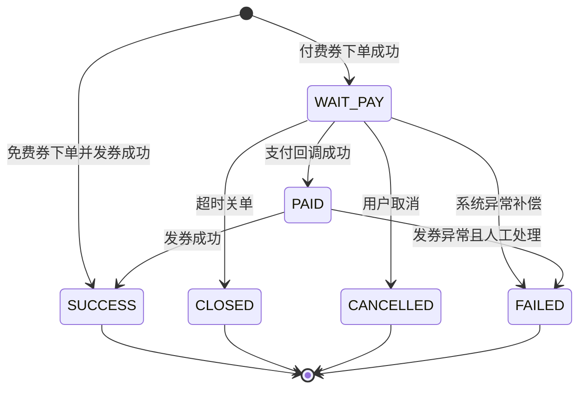
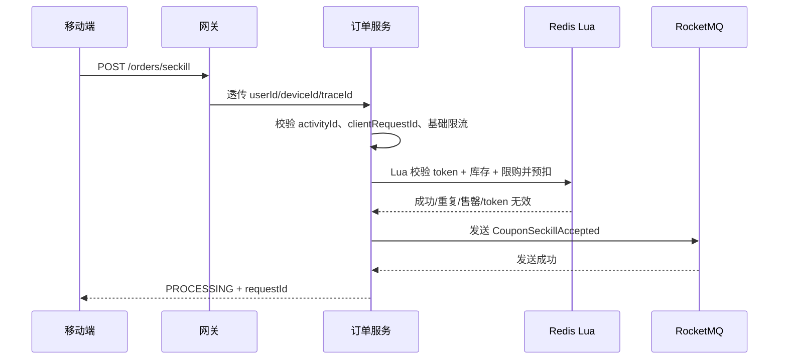
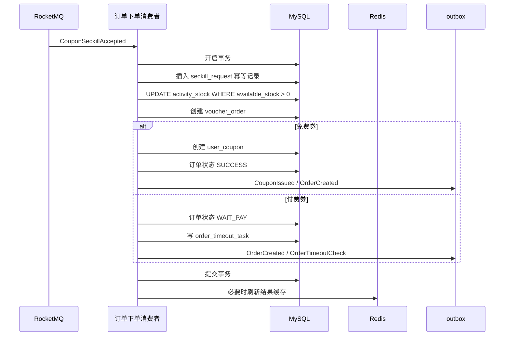
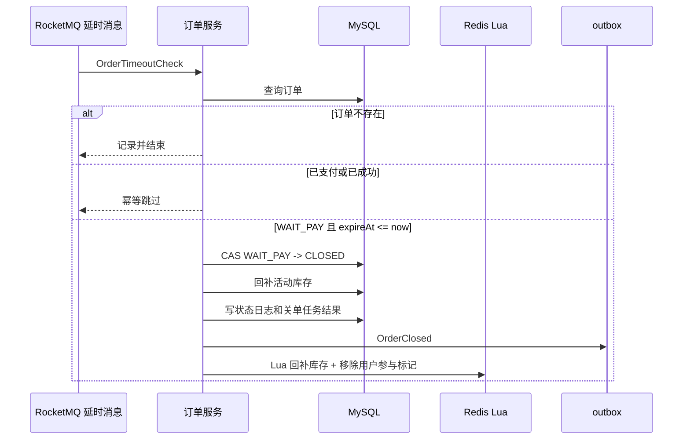

# BlueNote 订单服务设计

## 1. 背景与目标

订单服务负责 BlueNote 第一阶段的“神券秒杀”能力。这里的订单服务不是完整电商交易系统，也不是通用商品订单中心，而是面向偶发运营活动的限时、限量、限购神券抢购服务。

神券可以是免费券，也可以是低价付费券：

1. 免费券：用户抢到后直接生成订单成功记录和用户券。
2. 付费券：用户抢到后创建待支付订单，支付成功后发券，超时未支付则关闭订单并回补库存。

第一阶段设计目标：

1. 支持运营偶尔配置神券秒杀活动。
2. 支持活动开始前库存预热到 Redis。
3. 使用 Redis Lua 原子完成库存预扣、用户限购和秒杀 token 校验。
4. 使用 RocketMQ 削峰异步创建订单，避免高并发请求直接打 MySQL。
5. 使用 MySQL 乐观扣库存和唯一索引兜底，防止超卖和重复抢券。
6. 支持免费券直接发券，付费券进入待支付状态。
7. 使用 RocketMQ 延时消息处理付费券超时关单。
8. 支付回调、超时关单、用户取消使用订单状态机和 CAS 更新，避免并发覆盖。
9. 订单、支付记录、用户券、库存流水以 MySQL 为事实来源。
10. Redis、RocketMQ 只作为加速层、削峰层和异步触发器，数据必须可补偿和可重建。
11. 订单状态变化后发布 `order-event`，由通知服务和推送服务生成提醒。

关键约束：

1. 神券库存属于强一致交易数据，不能接入通用计数服务。
2. 延时消息不能作为订单状态依据，只能触发关单检查。
3. 秒杀成功接口返回“处理中”不代表最终拿到券，最终结果以订单服务查询结果或通知为准。
4. 第一阶段不引入独立支付服务，支付能力作为订单服务内部模块封装，后续再拆。
5. 第一阶段不做完整商品、店铺、购物车、退款和履约系统。

## 2. 功能范围

### 2.1 第一阶段支持

| 功能 | 说明 |
|---|---|
| 神券模板 | 配置券名称、面额、使用门槛、有效期、展示信息 |
| 秒杀活动 | 配置活动时间、库存、限购数量、支付金额、状态 |
| 活动预热 | 活动开始前将库存、限购集合、售罄标识等预热到 Redis |
| 秒杀 token | 用户进入活动页后获取短期一次性 token，防止直接刷接口 |
| 抢券接口 | 移动端提交 `activityId`、`clientRequestId`、`seckillToken` |
| Redis Lua 预扣 | 原子校验活动、库存、用户限购、token，并预扣 Redis 库存 |
| RocketMQ 异步下单 | 预扣成功后发送内部秒杀下单任务 |
| 消费端幂等 | 根据 `requestId`、`clientRequestId`、`userId + activityId` 防重复 |
| MySQL 扣库存 | 使用 `available_stock > 0` 条件更新，作为防超卖兜底 |
| 免费券发券 | `payAmount = 0` 时订单直接成功并生成用户券 |
| 付费券订单 | `payAmount > 0` 时创建 `WAIT_PAY` 订单 |
| 支付回调 | 验签、金额校验、订单状态 CAS、幂等处理 |
| 超时关单 | RocketMQ 延时消息触发检查，未支付订单 CAS 关闭 |
| 库存回补 | 关单或下单失败时回补 MySQL 和 Redis 库存 |
| 用户券查询 | 移动端查询自己已获得的神券 |
| 订单查询 | 查询抢券结果、订单详情、订单列表 |
| 订单事件 | 发布 `OrderCreated`、`OrderPaid`、`OrderClosed`、`CouponIssued` 等事件 |
| 推送请求 | 重要状态变化可发布 `PushSendRequested` |
| 兜底对账 | Redis、订单、库存、用户券之间定时校验和补偿 |

### 2.2 第一阶段不支持

| 功能 | 暂不支持原因 |
|---|---|
| 普通商品订单 | 商品、SKU、物流、售后复杂度高，不属于当前业务重点 |
| 购物车 | 神券秒杀是单活动单券，不需要购物车 |
| 多件购买 | 第一阶段按一人一券或一人限购少量设计，默认一人一券 |
| 复杂优惠叠加 | 神券本身就是优惠权益，不叠加满减、积分、会员价 |
| 退款系统 | 免费券不涉及退款；付费券第一阶段可先不开放主动退款 |
| 钱包余额 | 不做用户余额账户，避免引入资金账户复杂度 |
| 分账结算 | 当前没有商家和平台结算模型 |
| 发票 | 不属于第一阶段范围 |
| 后台运营系统完整页面 | 可先提供内部接口或配置脚本，后续单独设计管理端 |
| 大规模风控系统 | 第一阶段只做限流、token、设备/IP 基础策略 |
| 精确到毫秒的延时关单 | RocketMQ 延时消息和定时兜底允许秒级到分钟级误差 |

### 2.3 后续扩展

后续可以扩展：

1. 独立优惠券服务，订单服务只负责交易状态。
2. 独立支付服务，统一封装微信、支付宝、苹果内购等渠道。
3. 退款、撤销发券、券核销和核销记录。
4. 管理后台活动配置、库存调整和审核流。
5. 秒杀活动分片库存、热点活动本地缓存和多级限流。
6. 风控系统，识别设备异常、批量账号、脚本抢券。
7. 订单数据归档和交易报表。
8. 普通商品、会员、内容付费等更多交易形态。

## 3. 服务边界

### 3.1 订单服务负责

订单服务负责：

1. 神券模板、神券活动、活动库存和活动状态。
2. 秒杀入口校验、Redis 预扣库存、异步下单任务发送。
3. 秒杀请求记录和抢券结果查询。
4. 神券订单创建、订单状态机和订单状态流转日志。
5. 付费券支付单创建、支付回调验签和支付状态管理。
6. 免费券和付费成功后的用户券发放。
7. RocketMQ 延时关单任务和数据库扫表兜底。
8. MySQL 库存、Redis 库存和用户券之间的对账补偿。
9. 订单领域事件和推送请求的 outbox 投递。
10. 订单相关日志、指标、告警和风控。

### 3.2 非订单服务职责

订单服务不负责：

1. 不负责点赞、收藏、粉丝数等通用计数。
2. 不负责站内通知列表和通知已读未读。
3. 不负责 WebSocket 在线投递、系统 Push 和设备 token。
4. 不负责 IM 消息和会话。
5. 不负责用户资料维护。
6. 不负责文件上传和对象存储。
7. 不负责第三方支付平台本身。
8. 不负责钱包余额、资金账户和复杂清结算。
9. 不负责完整管理后台页面。

### 3.3 与计数服务的边界

神券库存不能进入 `bluenote-counter`。

原因：

1. 神券库存是交易强一致数据，扣减失败会造成超卖或少卖。
2. 库存扣减必须和订单、用户券状态在本服务内进行事务控制。
3. 计数服务适合点赞数、收藏数、粉丝数这类可异步校准的展示计数。

订单服务可以发布订单事件供后续数据分析使用，但库存事实只在订单服务内维护。

### 3.4 与通知服务的边界

订单服务只产生订单事实：

1. 抢券成功。
2. 待支付订单创建。
3. 支付成功。
4. 发券成功。
5. 订单关闭。

通知服务负责把这些事实转成站内通知，例如“神券已到账”“订单已关闭”。通知服务不修改订单状态，也不判断用户是否真的拿到券。

### 3.5 与推送服务的边界

订单服务可以通过 `push-request-event` 请求推送服务进行提醒。

推送服务负责：

1. 在线 WebSocket 提醒。
2. 离线系统 Push。
3. 用户推送偏好过滤。
4. 投递日志。

订单服务仍然是订单状态和用户券的事实来源。用户点击 Push 后，移动端必须调用订单服务查询最新结果。

### 3.6 与用户服务的边界

订单服务依赖用户服务校验：

1. 用户是否存在。
2. 用户状态是否正常。
3. 用户是否被封禁或注销。

订单服务可以冗余下单时用户昵称、头像等轻量快照用于订单展示，但用户资料事实仍然属于用户服务。

### 3.7 与登录服务和网关的边界

移动端所有订单接口通过网关访问。

网关负责：

1. Access Token 校验。
2. 注入 `userId`、`deviceId`、`traceId`。
3. 基础限流。

订单服务负责业务层限流、秒杀 token、活动校验和风控判断。

### 3.8 与支付渠道的边界

第一阶段不拆独立支付服务，但订单服务内部要封装支付适配层。

支付适配层负责：

1. 生成支付参数。
2. 接收支付渠道回调。
3. 验证签名。
4. 校验支付金额、币种、商户订单号。
5. 记录渠道流水。

订单领域层不直接依赖具体支付渠道 SDK，后续拆分支付服务时可以平滑迁移。

## 4. 核心概念

### 4.1 神券模板

神券模板描述券本身的权益。

示例：

1. 券名称：BlueNote 神券。
2. 券面额：10 元。
3. 使用门槛：满 30 元可用，或无门槛。
4. 有效期：领取后 7 天内有效，或固定日期前有效。
5. 展示文案、封面、使用说明。

模板不直接表示一次秒杀活动。一个模板可以被多个活动复用，后续运营可以配置不同批次。

### 4.2 神券活动

神券活动表示一次具体的秒杀投放。

核心属性：

1. 活动 ID。
2. 绑定的神券模板。
3. 活动开始时间和结束时间。
4. 活动总库存和可用库存。
5. 每人限购数量，第一阶段默认 1。
6. 需支付金额，0 表示免费券。
7. 支付超时时间，付费券使用。
8. 活动状态。

### 4.3 秒杀请求

秒杀请求是用户一次点击抢券产生的请求记录。

关键字段：

1. `requestId`：服务端生成的全局请求 ID。
2. `clientRequestId`：移动端生成的幂等 ID。
3. `userId`：用户 ID。
4. `activityId`：活动 ID。
5. `status`：处理中、成功、失败。

秒杀请求用于承接“接口已接收，但异步订单还没创建完成”的中间态。

### 4.4 神券订单

神券订单表示用户抢到某个活动名额后生成的交易记录。

免费券订单会快速进入成功状态。付费券订单会先进入待支付状态。

订单核心字段：

1. `orderId`
2. `orderNo`
3. `userId`
4. `activityId`
5. `couponTemplateId`
6. `payAmount`
7. `status`
8. `expireAt`

### 4.5 用户券

用户券表示用户已经获得的一张可使用权益。

核心字段：

1. `userCouponId`
2. `userId`
3. `couponTemplateId`
4. `sourceOrderId`
5. `status`
6. `validStartAt`
7. `validEndAt`

第一阶段只需要支持查询、展示和过期状态。真正核销可以后续接入订单或活动场景。

### 4.6 秒杀 token

秒杀 token 是用户进入活动页时由订单服务签发的短期一次性凭证。

它不是短信验证码，也不需要付费服务。它的目的不是证明手机号归属，而是减少直接抓包重放秒杀接口的风险。

特点：

1. 绑定 `userId + activityId`。
2. TTL 短，例如 30 秒。
3. 秒杀 Lua 脚本中校验并删除。
4. 一次 token 只能使用一次。

### 4.7 库存预扣

库存预扣指 Redis 层先扣减一个可用名额，并记录用户已参与。

预扣成功后：

1. 发送 RocketMQ 内部下单任务。
2. 移动端收到“处理中”。
3. 消费者异步写 MySQL。

如果 MQ 发送失败或 MySQL 落库失败，必须回补 Redis 库存和用户标记。

### 4.8 订单状态

订单状态建议如下：

| 状态 | 说明 |
|---|---|
| `WAIT_PAY` | 待支付，仅付费券使用 |
| `PAID` | 已支付，等待发券或发券处理中 |
| `SUCCESS` | 已完成，用户券已生成 |
| `CLOSED` | 超时关闭或系统关闭 |
| `CANCELLED` | 用户主动取消 |
| `FAILED` | 下单失败，通常为库存异常或系统补偿后失败 |

状态流转：



约束：

1. `SUCCESS`、`CLOSED`、`CANCELLED`、`FAILED` 是终态。
2. 支付成功和超时关单并发时，使用 CAS 更新保证只有一个成功。
3. 所有状态变化必须记录状态流转日志。

### 4.9 活动状态

活动状态建议如下：

| 状态 | 说明 |
|---|---|
| `DRAFT` | 草稿，未开放 |
| `READY` | 已配置，等待预热 |
| `PREHEATED` | Redis 库存已预热 |
| `ONLINE` | 活动进行中 |
| `SOLD_OUT` | 已售罄 |
| `PAUSED` | 暂停 |
| `ENDED` | 已结束 |
| `CANCELLED` | 活动取消 |

活动状态不只依赖时间，还要结合运营状态和库存状态判断。

## 5. 核心流程

### 5.1 活动配置和预热流程

```text
运营配置神券模板和活动
  -> 订单服务保存 coupon_template、coupon_activity
  -> 活动状态 READY
  -> 预热任务在开始前加载活动库存到 Redis
  -> SET seckill stock
  -> 清理 soldout 标识
  -> 初始化用户集合和请求映射 TTL
  -> 活动状态 PREHEATED
  -> 到开始时间后活动进入 ONLINE
```

关键要求：

1. 预热必须幂等，不能重复把 Redis 库存覆盖回初始值。
2. 活动已经开始后禁止直接修改总库存，必须走库存调整接口和库存流水。
3. 预热失败时活动不能进入 `ONLINE`，接口返回“活动准备中”。
4. Redis TTL 至少覆盖活动结束时间和支付超时时间。

### 5.2 获取秒杀 token

```text
移动端进入神券活动页
  -> GET /coupon-activities/{activityId}
  -> 展示活动状态、倒计时、库存状态
  -> POST /seckill/token
  -> 订单服务校验登录、用户状态、活动状态、限流
  -> 写入 Redis token，TTL 30 秒
  -> 返回 seckillToken
```

token 设计原因：

1. 防止直接绕过活动页刷抢券接口。
2. 防止同一个 token 被重复提交。
3. 不依赖短信、邮箱或第三方验证码服务。

### 5.3 用户抢神券流程



接口返回 `PROCESSING` 的原因：

1. 秒杀入口必须快，不能同步等待 MySQL 写入。
2. RocketMQ 消费可能存在短暂延迟。
3. 移动端可以轮询结果，或等待通知/推送。

### 5.4 Redis Lua 预扣逻辑

Lua 脚本需要原子完成：

1. 校验活动是否已预热。
2. 校验售罄标识。
3. 校验 token。
4. 校验用户是否已经抢过。
5. 校验库存是否大于 0。
6. 扣减库存。
7. 记录用户已参与。
8. 记录 `userId -> requestId` 映射，便于补偿和排查。

返回码建议：

| 返回码 | 说明 | 移动端提示 |
|---|---|---|
| `1` | 预扣成功 | 抢券处理中 |
| `0` | 库存不足 | 已抢光 |
| `-1` | 重复抢券 | 已参与或已获得 |
| `-2` | token 无效或过期 | 页面刷新后重试 |
| `-3` | 活动未开始或已结束 | 活动未开始/已结束 |
| `-4` | 活动未预热 | 系统繁忙 |
| `-5` | 被限流 | 操作太频繁 |

### 5.5 异步下单流程



关键要求：

1. 消费端先处理幂等，再扣 MySQL 库存。
2. `user_id + activity_id` 唯一索引兜底一人一券。
3. MySQL 扣库存使用 `available_stock > 0`，不能只信任 Redis。
4. 免费券发券、订单成功、用户券生成必须在同一个本地事务内完成。
5. 付费券订单创建成功后，延时关单消息必须在事务提交后投递。

### 5.6 免费券直接发券流程

```text
异步下单消费者
  -> 判断 activity.payAmount = 0
  -> 扣 MySQL 可用库存
  -> 创建订单 SUCCESS
  -> 创建 user_coupon
  -> 写 order_status_log
  -> 写 outbox: OrderCreated、CouponIssued、PushSendRequested
  -> 移动端查询结果看到 SUCCESS
```

免费券不需要超时关单，因为没有支付等待期。

### 5.7 付费券支付流程

```text
移动端查询到 WAIT_PAY 订单
  -> 调用支付下单接口
  -> 订单服务校验订单状态和金额
  -> 创建 payment_record
  -> 调用支付渠道适配器生成支付参数
  -> 移动端拉起支付
  -> 支付渠道回调订单服务
  -> 验签、校验金额、校验订单号
  -> CAS: WAIT_PAY -> PAID
  -> 创建 user_coupon
  -> 订单状态 PAID -> SUCCESS
  -> 发布 OrderPaid、CouponIssued
```

支付关键点：

1. 客户端不能告诉服务端支付金额，金额以订单服务数据库为准。
2. 支付回调必须幂等，重复回调不能重复发券。
3. 支付成功和超时关单并发时，以数据库状态机为准。
4. 支付渠道流水号必须唯一。

### 5.8 超时关单流程



关单原则：

1. 延时消息只是触发检查，不直接决定关闭。
2. 必须查询 MySQL 当前订单状态。
3. 只有 `WAIT_PAY` 且 `expireAt <= now` 才能关闭。
4. 更新订单状态必须带条件：`WHERE id = ? AND status = 'WAIT_PAY'`。
5. 支付回调先成功时，关单更新影响 0 行，直接幂等结束。
6. 关单先成功时，支付回调必须拒绝或走退款/人工处理流程。

### 5.9 用户主动取消订单

第一阶段可以支持付费券待支付订单主动取消。

```text
移动端点击取消
  -> 订单服务查询订单
  -> 校验订单属于当前用户
  -> CAS WAIT_PAY -> CANCELLED
  -> 回补 MySQL 活动库存
  -> Lua 回补 Redis 库存和用户参与标记
  -> 发布 OrderCancelled
```

已支付或已成功发券订单第一阶段不支持用户主动取消。

### 5.10 抢券结果查询

移动端提交抢券后，根据 `clientRequestId` 或 `requestId` 查询结果。

结果状态：

| 状态 | 说明 |
|---|---|
| `PROCESSING` | 已接收，异步处理中 |
| `SUCCESS` | 抢券成功，返回订单和用户券 |
| `WAIT_PAY` | 抢到付费券名额，等待支付 |
| `SOLD_OUT` | 库存不足 |
| `DUPLICATE` | 用户已参与或已获得 |
| `FAILED` | 系统异常或库存校验失败 |

查询流程：

1. 优先查询 MySQL `coupon_seckill_request`。
2. 如果请求记录不存在但 Redis 中有预扣映射，返回 `PROCESSING` 并设置最大等待时间。
3. 如果长时间无结果，触发补偿任务或提示用户刷新。

### 5.11 活动结束和数据清理

活动结束后：

1. 停止发放新秒杀 token。
2. 秒杀接口拒绝新请求。
3. 处理仍在 RocketMQ 中的下单任务。
4. 付费券未支付订单继续等待 `expireAt` 或被扫表关单。
5. Redis 库存、用户集合、token、请求映射在活动结束后一段时间清理。
6. MySQL 订单、用户券、库存流水长期保留。

## 6. 异常流程

### 6.1 活动未开始或已结束

处理：

1. 活动详情接口返回明确状态和倒计时。
2. 秒杀 token 接口不发 token。
3. 抢券接口直接拒绝，不执行 Lua 预扣。

### 6.2 活动未预热

处理：

1. 秒杀接口返回系统繁忙或活动准备中。
2. 触发预热任务告警。
3. 不降级为直接扣 MySQL，避免活动开始瞬间打爆数据库。

### 6.3 Redis 库存不足

处理：

1. Lua 返回库存不足。
2. 可写入售罄标识，后续请求快速失败。
3. 移动端展示“已抢光”。

### 6.4 用户重复抢券

重复来源：

1. 用户多次点击。
2. 移动端网络重试。
3. MQ 重复消费。
4. 支付回调重复。

处理：

1. Redis Set 拦截同一用户同一活动重复参与。
2. `coupon_seckill_request.client_request_id` 唯一约束。
3. `voucher_order.user_id + activity_id` 唯一约束。
4. `user_coupon.user_id + source_order_id` 唯一约束。
5. 支付流水号唯一约束。

### 6.5 MQ 发送秒杀任务失败

Redis 预扣成功后发送 `CouponSeckillAccepted` 失败时：

1. 立即执行 Redis 回补 Lua：库存 `INCR`、用户 Set `SREM`、请求映射 `HDEL`。
2. 如果回补成功，接口返回系统繁忙，用户可以重试。
3. 如果回补失败，记录本地异常日志和补偿任务。
4. 补偿任务根据 Redis 请求映射和 MySQL 订单结果做修复。

注意：这里不建议为了保证 MQ 发送而在入口同步写 MySQL，因为秒杀入口的核心价值是避免高峰流量直接进入数据库。

### 6.6 MQ 重复消费

处理：

1. 消费者先插入 `mq_consume_record` 或 `coupon_seckill_request` 幂等记录。
2. 发现重复 `requestId` 或重复 `userId + activityId` 时直接返回成功。
3. 不能重复扣 MySQL 库存。
4. 不能重复创建用户券。

### 6.7 MySQL 扣库存失败

可能原因：

1. Redis 和 MySQL 库存不一致。
2. Redis 主从切换导致预扣丢失。
3. 运营错误调整库存。
4. 重复消息穿透。

处理：

1. 下单请求标记为 `FAILED`。
2. 订单不进入成功状态。
3. Redis 写入售罄标识。
4. 执行 Redis 回补，防止用户长期占位。
5. 记录库存异常告警。

### 6.8 支付成功与超时关单并发

并发场景：

```text
T1 支付回调到达
T2 RocketMQ 延时关单到达
二者同时更新同一订单
```

处理：

1. 支付成功使用 `UPDATE ... WHERE status = 'WAIT_PAY'`。
2. 关单也使用 `UPDATE ... WHERE status = 'WAIT_PAY'`。
3. MySQL 行锁保证两个更新串行。
4. 先成功的一方影响 1 行，后到的一方影响 0 行并幂等结束。
5. 不需要分布式锁。

### 6.9 Redis 回补失败

关单成功后 Redis 回补失败时：

1. MySQL 已经是事实来源，订单关闭和库存回补必须先保证 MySQL 事务成功。
2. Redis 回补失败记录 `stock_compensation_task`。
3. 补偿任务重试 Redis Lua。
4. 如果活动已结束或 Redis Key 不存在，只回补 MySQL，不创建幽灵 Redis 库存。

### 6.10 支付回调验签失败

处理：

1. 拒绝处理。
2. 记录安全日志。
3. 不返回业务成功。
4. 多次异常触发告警。

### 6.11 发券失败

免费券发券和付费券支付成功后的发券应尽量在本地事务内完成。

如果发券失败：

1. 事务回滚，订单不能进入 `SUCCESS`。
2. 如果支付已经确认成功但发券失败，订单可进入 `PAID`，由补偿任务继续发券。
3. 补偿任务成功后更新 `SUCCESS` 并发布 `CouponIssued`。
4. 长时间失败需要人工处理。

## 7. 存储设计

### 7.1 MySQL 表设计

订单服务使用 schema：`bluenote_order`。

#### 7.1.1 coupon_template

用途：保存神券模板。

| 字段 | 类型 | 说明 |
|---|---|---|
| id | BIGINT | 模板 ID |
| template_name | VARCHAR(64) | 券名称 |
| coupon_type | VARCHAR(32) | 券类型，例如 AMOUNT_OFF、DISCOUNT |
| face_value | BIGINT | 券面额，单位分 |
| threshold_amount | BIGINT | 使用门槛，单位分 |
| validity_type | VARCHAR(32) | FIXED_RANGE、AFTER_RECEIVE |
| valid_start_at | DATETIME(3) | 固定有效期开始 |
| valid_end_at | DATETIME(3) | 固定有效期结束 |
| valid_days_after_receive | INT | 领取后有效天数 |
| display_title | VARCHAR(128) | 展示标题 |
| display_desc | VARCHAR(255) | 展示说明 |
| cover_file_id | BIGINT | 封面文件 ID，可选 |
| status | VARCHAR(32) | ENABLED、DISABLED |
| created_at | DATETIME(3) | 创建时间 |
| updated_at | DATETIME(3) | 更新时间 |

#### 7.1.2 coupon_activity

用途：保存神券秒杀活动。

| 字段 | 类型 | 说明 |
|---|---|---|
| id | BIGINT | 活动 ID |
| template_id | BIGINT | 神券模板 ID |
| activity_name | VARCHAR(128) | 活动名称 |
| start_at | DATETIME(3) | 开始时间 |
| end_at | DATETIME(3) | 结束时间 |
| total_stock | INT | 总库存 |
| available_stock | INT | 可用库存 |
| locked_stock | INT | 待支付锁定库存 |
| sold_count | INT | 已成功发券数量 |
| limit_per_user | INT | 每人限购数量，第一阶段默认 1 |
| pay_amount | BIGINT | 支付金额，单位分，0 表示免费 |
| pay_timeout_minutes | INT | 支付超时时间 |
| status | VARCHAR(32) | DRAFT、READY、PREHEATED、ONLINE、SOLD_OUT、PAUSED、ENDED |
| preheat_status | VARCHAR(32) | NOT_PREHEATED、PREHEATING、PREHEATED、FAILED |
| version | INT | 乐观锁版本，可选 |
| created_at | DATETIME(3) | 创建时间 |
| updated_at | DATETIME(3) | 更新时间 |

库存更新原则：

1. 免费券成功：`available_stock - 1`，`sold_count + 1`。
2. 付费券待支付：`available_stock - 1`，`locked_stock + 1`。
3. 付费成功发券：`locked_stock - 1`，`sold_count + 1`。
4. 超时关闭：`locked_stock - 1`，`available_stock + 1`。

#### 7.1.3 coupon_seckill_request

用途：记录秒杀请求结果，承接异步处理中状态。

| 字段 | 类型 | 说明 |
|---|---|---|
| id | BIGINT | 主键 |
| request_id | VARCHAR(64) | 服务端请求 ID |
| client_request_id | VARCHAR(64) | 移动端幂等 ID |
| user_id | BIGINT | 用户 ID |
| activity_id | BIGINT | 活动 ID |
| order_id | BIGINT | 订单 ID，成功后回填 |
| status | VARCHAR(32) | PROCESSING、SUCCESS、WAIT_PAY、SOLD_OUT、DUPLICATE、FAILED |
| fail_code | VARCHAR(64) | 失败原因码 |
| fail_message | VARCHAR(255) | 失败说明 |
| trace_id | VARCHAR(64) | 链路 ID |
| created_at | DATETIME(3) | 创建时间 |
| updated_at | DATETIME(3) | 更新时间 |

#### 7.1.4 voucher_order

用途：保存神券订单。

| 字段 | 类型 | 说明 |
|---|---|---|
| id | BIGINT | 订单 ID |
| order_no | VARCHAR(64) | 业务订单号 |
| request_id | VARCHAR(64) | 秒杀请求 ID |
| client_request_id | VARCHAR(64) | 移动端幂等 ID |
| user_id | BIGINT | 用户 ID |
| activity_id | BIGINT | 活动 ID |
| template_id | BIGINT | 神券模板 ID |
| pay_amount | BIGINT | 支付金额，单位分 |
| pay_status | VARCHAR(32) | NONE、WAIT_PAY、PAID、CLOSED |
| status | VARCHAR(32) | WAIT_PAY、PAID、SUCCESS、CLOSED、CANCELLED、FAILED |
| expire_at | DATETIME(3) | 支付过期时间 |
| paid_at | DATETIME(3) | 支付成功时间 |
| success_at | DATETIME(3) | 完成时间 |
| closed_at | DATETIME(3) | 关闭时间 |
| close_reason | VARCHAR(64) | TIMEOUT、USER_CANCEL、SYSTEM |
| user_snapshot | JSON | 用户下单时轻量快照，可选 |
| version | INT | 乐观锁版本 |
| created_at | DATETIME(3) | 创建时间 |
| updated_at | DATETIME(3) | 更新时间 |

#### 7.1.5 voucher_payment_record

用途：保存付费券支付记录和渠道回调。

| 字段 | 类型 | 说明 |
|---|---|---|
| id | BIGINT | 支付记录 ID |
| payment_no | VARCHAR(64) | 内部支付单号 |
| order_id | BIGINT | 订单 ID |
| order_no | VARCHAR(64) | 业务订单号 |
| user_id | BIGINT | 用户 ID |
| channel | VARCHAR(32) | 支付渠道 |
| channel_trade_no | VARCHAR(128) | 渠道交易号 |
| pay_amount | BIGINT | 应付金额 |
| paid_amount | BIGINT | 实付金额 |
| status | VARCHAR(32) | INIT、PAYING、SUCCESS、FAILED、CLOSED |
| callback_payload_hash | VARCHAR(128) | 回调报文摘要 |
| paid_at | DATETIME(3) | 支付成功时间 |
| created_at | DATETIME(3) | 创建时间 |
| updated_at | DATETIME(3) | 更新时间 |

#### 7.1.6 user_coupon

用途：保存用户已获得的神券。

| 字段 | 类型 | 说明 |
|---|---|---|
| id | BIGINT | 用户券 ID |
| user_id | BIGINT | 用户 ID |
| template_id | BIGINT | 神券模板 ID |
| activity_id | BIGINT | 来源活动 ID |
| source_order_id | BIGINT | 来源订单 ID |
| coupon_name_snapshot | VARCHAR(128) | 券名称快照 |
| face_value | BIGINT | 面额快照 |
| threshold_amount | BIGINT | 门槛快照 |
| status | VARCHAR(32) | UNUSED、USED、EXPIRED、REVOKED |
| valid_start_at | DATETIME(3) | 有效期开始 |
| valid_end_at | DATETIME(3) | 有效期结束 |
| used_at | DATETIME(3) | 使用时间，后续 |
| created_at | DATETIME(3) | 创建时间 |
| updated_at | DATETIME(3) | 更新时间 |

#### 7.1.7 order_status_log

用途：记录订单状态流转，便于排查。

| 字段 | 类型 | 说明 |
|---|---|---|
| id | BIGINT | 主键 |
| order_id | BIGINT | 订单 ID |
| from_status | VARCHAR(32) | 原状态 |
| to_status | VARCHAR(32) | 新状态 |
| reason | VARCHAR(64) | 流转原因 |
| operator_type | VARCHAR(32) | USER、SYSTEM、PAYMENT_CALLBACK、MQ |
| operator_id | VARCHAR(64) | 操作人或任务 ID |
| trace_id | VARCHAR(64) | 链路 ID |
| created_at | DATETIME(3) | 创建时间 |

#### 7.1.8 coupon_stock_flow

用途：记录库存变化流水。

| 字段 | 类型 | 说明 |
|---|---|---|
| id | BIGINT | 主键 |
| activity_id | BIGINT | 活动 ID |
| order_id | BIGINT | 订单 ID，可为空 |
| request_id | VARCHAR(64) | 秒杀请求 ID |
| change_type | VARCHAR(32) | LOCK、SELL、UNLOCK、ADJUST |
| available_delta | INT | 可用库存变化 |
| locked_delta | INT | 锁定库存变化 |
| sold_delta | INT | 已售变化 |
| before_snapshot | JSON | 变化前快照，可选 |
| after_snapshot | JSON | 变化后快照，可选 |
| created_at | DATETIME(3) | 创建时间 |

#### 7.1.9 order_timeout_task

用途：记录延时关单任务和兜底扫描状态。

| 字段 | 类型 | 说明 |
|---|---|---|
| id | BIGINT | 主键 |
| order_id | BIGINT | 订单 ID |
| activity_id | BIGINT | 活动 ID |
| user_id | BIGINT | 用户 ID |
| expire_at | DATETIME(3) | 过期时间 |
| status | VARCHAR(32) | INIT、SENT、CONSUMED、CLOSED、SKIPPED、FAILED |
| retry_count | INT | 重试次数 |
| last_error | VARCHAR(255) | 最近错误 |
| created_at | DATETIME(3) | 创建时间 |
| updated_at | DATETIME(3) | 更新时间 |

#### 7.1.10 outbox_event

用途：本地事务内记录待发布事件。

| 字段 | 类型 | 说明 |
|---|---|---|
| id | BIGINT | 主键 |
| event_id | VARCHAR(64) | 事件 ID |
| topic | VARCHAR(128) | Topic |
| event_type | VARCHAR(64) | 事件类型 |
| biz_key | VARCHAR(128) | 业务键 |
| payload | JSON | 事件内容 |
| status | VARCHAR(32) | INIT、SENT、FAILED |
| retry_count | INT | 重试次数 |
| next_retry_at | DATETIME(3) | 下次重试时间 |
| created_at | DATETIME(3) | 创建时间 |
| updated_at | DATETIME(3) | 更新时间 |

#### 7.1.11 mq_consume_record

用途：记录 MQ 消费幂等。

| 字段 | 类型 | 说明 |
|---|---|---|
| id | BIGINT | 主键 |
| consumer_group | VARCHAR(128) | 消费组 |
| event_id | VARCHAR(64) | 事件 ID |
| event_type | VARCHAR(64) | 事件类型 |
| biz_key | VARCHAR(128) | 业务键 |
| status | VARCHAR(32) | PROCESSING、SUCCESS、FAILED |
| error_message | VARCHAR(255) | 错误信息 |
| consumed_at | DATETIME(3) | 消费完成时间 |
| created_at | DATETIME(3) | 创建时间 |
| updated_at | DATETIME(3) | 更新时间 |

### 7.2 索引设计

| 表 | 索引 | 说明 |
|---|---|---|
| coupon_template | `idx_status` | 查询可用模板 |
| coupon_activity | `idx_status_time(status, start_at, end_at)` | 查询进行中或待开始活动 |
| coupon_activity | `idx_template(template_id)` | 查询模板关联活动 |
| coupon_seckill_request | `uk_request_id(request_id)` | 服务端请求幂等 |
| coupon_seckill_request | `uk_client_request(user_id, client_request_id)` | 移动端请求幂等 |
| coupon_seckill_request | `uk_user_activity(user_id, activity_id)` | 一人一券兜底 |
| coupon_seckill_request | `idx_user_created(user_id, created_at)` | 用户查询抢券记录 |
| voucher_order | `uk_order_no(order_no)` | 业务订单号唯一 |
| voucher_order | `uk_request_id(request_id)` | 请求和订单一对一 |
| voucher_order | `uk_user_activity(user_id, activity_id)` | 一人一券兜底 |
| voucher_order | `uk_client_request(user_id, client_request_id)` | 移动端幂等查询 |
| voucher_order | `idx_user_created(user_id, created_at)` | 用户订单列表 |
| voucher_order | `idx_status_expire(status, expire_at)` | 超时关单扫表 |
| voucher_payment_record | `uk_payment_no(payment_no)` | 内部支付单唯一 |
| voucher_payment_record | `uk_channel_trade(channel, channel_trade_no)` | 支付回调幂等 |
| voucher_payment_record | `idx_order(order_id)` | 查询订单支付记录 |
| user_coupon | `uk_order(source_order_id)` | 一个订单只能发一张券 |
| user_coupon | `idx_user_status_valid(user_id, status, valid_end_at)` | 用户券列表和过期扫描 |
| order_status_log | `idx_order_created(order_id, created_at)` | 查询订单状态流转 |
| coupon_stock_flow | `idx_activity_created(activity_id, created_at)` | 库存流水 |
| order_timeout_task | `uk_order(order_id)` | 每个订单一个主关单任务 |
| order_timeout_task | `idx_status_expire(status, expire_at)` | 兜底扫描 |
| outbox_event | `uk_event_id(event_id)` | 事件唯一 |
| outbox_event | `idx_status_retry(status, next_retry_at)` | 待投递扫描 |
| mq_consume_record | `uk_group_event(consumer_group, event_id)` | 消费幂等 |

### 7.3 Redis Key 设计

Key 命名遵循：

```text
bluenote:{env}:order:{domain}:{id}
```

| Key | 数据结构 | TTL | 用途 |
|---|---|---|---|
| `bluenote:{env}:order:seckill:stock:{activityId}` | String | 活动结束 + 支付超时 + 1 小时 | Redis 可用库存 |
| `bluenote:{env}:order:seckill:users:{activityId}` | Set | 活动结束 + 支付超时 + 1 小时 | 已预占或已获得用户 |
| `bluenote:{env}:order:seckill:req-map:{activityId}` | Hash | 活动结束 + 支付超时 + 1 小时 | `userId -> requestId` |
| `bluenote:{env}:order:seckill:req:{requestId}` | String / Hash | 1 到 24 小时 | 请求短期结果 |
| `bluenote:{env}:order:seckill:token:{userId}:{activityId}` | String | 30 秒左右 | 秒杀一次性 token |
| `bluenote:{env}:order:seckill:soldout:{activityId}` | String | 活动结束 | 售罄标识 |
| `bluenote:{env}:order:activity:rebuilding:{activityId}` | String | 短 TTL | Redis 重建保护 |
| `bluenote:{env}:order:idempotent:pay:{channel}:{tradeNo}` | String | 1 到 7 天 | 支付回调短期幂等辅助 |

Redis 原则：

1. Redis 不是库存事实来源。
2. 库存预热必须从 MySQL 读取。
3. Redis 丢失后需要暂停活动入口或返回系统繁忙，再按 MySQL 重建。
4. 回补库存时必须先判断库存 Key 是否存在，避免活动结束后创建幽灵库存。

### 7.4 Redis 回补 Lua

关单或下单失败后回补 Redis 时，Lua 必须原子完成：

1. 判断库存 Key 是否存在。
2. 判断用户 Set 中是否存在该用户。
3. `INCR` 库存。
4. `SREM` 用户参与标记。
5. `HDEL` 请求映射。

如果库存 Key 已不存在，说明活动已结束或 Redis 已清理，不应重新创建库存 Key。此时只保留 MySQL 的库存回补结果。

### 7.5 Redis 重建

Redis 异常丢失时：

1. 对活动写入 `rebuilding` 标识或将活动状态临时置为 `PAUSED`。
2. 从 MySQL `coupon_activity.available_stock` 重建库存。
3. 从 `voucher_order` 中查询 `WAIT_PAY`、`PAID`、`SUCCESS`、`CANCELLED` 需要限制参与资格的记录，重建用户 Set。
4. 删除错误售罄标识。
5. 重建完成后恢复活动状态。

重建期间不允许继续放行秒杀请求，否则可能超卖。

## 8. 接口设计

### 8.1 移动端接口

所有接口通过网关访问，网关注入 `userId`、`deviceId`、`traceId`。

#### 8.1.1 查询当前神券活动

```http
GET /api/order/coupon-activities/current
```

响应示例：

```json
{
  "activityId": "10001",
  "activityName": "BlueNote 周末神券",
  "templateName": "满30减10神券",
  "faceValue": 1000,
  "thresholdAmount": 3000,
  "payAmount": 0,
  "status": "ONLINE",
  "startAt": "2026-06-04T20:00:00+08:00",
  "endAt": "2026-06-04T22:00:00+08:00",
  "userJoined": false,
  "serverTime": "2026-06-04T20:01:00+08:00"
}
```

说明：

1. 不建议返回精确剩余库存，避免刺激刷接口。
2. 可以返回 `SOLD_OUT`、`NOT_STARTED`、`ENDED` 等状态。

#### 8.1.2 获取秒杀 token

```http
POST /api/order/seckill/token
```

请求：

```json
{
  "activityId": "10001"
}
```

响应：

```json
{
  "seckillToken": "token-string",
  "expiresInSeconds": 30
}
```

#### 8.1.3 发起抢券

```http
POST /api/order/seckill/orders
```

请求：

```json
{
  "activityId": "10001",
  "clientRequestId": "app-generated-uuid",
  "seckillToken": "token-string"
}
```

响应：

```json
{
  "requestId": "req_10001",
  "status": "PROCESSING",
  "message": "抢券处理中"
}
```

幂等规则：

1. 同一用户重复提交相同 `clientRequestId`，返回同一处理结果。
2. 同一用户同一活动已成功或处理中，返回重复参与结果。
3. `clientRequestId` 必须由移动端生成并在重试时保持不变。

#### 8.1.4 查询抢券结果

```http
GET /api/order/seckill/results/{requestId}
```

响应：

```json
{
  "requestId": "req_10001",
  "status": "SUCCESS",
  "orderId": "90001",
  "userCouponId": "80001",
  "payRequired": false
}
```

付费券待支付响应：

```json
{
  "requestId": "req_10002",
  "status": "WAIT_PAY",
  "orderId": "90002",
  "payRequired": true,
  "payAmount": 990,
  "expireAt": "2026-06-04T20:16:00+08:00"
}
```

#### 8.1.5 订单详情

```http
GET /api/order/orders/{orderId}
```

返回订单状态、活动信息、神券信息、支付金额、过期时间、用户券信息。

#### 8.1.6 创建支付参数

```http
POST /api/order/orders/{orderId}/pay
```

请求：

```json
{
  "channel": "MOCK"
}
```

第一阶段可以先支持 `MOCK` 或测试支付通道，接口形态保留真实支付扩展。

#### 8.1.7 取消待支付订单

```http
POST /api/order/orders/{orderId}/cancel
```

约束：

1. 只能取消自己的订单。
2. 只能取消 `WAIT_PAY` 状态。
3. 已支付和已发券不能取消。

#### 8.1.8 我的神券列表

```http
GET /api/order/my-coupons?status=UNUSED&cursor=xxx&pageSize=20
```

返回用户已获得的神券列表。

### 8.2 内部接口

#### 8.2.1 活动配置接口

第一阶段可以提供内部接口或脚本配置活动：

```http
POST /internal/order/coupon-activities
POST /internal/order/coupon-activities/{activityId}/preheat
POST /internal/order/coupon-activities/{activityId}/pause
POST /internal/order/coupon-activities/{activityId}/resume
POST /internal/order/coupon-activities/{activityId}/end
```

这些接口必须使用管理员权限或内网鉴权，不暴露给普通移动端。

#### 8.2.2 支付回调接口

```http
POST /internal/order/payments/callback/{channel}
```

要求：

1. 验签。
2. 校验订单号。
3. 校验金额。
4. 记录原始回调摘要。
5. 幂等处理。

#### 8.2.3 内部查询接口

提供给通知、推送点击跳转或后续客服工具：

```http
GET /internal/order/orders/{orderId}/summary
GET /internal/order/coupons/{userCouponId}/summary
```

内部接口只返回轻量摘要，不暴露支付敏感信息。

## 9. 安全与风控设计

### 9.1 鉴权

要求：

1. 移动端订单接口必须登录。
2. 网关注入用户上下文，订单服务不信任客户端传入的 `userId`。
3. 内部活动配置接口必须管理员鉴权。
4. 支付回调接口不使用普通用户 token，但必须验签。

### 9.2 参数安全

要求：

1. `activityId` 必须校验存在。
2. `clientRequestId` 必须长度、格式合法。
3. 客户端不能传支付金额、券面额、库存数量。
4. 服务端根据活动和订单计算金额。

### 9.3 秒杀 token

秒杀 token 用于防重放：

1. 进入活动页后发放。
2. 短 TTL。
3. 一次性使用。
4. 与用户和活动绑定。
5. Lua 脚本中校验和删除。

### 9.4 限流

限流层次：

1. 网关按 IP、用户、接口限流。
2. 订单服务按 `userId + activityId` 限流。
3. 订单服务按 `deviceId + activityId` 限流。
4. 对异常失败率高的 IP 或设备临时拒绝。

第一阶段不需要复杂风控系统，但必须保留配置化阈值。

### 9.5 支付安全

支付回调必须校验：

1. 渠道签名。
2. 商户订单号。
3. 支付金额。
4. 支付状态。
5. 渠道交易号唯一。
6. 回调时间和重复回调。

不能因为移动端返回“支付成功”就修改订单状态。

### 9.6 数据越权

要求：

1. 用户只能查询自己的订单。
2. 用户只能查询自己的券。
3. 用户不能取消别人的订单。
4. 内部接口和管理接口必须隔离权限。

## 10. 前后端实现要点

### 10.1 移动端实现要点

移动端页面建议：

1. 神券活动入口卡片。
2. 活动详情弹窗或页面。
3. 抢券按钮状态：未开始、可抢、处理中、已抢到、已抢光。
4. 抢券结果页。
5. 待支付倒计时。
6. 我的神券列表。

交互要求：

1. 使用服务端时间计算倒计时，避免客户端时间不准。
2. 抢券按钮点击后立即置灰，使用 `clientRequestId` 保持重试幂等。
3. 抢券接口返回 `PROCESSING` 后轮询结果，间隔可以从 500ms 增加到 2s。
4. 收到 Push 或通知后重新拉取订单详情。
5. 支付成功后也要调用订单详情接口确认最终状态。

### 10.2 后端模块建议

`bluenote-order` 内部可以按模块划分：

| 模块 | 职责 |
|---|---|
| activity | 神券模板、活动、预热、状态 |
| seckill | 秒杀 token、Lua 预扣、异步任务发送 |
| order | 订单创建、状态机、取消、查询 |
| payment | 支付单、支付渠道适配、回调 |
| coupon | 用户券发放、查询、过期 |
| stock | MySQL 库存、Redis 库存、库存流水 |
| mq | RocketMQ 生产、消费、outbox |
| reconcile | 对账、补偿、扫表关单 |
| risk | 限流、风控、异常用户策略 |

### 10.3 事务边界

必须使用本地事务的场景：

1. 异步下单：请求记录、扣库存、订单、用户券或关单任务、outbox。
2. 支付回调：支付记录、订单状态、用户券、状态日志、outbox。
3. 超时关单：订单状态、库存回补、状态日志、outbox。
4. 用户取消：订单状态、库存回补、状态日志、outbox。

不建议把 Redis 写操作放入数据库事务中。Redis 操作失败通过补偿任务处理。

### 10.4 状态机实现

订单状态变更建议集中封装：

```text
OrderStateMachine.transition(orderId, fromStatus, toStatus, reason)
```

要求：

1. 所有状态更新必须带期望原状态。
2. 所有状态变更必须写 `order_status_log`。
3. 终态不能继续流转。
4. 非法流转直接拒绝。

### 10.5 配置项

建议配置化：

1. 秒杀 token TTL。
2. 活动预热提前时间。
3. 支付超时时间默认值。
4. 秒杀接口用户限流阈值。
5. 订单消费者并发数。
6. 关单扫表批次大小。
7. outbox 重试间隔和最大重试次数。
8. Redis Key TTL。

## 11. 数据一致性与事件

### 11.1 一致性原则

订单服务采用：

1. Redis Lua 前置拦截。
2. RocketMQ 异步削峰。
3. MySQL 作为事实来源。
4. 数据库唯一索引和状态机兜底。
5. Outbox 发布领域事件。
6. 补偿任务和对账任务修复异常。

### 11.2 生产 Topic

| Topic | 事件 | 说明 |
|---|---|---|
| `order-seckill-task-event` | `CouponSeckillAccepted` | Redis 预扣成功后的内部下单任务 |
| `order-timeout-event` | `OrderTimeoutCheck` | 付费券订单超时关单检查 |
| `order-event` | `OrderCreated` | 订单创建 |
| `order-event` | `OrderPaid` | 支付成功 |
| `order-event` | `OrderClosed` | 超时或系统关闭 |
| `order-event` | `OrderCancelled` | 用户取消 |
| `order-event` | `CouponIssued` | 用户券已发放 |
| `push-request-event` | `PushSendRequested` | 需要订单状态提醒 |

### 11.3 订阅 Topic

| Topic | 事件 | 用途 |
|---|---|---|
| `order-seckill-task-event` | `CouponSeckillAccepted` | 订单服务内部消费者异步下单 |
| `order-timeout-event` | `OrderTimeoutCheck` | 订单服务关单消费者执行超时检查 |

第一阶段订单服务不依赖其他业务事件完成主流程。

### 11.4 CouponSeckillAccepted 示例

```json
{
  "eventId": "evt_10001",
  "eventType": "CouponSeckillAccepted",
  "eventVersion": 1,
  "occurredAt": "2026-06-04T20:00:01+08:00",
  "producer": "bluenote-order",
  "traceId": "trace-abc",
  "bizKey": "req_10001",
  "payload": {
    "requestId": "req_10001",
    "clientRequestId": "app-uuid",
    "userId": "10001",
    "activityId": "20001",
    "expectedPayAmount": 0
  }
}
```

### 11.5 OrderTimeoutCheck 示例

```json
{
  "eventId": "evt_10002",
  "eventType": "OrderTimeoutCheck",
  "eventVersion": 1,
  "occurredAt": "2026-06-04T20:00:05+08:00",
  "producer": "bluenote-order",
  "traceId": "trace-def",
  "bizKey": "90001",
  "payload": {
    "orderId": "90001",
    "orderNo": "BN2026060420000001",
    "userId": "10001",
    "activityId": "20001",
    "expireAt": "2026-06-04T20:15:05+08:00"
  }
}
```

### 11.6 OrderCreated 示例

```json
{
  "eventId": "evt_10003",
  "eventType": "OrderCreated",
  "eventVersion": 1,
  "occurredAt": "2026-06-04T20:00:02+08:00",
  "producer": "bluenote-order",
  "traceId": "trace-abc",
  "bizKey": "90001",
  "payload": {
    "orderId": "90001",
    "orderNo": "BN2026060420000001",
    "userId": "10001",
    "activityId": "20001",
    "payAmount": 0,
    "status": "SUCCESS"
  }
}
```

### 11.7 CouponIssued 示例

```json
{
  "eventId": "evt_10004",
  "eventType": "CouponIssued",
  "eventVersion": 1,
  "occurredAt": "2026-06-04T20:00:02+08:00",
  "producer": "bluenote-order",
  "traceId": "trace-abc",
  "bizKey": "80001",
  "payload": {
    "userCouponId": "80001",
    "orderId": "90001",
    "userId": "10001",
    "activityId": "20001",
    "templateId": "30001",
    "validEndAt": "2026-06-11T23:59:59+08:00"
  }
}
```

### 11.8 PushSendRequested 场景

订单服务可以在以下场景请求推送：

1. 免费券发券成功。
2. 付费券待支付订单创建，需要提醒用户尽快支付。
3. 支付成功并发券。
4. 订单超时关闭。

Push 内容只放轻量信息：

```json
{
  "scene": "ORDER_STATUS",
  "targetUserId": "10001",
  "title": "神券已到账",
  "body": "你抢到的 BlueNote 神券已放入卡包",
  "data": {
    "orderId": "90001",
    "userCouponId": "80001",
    "jumpType": "USER_COUPON_DETAIL"
  }
}
```

### 11.9 幂等策略

| 场景 | 幂等方式 |
|---|---|
| 移动端重复抢券 | `userId + clientRequestId` 唯一 |
| 同一用户同一活动重复参与 | `userId + activityId` 唯一 |
| MQ 重复消费 | `consumer_group + event_id` 或 `requestId` 唯一 |
| 订单重复创建 | `requestId`、`userId + activityId` 唯一 |
| 支付重复回调 | `channel + channel_trade_no` 唯一 |
| 发券重复 | `source_order_id` 唯一 |
| 关单重复 | 订单状态 CAS |
| 推送重复 | `eventId` 或业务 `dedupeKey` |

### 11.10 兜底任务

| 任务 | 频率建议 | 作用 |
|---|---|---|
| outbox 投递任务 | 秒级到分钟级 | 重试发送领域事件和推送请求 |
| 关单扫表任务 | 1 分钟左右 | 扫描超时 `WAIT_PAY` 订单 |
| 发券补偿任务 | 1 分钟左右 | 处理 `PAID` 但未发券订单 |
| Redis 库存校验 | 活动低峰或结束后 | 校验 Redis 和 MySQL 库存 |
| 用户券过期任务 | 分钟级或小时级 | 将过期券标记为 `EXPIRED` |
| 异常请求收敛任务 | 分钟级 | 处理长时间 `PROCESSING` 请求 |

## 12. 日志、指标与告警

### 12.1 关键日志

日志必须包含 `traceId`，涉及 MQ 时包含 `eventId`、`topic`、`consumerGroup`。

关键日志：

1. 活动预热开始、成功、失败。
2. 秒杀 Lua 返回码和活动 ID。
3. Redis 预扣成功但 MQ 发送失败。
4. 异步下单消费开始和结果。
5. MySQL 扣库存失败。
6. 订单状态流转。
7. 支付回调验签失败、金额不一致、重复回调。
8. 超时关单消费结果。
9. Redis 回补失败。
10. outbox 投递失败。
11. 对账补偿结果。

### 12.2 核心指标

| 指标 | 说明 |
|---|---|
| `order_seckill_request_total` | 秒杀请求总数 |
| `order_seckill_lua_success_total` | Redis 预扣成功数 |
| `order_seckill_lua_reject_total` | Lua 拒绝数，按原因分组 |
| `order_seckill_mq_send_fail_total` | 秒杀任务 MQ 发送失败数 |
| `order_seckill_consume_lag` | 秒杀下单消费延迟 |
| `order_created_total` | 订单创建数 |
| `order_coupon_issued_total` | 发券成功数 |
| `order_stock_db_deduct_fail_total` | MySQL 扣库存失败数 |
| `order_timeout_closed_total` | 超时关闭订单数 |
| `order_payment_callback_total` | 支付回调数 |
| `order_payment_verify_fail_total` | 支付验签失败数 |
| `order_outbox_pending_count` | outbox 待发送数量 |
| `order_reconcile_fix_total` | 对账修复次数 |

### 12.3 告警

需要告警：

1. 活动开始前预热失败。
2. 秒杀任务 MQ 发送失败持续升高。
3. `order-seckill-task-event` 消费堆积。
4. MySQL 扣库存失败异常升高。
5. 支付回调验签失败异常升高。
6. `WAIT_PAY` 超时订单扫表数量异常。
7. outbox 待发送数量持续增长。
8. Redis 回补失败。
9. 发券补偿任务连续失败。
10. Redis 和 MySQL 库存差异超过阈值。

## 13. 测试重点

### 13.1 单元测试

重点：

1. 订单状态机合法流转和非法流转。
2. 免费券发券逻辑。
3. 付费券支付成功发券逻辑。
4. 超时关单 CAS 条件。
5. Redis 预扣 Lua 返回码。
6. Redis 回补 Lua 的 Key 不存在场景。
7. 支付回调验签和金额校验。

### 13.2 集成测试

重点：

1. 活动预热后可以正常抢券。
2. Redis 预扣成功后 RocketMQ 消费创建订单。
3. 免费券订单直接 `SUCCESS` 并生成 `user_coupon`。
4. 付费券订单进入 `WAIT_PAY` 并发送延时消息。
5. 延时消息到期后关闭未支付订单。
6. 支付成功后延时消息到达不误关。
7. 用户取消后延时消息到达不重复处理。
8. MQ 重复投递不重复扣库存、不重复发券。
9. Redis 回补失败后补偿任务可修复。
10. outbox 投递失败后可重试。

### 13.3 并发测试

重点：

1. 1000 个请求抢 10 张券，最终成功数不能超过 10。
2. 同一用户并发请求同一活动，只能成功一次。
3. 多个消费者并发消费同一活动库存，不超卖。
4. 支付回调和超时关单并发，只能产生一个终态。
5. 活动售罄后接口快速失败。

### 13.4 异常测试

重点：

1. Redis 不可用时秒杀接口降级为系统繁忙。
2. RocketMQ 发送失败时 Redis 预扣可以回补。
3. MySQL 扣库存失败时请求标记失败并回补 Redis。
4. 支付渠道重复回调。
5. 支付金额不一致。
6. 活动结束后 Redis 回补不能创建幽灵库存。
7. 订单服务重启后 outbox、关单任务、补偿任务可继续。

## 14. 部署与资源考虑

第一阶段资源有限，建议：

1. 订单服务可以和低流量服务合并部署，但逻辑边界保持独立。
2. 秒杀消费者并发数不要盲目调高，避免 MySQL 写入被打满。
3. RocketMQ topic 数量控制在必要范围。
4. Redis Key TTL 要明确，避免活动数据长期占用内存。
5. 活动库存规模不大时，不需要 Redis Cluster。
6. 付费能力如果暂未接真实支付渠道，可以先保留接口并使用测试通道。

第一阶段可接受：

1. 秒杀活动偶发。
2. 库存数量较小。
3. 结果查询存在秒级延迟。
4. 超时关单存在秒级到分钟级误差。

不可接受：

1. 超卖。
2. 重复发券。
3. 支付成功后误关单。
4. Redis 数据丢失后无法恢复。
5. MQ 失败只打印日志无补偿。

## 15. 风险与后续演进

### 15.1 主要风险

| 风险 | 影响 | 应对 |
|---|---|---|
| Redis 和 MySQL 库存不一致 | 少卖或请求失败 | MySQL 兜底、售罄标识、对账补偿 |
| MQ 发送失败 | Redis 预扣成功但订单不创建 | 发送失败立即回补，异常补偿 |
| MQ 消费堆积 | 用户长时间处理中 | 监控 Lag、限制活动规模、扩消费者 |
| 支付回调和关单竞态 | 误关已支付订单 | 状态机 CAS 和行锁 |
| 重复消费 | 重复扣库存或发券 | 唯一索引、消费记录、状态幂等 |
| Redis Key 被清理后回补 | 幽灵库存 | 回补 Lua 必须检查 Key 存在 |
| 活动配置错误 | 金额、库存、时间错误 | 内部配置校验和上线前预检查 |

### 15.2 演进路线

第一阶段：

1. 单活动神券秒杀。
2. 免费券优先跑通。
3. 付费券保留状态机、支付接口和超时关单。
4. RocketMQ 异步下单和延时关单。
5. Redis Lua 预扣和 MySQL 兜底。

第二阶段：

1. 接入真实支付渠道。
2. 完善管理端活动配置。
3. 增加退款、撤销发券和人工处理。
4. 增加活动库存调整流水和审批。
5. 更完整的订单通知接入。

第三阶段：

1. 拆分支付服务。
2. 拆分优惠券服务。
3. 引入更完整的风控策略。
4. 支持多活动、多券包、会员权益。
5. 订单归档和交易报表。

## 16. 与其他文档的关系

1. `01-总体技术方案.md`：订单服务仍使用 Java、Spring Boot、MySQL、Redis、RocketMQ。
2. `02-服务划分方案.md`：订单服务应从泛化订单收敛为第一阶段神券秒杀订单。
3. `04-数据存储方案.md`：`bluenote_order` schema 应包含神券活动、订单、支付、用户券、库存流水。
4. `05-消息队列方案.md`：已补充 `order-seckill-task-event`，并细化 `order-event` 的神券事件。
5. `10-推送与实时投递服务设计.md`：订单服务只请求推送，不自己做在线或离线投递。
6. `11-通知服务设计.md`：订单事件可以后续生成订单通知，通知服务不改变订单事实。
